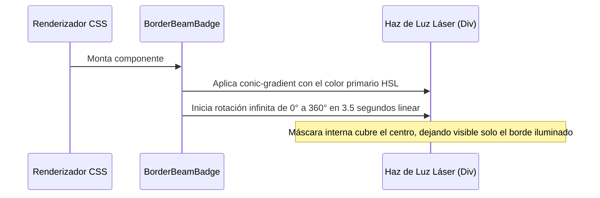

<!--
{
  "resource": "BorderBeamBadge",
  "technicalName": "BorderBeamBadge",
  "targetPath": "src/components/common/BorderBeamBadge.jsx",
  "type": "atom",
  "niches": ["retail_clothing", "grocery_food", "licores-cocteleria"],
  "dependencies": {
    "npm": {
      "framer-motion": "^11.0.0"
    },
    "internal": []
  }
}
-->

# Badge con Haz Láser (BorderBeamBadge)

Componente atómico en forma de etiqueta/badge flotante minimalista que resalta productos, ofertas o alertas mediante un rayo de luz (perímetro láser) rotativo continuo.

## 1. Propósito y Casos de Uso
Llama la atención de forma extremadamente premium hacia elementos destacados como "Oferta 50%", "Edición Especial" (*Bodega de Licores*), o "Nuevo" (*Ropa y Retail*), sin sobrecargar la interfaz.

## 2. Especificación Visual y Estilos (Tailwind CSS)
Utiliza un contenedor relativo con esquinas redondeadas y `overflow-hidden` con el hack definitivo de Webkit Mask.
- Alineación del Haz: Centrado absoluto mediante `top-1/2 left-1/2` y traslación negativa `x: '-50%', y: '-50%'` con `transformOrigin: 'center center'` para garantizar una órbita rotatoria perfectly simétrica.

---

## 3. Código React Completo y 100% Funcional

```jsx
import React from 'react';
import { motion } from 'framer-motion';

export default function BorderBeamBadge({
  children,
  className = '',
  beamColor = 'var(--color-primary)'
}) {
  return (
    <div
      className={`relative inline-flex items-center justify-center px-2.5 py-1 rounded-full border border-[var(--color-border)] bg-[var(--color-surface-3)] overflow-hidden select-none ${className}`}
      style={{
        WebkitMaskImage: '-webkit-radial-gradient(white, black)', // Forzar overflow-hidden en Safari/Blink
        maskImage: 'radial-gradient(white, black)'
      }}
    >
      {/* Haz de luz láser giratorio */}
      <motion.div
        animate={{ rotate: 360 }}
        transition={{
          duration: 3.5,
          repeat: Infinity,
          ease: "linear"
        }}
        className="absolute w-[180%] h-[180%] pointer-events-none z-0 top-1/2 left-1/2"
        style={{
          x: '-50%',
          y: '-50%',
          transformOrigin: 'center center',
          background: `conic-gradient(from 0deg, transparent 50%, ${beamColor} 100%)`
        }}
      />

      {/* Máscara de fondo interna */}
      <div className="absolute inset-[1px] bg-[var(--color-surface-3)] rounded-full z-1 pointer-events-none" />

      {/* Contenido */}
      <span className="relative z-10 text-[10px] font-extrabold text-[var(--color-text)] tracking-wider uppercase leading-none">
        {children}
      </span>
    </div>
  );
}
```

---

## 4. Lógica de Estado y Flujo Operativo


