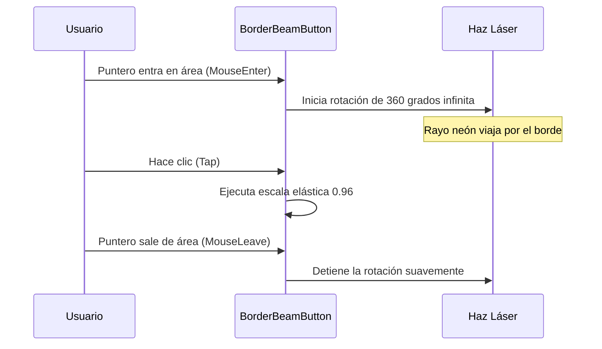

<!--
{
  "resource": "BorderBeamButton",
  "technicalName": "BorderBeamButton",
  "targetPath": "src/components/common/BorderBeamButton.jsx",
  "type": "atom",
  "niches": ["technical_services", "ferreteria-rural"],
  "dependencies": {
    "npm": {
      "framer-motion": "^11.0.0"
    },
    "internal": []
  }
}
-->

# Botón con Efecto de Haz de Borde (BorderBeamButton)

Componente atómico de botón minimalista que dibuja un rayo láser neón continuo y brillante viajando a lo largo de su contorno exterior al hacer hover, complementado con escalas elásticas al hacer tap.

## 1. Propósito y Casos de Uso
Sirve como llamada a la acción secundaria premium en secciones técnicas o de configuración (ej: "Ver Planos", "Sincronizar Diffs", "Exportar PDF de metrología") en *Tornerías y Mecanizado de Precisión*.

## 2. Especificación Visual y Estilos (Tailwind CSS)
Utiliza un degradado cónico perimetral dinámico y un contenedor interno para tapar el centro, simulando un borde brillante delgado. Consume variables:
- Haz de luz (Láser): `bg-[conic-gradient(from_0deg,transparent_60%,var(--color-primary)_85%,var(--color-secondary)_95%,transparent_100%)]`
- Relleno interno: `bg-[var(--color-surface)]`

---

## 3. Código React Completo y 100% Funcional

```jsx
import React, { useState } from 'react';
import { motion } from 'framer-motion';

export default function BorderBeamButton({
  children,
  onClick,
  disabled = false,
  className = ''
}) {
  const [isHovered, setIsHovered] = useState(false);

  return (
    <motion.button
      onMouseEnter={() => setIsHovered(true)}
      onMouseLeave={() => setIsHovered(false)}
      onClick={onClick}
      disabled={disabled}
      whileTap={{ scale: 0.96 }}
      className={`relative overflow-hidden rounded-xl bg-[var(--color-border)] p-[1px] transition-all duration-300 outline-none select-none disabled:opacity-50 disabled:cursor-not-allowed ${className}`}
    >
      {/* Haz perimetral animado en rotación al hacer hover */}
      <motion.div
        animate={isHovered ? { rotate: 360 } : { rotate: 0 }}
        transition={isHovered ? {
          repeat: Infinity,
          duration: 2,
          ease: "linear"
        } : { duration: 0.5 }}
        className="absolute w-[300%] h-[300%] top-1/2 left-1/2 pointer-events-none z-0"
        style={{
          background: `conic-gradient(from 0deg, transparent 60%, var(--color-primary) 85%, var(--color-secondary) 95%, transparent 100%)`,
          x: '-50%',
          y: '-50%',
          transformOrigin: 'center center'
        }}
      />
      {/* Contenido del botón */}
      <div className="relative rounded-[11px] bg-[var(--color-surface)] px-5 py-2.5 z-10 transition-colors duration-300 group-hover:bg-[var(--color-surface-2)]">
        <span className="text-sm font-semibold text-[var(--color-text)]">
          {children}
        </span>
      </div>
    </motion.button>
  );
}
```

---

## 4. Lógica de Estado y Flujo Operativo


