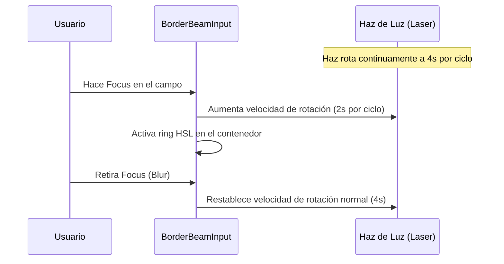

<!--
{
  "resource": "BorderBeamInput",
  "technicalName": "BorderBeamInput",
  "targetPath": "src/components/common/BorderBeamInput.jsx",
  "type": "atom",
  "niches": ["alimentos-artesanales", "technical_services"],
  "dependencies": {
    "npm": {
      "framer-motion": "^11.0.0"
    },
    "internal": []
  }
}
-->

# Input con Borde de Haz Animado (BorderBeamInput)

Componente atómico de formulario premium que dibuja un haz de luz láser de alta intensidad en rotación continua alrededor del perímetro del input, reaccionando de forma dinámica en foco.

## 1. Propósito y Casos de Uso
Ideal para capturas de alta importancia como cupones especiales de descuento, accesos administrativos o desbloqueos de privilegios. Genera una excelente retroalimentación visual de exclusividad en la vertical de *Alimentos Artesanales y Repostería* o terminales POS.

## 2. Especificación Visual y Estilos (Tailwind CSS)
Utiliza una máscara perimetral mediante posicionamiento absoluto y rotación infinita CSS con variables CSS HSL de marca. Consume variables:
- Borde del Haz: `from-[var(--color-primary)] to-[var(--color-secondary)]`
- Contenedor Interno: `bg-[var(--color-surface)] rounded-[11px]`

---

## 3. Código React Completo y 100% Funcional

```jsx
import React, { useState } from 'react';
import { motion } from 'framer-motion';

export default function BorderBeamInput({
  type = 'text',
  placeholder = '',
  value = '',
  onChange,
  disabled = false,
  error = false
}) {
  const [isFocused, setIsFocused] = useState(false);

  return (
    <div className={`relative overflow-hidden rounded-xl bg-[var(--color-border)] p-[1px] transition-all duration-300
      ${isFocused ? 'ring-2 ring-[var(--color-primary)]/30' : ''}
      ${disabled ? 'opacity-50 cursor-not-allowed pointer-events-none' : ''}
    `}>
      {/* Haz de luz láser animado en rotación */}
      <motion.div
        animate={{ rotate: 360 }}
        transition={{
          repeat: Infinity,
          duration: isFocused ? 2 : 4,
          ease: "linear"
        }}
        className="absolute w-[300%] h-[300%] top-1/2 left-1/2 pointer-events-none z-0"
        style={{
          background: `conic-gradient(from 0deg, transparent 60%, ${error ? '#ef4444' : 'var(--color-primary)'} 85%, ${error ? '#f87171' : 'var(--color-secondary)'} 95%, transparent 100%)`,
          x: '-50%',
          y: '-50%',
          transformOrigin: 'center center'
        }}
      />
      {/* Contenedor y campo de entrada */}
      <div className="relative w-full rounded-[11px] bg-[var(--color-surface)] z-10">
        <input
          type={type}
          placeholder={placeholder}
          value={value}
          onChange={onChange}
          disabled={disabled}
          onFocus={() => setIsFocused(true)}
          onBlur={() => setIsFocused(false)}
          className="w-full rounded-[11px] bg-transparent px-4 py-3 text-sm text-[var(--color-text)] placeholder-[var(--color-text-muted)]/50 outline-none transition-colors"
        />
      </div>
    </div>
  );
}
```

---

## 4. Lógica de Estado y Flujo Operativo


