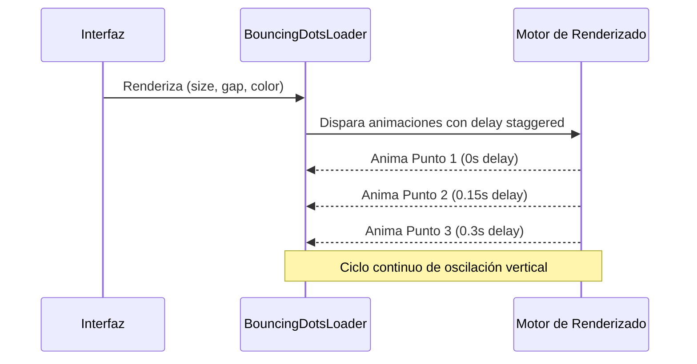

<!--
{
  "resource": "BouncingDotsLoader",
  "technicalName": "BouncingDotsLoader",
  "targetPath": "src/components/common/BouncingDotsLoader.jsx",
  "type": "atom",
  "niches": [],
  "dependencies": {
    "npm": {},
    "internal": []
  }
}
-->

# BouncingDotsLoader (Cargador de Tres Puntos Rebotantes)

Indicador de carga minimalista de tres puntos elásticos alineados horizontalmente que rebotan con un efecto escalonado (staggered delay). Optimizado para caber de forma compacta en botones, campos de chat y listados sin saturar visualmente al usuario.

## 1. Propósito y Casos de Uso
- **Loaders de Botones**: Ideal para reemplazar el texto de un botón durante el envío de un formulario.
- **Micro-conversaciones**: Globos de chat que indican que la IA o el operador humano está escribiendo.
- **Checkouts y compras**: Pequeños indicadores de procesamiento dentro de pasarelas de pago.

## 2. Especificación Visual y Estilos (Tailwind CSS)
- **Rebote Spring**: Movimiento vertical suavizado mediante traslación de eje Y (`translateY(-8px)`).
- **Escalonado Temporal**: Retrasos de animación escalonados (`0.15s` y `0.3s`) para dar sensación de oleada continua.
- **Marca Blanca**: Consume la variable `--color-primary` para mantener sintonía de color en todos los puntos.

## 3. Código React Completo y Portable

```jsx
import React from 'react';

export default function BouncingDotsLoader({
  size = 'w-2 h-2',
  gap = 'gap-1',
  color = 'bg-[var(--color-primary)]',
  className = ''
}) {
  return (
    <div className={`flex items-center justify-center py-2 ${gap} ${className}`}>
      {/* Punto 1 */}
      <div 
        className={`rounded-full animate-bounceDot ${size} ${color}`}
        style={{ animationDelay: '0s' }}
      />
      {/* Punto 2 */}
      <div 
        className={`rounded-full animate-bounceDot ${size} ${color}`}
        style={{ animationDelay: '0.15s' }}
      />
      {/* Punto 3 */}
      <div 
        className={`rounded-full animate-bounceDot ${size} ${color}`}
        style={{ animationDelay: '0.3s' }}
      />

      {/* Estilos CSS Inline para Keyframes */}
      <style dangerouslySetInnerHTML={{__html: `
        @keyframes bounceDot {
          0%, 100% {
            transform: translateY(0);
          }
          50% {
            transform: translateY(-6px);
          }
        }
        .animate-bounceDot {
          animation: bounceDot 0.6s infinite ease-in-out;
        }
      `}} />
    </div>
  );
}
```

## 4. Lógica de Estado y Ciclo de Vida
El componente es puramente estático de cara al estado de React. No requiere timers ni hooks de efectos, ya que los retrasos de la animación se declaran mediante estilos inline nativos del motor CSS, eliminando race conditions y mejorando el consumo energético.

## 5. Secuencia de Interacción


