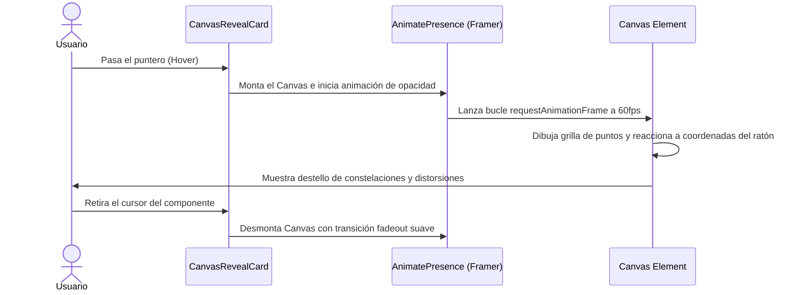

<!--
{
  "resource": "CanvasRevealCard",
  "technicalName": "CanvasRevealCard",
  "targetPath": "src/components/ui/CanvasRevealCard.jsx",
  "type": "atom",
  "dependencies": {
    "npm": {
      "framer-motion": "^11.0.0"
    },
    "internal": []
  }
}
-->

# Tarjeta con Revelación de Canvas de Fondo (CanvasRevealCard)

## 1. Propósito y Casos de Uso
Tarjeta interactiva premium inspirada en Aceternity UI que, al hacer hover sobre ella, desvanece de fondo su color de superficie plano para revelar una matriz dinámica de puntos animados o constelaciones con física interactiva.

### Casos de Uso Real:
- Tarjeta de catálogo de productos exclusivos en la vertical de *Ropa y Retail Tradicional (`retail_clothing`)*.
- Tarjeta de banners interactivos o hitos en landing pages.

## 2. Especificación Visual y Estilos (Tailwind CSS)
Utiliza un Canvas HTML5 interactivo animado de fondo con difuminado HSL.

---

## 3. Código React Completo y 100% Funcional

```jsx
import React, { useState, useRef, useEffect } from 'react';
import { motion, AnimatePresence } from 'framer-motion';

export default function CanvasRevealCard({
  children,
  className = '',
  dotColor = 'var(--color-primary)',
  dotSize = 2,
  dotGap = 15
}) {
  const [hovered, setHovered] = useState(false);
  const canvasRef = useRef(null);

  useEffect(() => {
    if (!canvasRef.current) return;
    const canvas = canvasRef.current;
    const ctx = canvas.getContext('2d');
    let animationFrameId;

    const resizeCanvas = () => {
      canvas.width = canvas.offsetWidth;
      canvas.height = canvas.offsetHeight;
    };
    resizeCanvas();

    let mouse = { x: null, y: null };

    const handleMouseMove = (e) => {
      const rect = canvas.getBoundingClientRect();
      mouse.x = e.clientX - rect.left;
      mouse.y = e.clientY - rect.top;
    };

    const handleMouseLeave = () => {
      mouse.x = null;
      mouse.y = null;
    };

    canvas.addEventListener('mousemove', handleMouseMove);
    canvas.addEventListener('mouseleave', handleMouseLeave);

    let time = 0;
    const draw = () => {
      time += 0.05;
      ctx.clearRect(0, 0, canvas.width, canvas.height);

      const rows = Math.ceil(canvas.height / dotGap);
      const cols = Math.ceil(canvas.width / dotGap);

      // Dibujar la grilla de puntos interactivos
      for (let r = 0; r < rows; r++) {
        for (let c = 0; c < cols; c++) {
          const x = c * dotGap;
          const y = r * dotGap;

          // Animación de escala senoidal en base al tiempo
          let scale = 0.5 + Math.sin(time + (x + y) * 0.01) * 0.5;

          // Distorsión interactiva basada en el mouse
          if (mouse.x !== null && mouse.y !== null) {
            const dist = Math.hypot(x - mouse.x, y - mouse.y);
            if (dist < 60) {
              scale += (1 - dist / 60) * 1.5;
            }
          }

          ctx.beginPath();
          ctx.arc(x, y, dotSize * Math.max(0.2, scale), 0, Math.PI * 2);
          ctx.fillStyle = dotColor;
          ctx.fill();
        }
      }

      animationFrameId = requestAnimationFrame(draw);
    };
    draw();

    window.addEventListener('resize', resizeCanvas);

    return () => {
      cancelAnimationFrame(animationFrameId);
      window.removeEventListener('resize', resizeCanvas);
      canvas.removeEventListener('mousemove', handleMouseMove);
      canvas.removeEventListener('mouseleave', handleMouseLeave);
    };
  }, [dotGap, dotSize, dotColor, hovered]);

  return (
    <div
      onMouseEnter={() => setHovered(true)}
      onMouseLeave={() => setHovered(false)}
      className={`relative w-full rounded-2xl border border-[var(--color-border)] bg-[var(--color-surface)] p-6 overflow-hidden min-h-[220px] flex items-center justify-center transition-shadow duration-300 ${
        hovered ? 'shadow-xl shadow-[var(--color-primary)]/5' : 'shadow-sm'
      } ${className}`}
    >
      {/* Capa de Canvas Revelado en Hover */}
      <AnimatePresence>
        {hovered && (
          <motion.canvas
            ref={canvasRef}
            initial={{ opacity: 0 }}
            animate={{ opacity: 1 }}
            exit={{ opacity: 0 }}
            transition={{ duration: 0.3 }}
            className="absolute inset-0 w-full h-full pointer-events-none z-0"
          />
        )}
      </AnimatePresence>

      {/* Contenido en primer plano */}
      <div className="relative z-10 w-full h-full flex flex-col justify-between">
        {children}
      </div>
    </div>
  );
}
```

---

## 4. Flujo Operativo y Secuencia de Interacción


