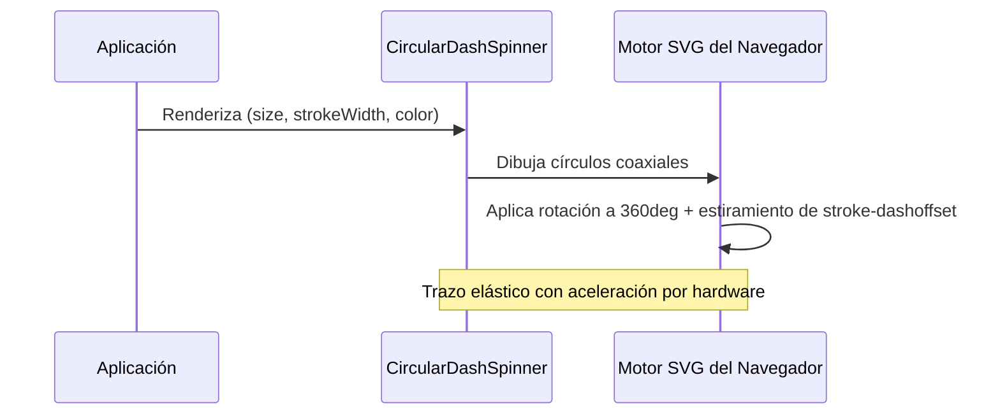

<!--
{
  "resource": "CircularDashSpinner",
  "technicalName": "CircularDashSpinner",
  "targetPath": "src/components/common/CircularDashSpinner.jsx",
  "type": "atom",
  "niches": [],
  "dependencies": {
    "npm": {},
    "internal": []
  }
}
-->

# CircularDashSpinner (Spinner Circular de Trazo Elástico)

Spinner premium basado en SVG con una animación elástica de tipo `stroke-dasharray`. El trazo se estira, se encoge y gira simultáneamente usando transformaciones aceleradas por hardware.

## 1. Propósito y Casos de Uso
- **Carga de componentes pequeños**: Ideal para loaders dentro de botones de confirmación.
- **Acceso a pasarelas de pago**: Indicador de transición elegante mientras se autoriza una transacción.
- **Carga de módulos aislados**: Spinner centralizado para secciones de analíticas o gráficos.

## 2. Especificación Visual y Estilos (Tailwind CSS)
- **Trazo SVG Dinámico**: Emplea propiedades `stroke-dasharray` y `stroke-dashoffset` animadas secuencialmente.
- **Micro-rotaciones**: Rotación de 360 grados combinada con la animación de estiramiento del trazo.
- **Marca Blanca**: Consume `--color-primary` para colorear la línea interactiva de carga.

## 3. Código React Completo y Portable

```jsx
import React from 'react';

export default function CircularDashSpinner({
  size = 'w-10 h-10',
  strokeWidth = 3.5,
  color = 'stroke-[var(--color-primary)]',
  className = ''
}) {
  return (
    <div className={`relative flex items-center justify-center ${size} ${className}`}>
      <svg
        className="w-full h-full animate-rotateSpinner"
        viewBox="0 0 50 50"
      >
        {/* Círculo de Fondo Translúcido */}
        <circle
          className="stroke-[var(--color-surface-3)]"
          cx="25"
          cy="25"
          r="20"
          fill="none"
          strokeWidth={strokeWidth}
        />
        {/* Círculo Animado Elástico */}
        <circle
          className={`${color} stroke-round animate-dashSpinner`}
          cx="25"
          cy="25"
          r="20"
          fill="none"
          strokeWidth={strokeWidth}
          strokeLinecap="round"
        />
      </svg>

      {/* Estilos CSS Inline para Keyframes */}
      <style dangerouslySetInnerHTML={{__html: `
        @keyframes rotateSpinner {
          100% {
            transform: rotate(360deg);
          }
        }
        @keyframes dashSpinner {
          0% {
            stroke-dasharray: 1, 150;
            stroke-dashoffset: 0;
          }
          50% {
            stroke-dasharray: 90, 150;
            stroke-dashoffset: -35;
          }
          100% {
            stroke-dasharray: 90, 150;
            stroke-dashoffset: -124;
          }
        }
        .animate-rotateSpinner {
          animation: rotateSpinner 2s linear infinite;
        }
        .animate-dashSpinner {
          animation: dashSpinner 1.5s ease-in-out infinite;
        }
      `}} />
    </div>
  );
}
```

## 4. Lógica de Estado y Ciclo de Vida
El componente es un elemento atómico autónomo. Utiliza clases CSS declaradas dentro del bloque `<style>` inline para ejecutar las dos animaciones concurrentes (`rotateSpinner` y `dashSpinner`), evitando colisiones de hojas de estilo globales en Vite.

## 5. Secuencia de Interacción


