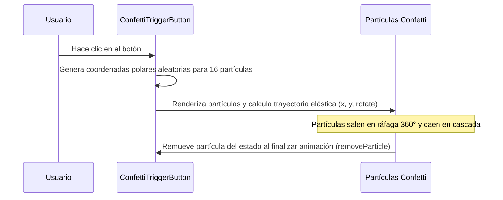

<!--
{
  "resource": "ConfettiTriggerButton",
  "technicalName": "ConfettiTriggerButton",
  "targetPath": "src/components/common/ConfettiTriggerButton.jsx",
  "type": "atom",
  "niches": ["fidelizacion_y_gamificacion", "alimentos-artesanales"],
  "dependencies": {
    "npm": {
      "framer-motion": "^11.0.0"
    },
    "internal": []
  }
}
-->

# Botón con Explosión de Confeti (ConfettiTriggerButton)

Componente atómico interactivo que, al activarse, renderiza una ráfaga instantánea de partículas coloridas de confeti SVG animadas con trayectorias de física elástica.

## 1. Propósito y Casos de Uso
Celebra logros menores del usuario (ej: "Código Canjeado con Éxito", "Cita Confirmada", "Pedido Enviado") en flujos de gamificación, checkout de compras o portales de citas, aumentando la satisfacción interactiva y el refuerzo positivo.

## 2. Especificación Visual y Estilos (Tailwind CSS)
Utiliza partículas con formas variadas (círculos, cuadrados) y colores cromáticos alegres sobre un contenedor relativo con desbordamiento visible (`overflow-visible`) para que el confeti escape de la caja del botón de forma natural. Consume variables HSL:
- Botón base: `bg-[var(--color-primary)] !text-white rounded-xl shadow-md`

---

## 3. Código React Completo y 100% Funcional

```jsx
import React, { useState } from 'react';
import { motion, AnimatePresence } from 'framer-motion';

const CONFETTI_COLORS = ['#22c55e', '#3b82f6', '#eab308', '#ec4899', '#a855f7', '#f97316'];

export default function ConfettiTriggerButton({
  children,
  onClick,
  disabled = false,
  className = ''
}) {
  const [particles, setParticles] = useState([]);

  const triggerConfetti = (e) => {
    if (disabled) return;

    const newParticles = Array.from({ length: 16 }).map((_, idx) => {
      const angle = (idx / 16) * 360 + (Math.random() - 0.5) * 20;
      const distance = 40 + Math.random() * 80;
      const radians = (angle * Math.PI) / 180;
      
      return {
        id: Date.now() + idx + Math.random(),
        color: CONFETTI_COLORS[Math.floor(Math.random() * CONFETTI_COLORS.length)],
        x: Math.cos(radians) * distance,
        y: Math.sin(radians) * distance - 30, // Desplazamiento hacia arriba
        size: 6 + Math.random() * 8,
        rotate: Math.random() * 360,
        shape: Math.random() > 0.5 ? 'circle' : 'square'
      };
    });

    setParticles((prev) => [...prev, ...newParticles]);
    if (onClick) onClick(e);
  };

  const removeParticle = (id) => {
    setParticles((prev) => prev.filter((p) => p.id !== id));
  };

  return (
    <div className="relative inline-block overflow-visible">
      {/* Contenedor de partículas */}
      <AnimatePresence>
        {particles.map((p) => (
          <motion.div
            key={p.id}
            initial={{ x: 0, y: 0, scale: 0, rotate: 0, opacity: 1 }}
            animate={{
              x: p.x,
              y: p.y,
              scale: [1, 1.2, 0.5],
              rotate: p.rotate + 180,
              opacity: [1, 1, 0]
            }}
            exit={{ opacity: 0 }}
            onAnimationComplete={() => removeParticle(p.id)}
            transition={{ duration: 0.8, ease: "easeOut" }}
            className="absolute pointer-events-none z-50 left-1/2 top-1/2"
            style={{
              width: p.size,
              height: p.size,
              backgroundColor: p.color,
              borderRadius: p.shape === 'circle' ? '50%' : '2px',
              marginLeft: -p.size / 2,
              marginTop: -p.size / 2
            }}
          />
        ))}
      </AnimatePresence>

      <motion.button
        onClick={triggerConfetti}
        disabled={disabled}
        whileTap={{ scale: 0.95 }}
        className={`relative rounded-xl bg-[var(--color-primary)] !text-[var(--color-text)] px-6 py-3 font-semibold shadow-md shadow-[var(--color-primary)]/20 outline-none select-none disabled:opacity-50 disabled:cursor-not-allowed z-10 ${className}`}
      >
        {children}
      </motion.button>
    </div>
  );
}
```

---

## 4. Lógica de Estado y Flujo Operativo


