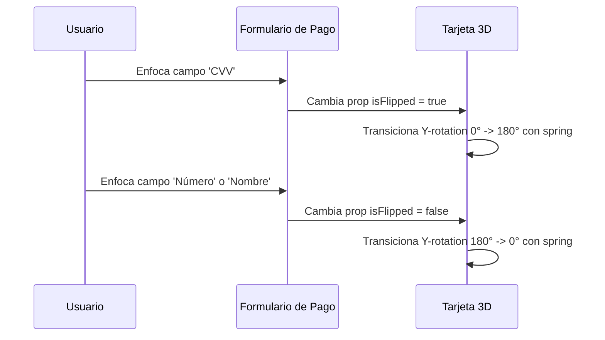

<!--
{
  "technicalName": "CreditCardInteractiveFlip",
  "targetPath": "src/components/ui/CreditCardInteractiveFlip.jsx",
  "dependencies": {
    "npm": {
      "framer-motion": "^11.0.0"
    },
    "internal": []
  },
  "type": "atom",
  "niches": []
}
-->

# CreditCardInteractiveFlip — Tarjeta Bancaria 3D Rotativa

## 1. Propósito y Casos de Uso
El `CreditCardInteractiveFlip` es un componente visual interactivo tridimensional diseñado para interfaces de pago, checkout de e-commerce y facturación. Permite visualizar de forma interactiva una tarjeta de crédito o débito que se voltea 180° mostrando el frente o el dorso (donde se firma y se ingresa el código CVV) basándose en qué campo de entrada esté enfocado en un formulario.

## 2. Especificación Visual y Estilos
- **Perspectiva 3D:** Uso de propiedades CSS de perspectiva y preservación 3D para lograr una rotación realista.
- **Ocultación de Cara Trasera:** Uso de `backface-visibility: hidden` para que la cara trasera y delantera no se solapen durante la transición.
- **Estética Oscura/Glow:** Degradados premium del fondo que contrastan con los textos monomarca y chip simulado.

## 3. Código React Completo y 100% Funcional

```jsx
import React from 'react';
import { motion } from 'framer-motion';

export default function CreditCardInteractiveFlip({
  number = '',
  name = '',
  expiry = '',
  cvv = '',
  isFlipped = false,
  cardType = 'visa', // visa, mastercard, amex
  className = ''
}) {
  const getCardLogo = (type) => {
    if (type === 'mastercard') return 'Mastercard';
    if (type === 'amex') return 'Amex';
    return 'Visa';
  };

  // Formatea el número de tarjeta a grupos de 4 dígitos
  const formatNumber = (num) => {
    const padded = num.padEnd(16, '•');
    return `${padded.slice(0, 4)} ${padded.slice(4, 8)} ${padded.slice(8, 12)} ${padded.slice(12, 16)}`;
  };

  return (
    <div className={`relative w-full max-w-[20rem] h-[190px] mx-auto select-none ${className}`} style={{ perspective: '1000px', WebkitPerspective: '1000px' }}>
      <motion.div
        animate={{ rotateY: isFlipped ? 180 : 0 }}
        transition={{ type: 'spring', stiffness: 50, damping: 12 }}
        className="relative w-full h-full"
        style={{ transformStyle: 'preserve-3d', WebkitTransformStyle: 'preserve-3d' }}
      >
        {/* CARA FRONTAL (Frente) */}
        <div
          className="absolute inset-0 w-full h-full p-5 rounded-2xl bg-gradient-to-br from-zinc-800 to-zinc-950 text-[var(--color-text)] border border-white/10 shadow-2xl flex flex-col justify-between"
          style={{
            backfaceVisibility: 'hidden',
            WebkitBackfaceVisibility: 'hidden'
          }}
        >
          <div className="flex justify-between items-start">
            <div className="h-8 w-12 bg-amber-500/25 rounded-md border border-amber-500/20" /> {/* Chip Metálico */}
            <span className="text-sm font-black italic tracking-wider opacity-85">
              {getCardLogo(cardType)}
            </span>
          </div>

          <div className="text-lg font-mono font-bold tracking-widest text-center mt-2.5">
            {formatNumber(number)}
          </div>

          <div className="flex justify-between items-end mt-2">
            <div className="min-w-0 pr-2">
              <span className="block text-[8px] text-zinc-400 uppercase tracking-widest">Titular</span>
              <span className="block text-xs font-bold font-mono tracking-wider truncate uppercase">
                {name || 'NOMBRE TITULAR'}
              </span>
            </div>
            <div className="shrink-0 text-right">
              <span className="block text-[8px] text-zinc-400 uppercase tracking-widest">Vence</span>
              <span className="block text-xs font-bold font-mono tracking-wider">
                {expiry || 'MM/AA'}
              </span>
            </div>
          </div>
        </div>

        {/* CARA TRASERA (Reverso) */}
        <div
          className="absolute inset-0 w-full h-full rounded-2xl bg-gradient-to-br from-zinc-900 to-zinc-950 text-[var(--color-text)] border border-white/10 shadow-2xl flex flex-col justify-between py-5"
          style={{
            backfaceVisibility: 'hidden',
            WebkitBackfaceVisibility: 'hidden',
            transform: 'rotateY(180deg)',
            WebkitTransform: 'rotateY(180deg)'
          }}
        >
          <div className="w-full h-10 bg-zinc-800" /> {/* Banda Magnética */}

          <div className="px-5 space-y-1">
            <div className="flex justify-end pr-2">
              <span className="text-[8px] text-zinc-400 uppercase tracking-widest">CVV / Firma</span>
            </div>
            <div className="flex items-center justify-between bg-zinc-700/30 rounded border border-white/5 p-2 h-9">
              <div className="flex-1 bg-white/5 h-full rounded flex items-center px-2">
                <span className="text-[10px] text-zinc-400 font-mono tracking-widest select-none">••••••••••••</span>
              </div>
              <span className="text-sm font-black font-mono tracking-wider pl-3 pr-1 text-amber-400">
                {cvv || '•••'}
              </span>
            </div>
          </div>

          <div className="px-5 text-[8px] text-zinc-500 text-center leading-normal">
            Esta tarjeta es personal e intransferible. Uso sujeto a condiciones de la plataforma.
          </div>
        </div>
      </motion.div>
    </div>
  );
}
```

## 4. Lógica de Estado y Ciclo de Vida
Este componente delega la gestión del estado de volteado (`isFlipped`) al padre, el cual puede cambiar su valor reactivamente al detectar el foco en el campo de entrada de CVV. La animación 3D de rotación se realiza mediante transformaciones CSS aceleradas por hardware en el contenedor principal usando Framer Motion.

## 5. Flujo Operativo y Secuencia de Interacción


