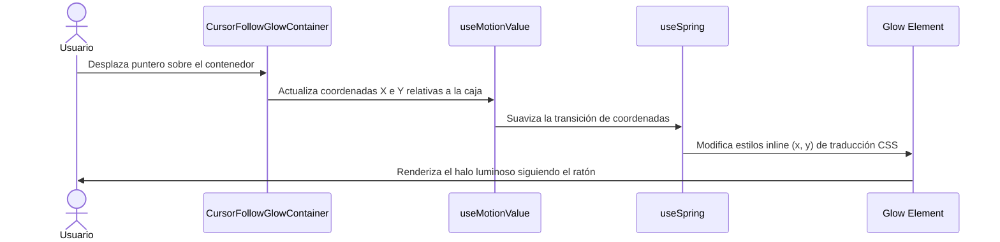

<!--
{
  "resource": "CursorFollowGlowContainer",
  "technicalName": "CursorFollowGlowContainer",
  "targetPath": "src/components/ui/CursorFollowGlowContainer.jsx",
  "type": "atom",
  "dependencies": {
    "npm": {
      "framer-motion": "^11.0.0"
    },
    "internal": []
  }
}
-->

# Contenedor con Glow de Foco Cursor (CursorFollowGlowContainer)

## 1. Propósito y Casos de Uso
Este componente crea un efecto envolvente premium donde el movimiento del cursor revela el contenido o los bordes de la tarjeta a través de un gradiente radial flotante en segundo plano. Es ideal para elementos interactivos en layouts oscuros o de tipo glassmorphic.

### Casos de Uso Real:
- Tarjeta de indicadores del Dashboard Administrativo para resaltar KPIs comerciales clave.
- Módulos interactivos de servicio técnico en la vertical de *Lavanderías y Tintorerías (`laundry`)*.

## 2. Especificación Visual y Estilos (Tailwind CSS)
Utiliza un halo difuso circular HSL en segundo plano con opacidad controlada.

---

## 3. Código React Completo y 100% Funcional

```jsx
import React, { useRef } from 'react';
import { motion, useMotionValue, useSpring, useTransform } from 'framer-motion';

export default function CursorFollowGlowContainer({
  children,
  className = '',
  glowSize = 200,
  glowColor = 'var(--color-primary)',
  glowOpacity = 0.15
}) {
  const containerRef = useRef(null);
  
  // Posición del mouse relativa al contenedor
  const mouseX = useMotionValue(0);
  const mouseY = useMotionValue(0);

  // Configuración de movimiento físico spring suavizado
  const springConfig = { damping: 30, stiffness: 300, mass: 0.2 };
  const springX = useSpring(mouseX, springConfig);
  const springY = useSpring(mouseY, springConfig);

  const handleMouseMove = (e) => {
    if (!containerRef.current) return;
    const rect = containerRef.current.getBoundingClientRect();
    
    // Asignar posición relativa
    mouseX.set(e.clientX - rect.left);
    mouseY.set(e.clientY - rect.top);
  };

  const handleMouseEnter = (e) => {
    if (!containerRef.current) return;
    const rect = containerRef.current.getBoundingClientRect();
    mouseX.set(e.clientX - rect.left);
    mouseY.set(e.clientY - rect.top);
  };

  return (
    <div
      ref={containerRef}
      onMouseMove={handleMouseMove}
      onMouseEnter={handleMouseEnter}
      className={`relative overflow-hidden rounded-2xl border border-[var(--color-border)] bg-[var(--color-surface)] p-6 transition-all duration-300 ${className}`}
    >
      {/* Halo de luz de fondo (Glow radial) que sigue al puntero */}
      <motion.div
        style={{
          x: useTransform(springX, (x) => x - glowSize / 2),
          y: useTransform(springY, (y) => y - glowSize / 2),
          width: glowSize,
          height: glowSize,
          background: `radial-gradient(circle, ${glowColor} 0%, transparent 70%)`,
          opacity: glowOpacity,
        }}
        className="absolute top-0 left-0 rounded-full blur-2xl pointer-events-none z-0"
      />

      {/* Contenido en primer plano para evitar que quede tapado */}
      <div className="relative z-10">
        {children}
      </div>
    </div>
  );
}
```

---

## 4. Flujo Operativo y Secuencia de Interacción


