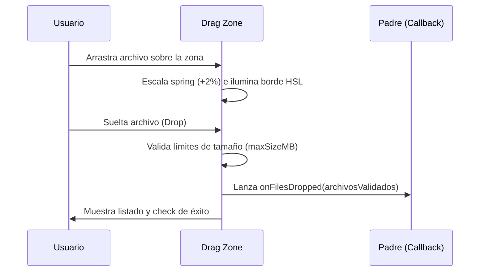

<!--
{
  "technicalName": "DragAndDropZone",
  "targetPath": "src/components/ui/DragAndDropZone.jsx",
  "dependencies": {
    "npm": {
      "framer-motion": "^11.0.0",
      "lucide-react": "^0.300.0"
    },
    "internal": []
  },
  "type": "atom",
  "niches": []
}
-->

# DragAndDropZone — Zona de Arrastre de Archivos Premium

## 1. Propósito y Casos de Uso
El `DragAndDropZone` es un componente de carga de archivos diseñado para paneles de administración, formularios de carga de imágenes de productos y zonas de facturación. Su propósito es capturar de forma interactiva uno o más archivos arrastrados por el usuario, reaccionando con un borde dinámico y una transición elástica que mejora la respuesta táctil y visual.

## 2. Especificación Visual y Estilos
- **Línea de Borde:** Contorno discontinuo (`border-dashed`) que se ilumina usando variables HSL (`var(--color-primary)`).
- **Animación de Arrastre:** Escala sutil (1.02) y color de fondo reactivo cuando el archivo está flotando sobre la zona.

## 3. Código React Completo y 100% Funcional

```jsx
import React, { useState, useRef } from 'react';
import { motion } from 'framer-motion';
import { UploadCloud, File, CheckCircle2 } from 'lucide-react';

export default function DragAndDropZone({
  onFilesDropped,
  acceptedTypes = '*/*',
  maxSizeMB = 5,
  multiple = false,
  className = ''
}) {
  const [isDragActive, setIsDragActive] = useState(false);
  const [files, setFiles] = useState([]);
  const fileInputRef = useRef(null);

  const handleDrag = (e) => {
    e.preventDefault();
    e.stopPropagation();
    if (e.type === 'dragenter' || e.type === 'dragover') {
      setIsDragActive(true);
    } else if (e.type === 'dragleave') {
      setIsDragActive(false);
    }
  };

  const processFiles = (fileList) => {
    const validFiles = Array.from(fileList).filter(
      (file) => file.size <= maxSizeMB * 1024 * 1024
    );
    
    setFiles(validFiles);
    if (onFilesDropped) {
      onFilesDropped(validFiles);
    }
  };

  const handleDrop = (e) => {
    e.preventDefault();
    e.stopPropagation();
    setIsDragActive(false);

    if (e.dataTransfer.files && e.dataTransfer.files.length > 0) {
      processFiles(e.dataTransfer.files);
    }
  };

  const handleInputChange = (e) => {
    if (e.target.files && e.target.files.length > 0) {
      processFiles(e.target.files);
    }
  };

  const handleButtonClick = () => {
    if (fileInputRef.current) {
      fileInputRef.current.click();
    }
  };

  return (
    <div className={`w-full ${className}`}>
      <motion.div
        onDragEnter={handleDrag}
        onDragOver={handleDrag}
        onDragLeave={handleDrag}
        onDrop={handleDrop}
        animate={{
          scale: isDragActive ? 1.02 : 1,
          borderColor: isDragActive ? 'var(--color-primary)' : 'var(--color-border)'
        }}
        transition={{ type: 'spring', stiffness: 200, damping: 20 }}
        className={`relative flex flex-col items-center justify-center p-8 rounded-2xl border-2 border-dashed bg-[var(--color-surface)] text-center transition-colors cursor-pointer ${
          isDragActive ? 'bg-[var(--color-primary)]/5 border-[var(--color-primary)]' : ''
        }`}
        onClick={handleButtonClick}
      >
        <input
          ref={fileInputRef}
          type="file"
          className="hidden"
          multiple={multiple}
          accept={acceptedTypes}
          onChange={handleInputChange}
        />

        {files.length === 0 ? (
          <>
            <div className="p-3 bg-[var(--color-surface-2)] rounded-full border border-[var(--color-border)] text-[var(--color-text-muted)] mb-3">
              <UploadCloud className="w-6 h-6" />
            </div>
            <p className="text-sm font-semibold text-[var(--color-text)]">
              Arrastra tus archivos aquí o haz click
            </p>
            <p className="text-xs text-[var(--color-text-muted)] mt-1">
              Máximo {maxSizeMB}MB por archivo ({acceptedTypes === '*/*' ? 'cualquier tipo' : acceptedTypes})
            </p>
          </>
        ) : (
          <div className="space-y-3 w-full">
            <div className="flex items-center justify-center space-x-2 text-emerald-500">
              <CheckCircle2 className="w-5 h-5" />
              <span className="text-xs font-bold uppercase tracking-wider">Cargado con éxito</span>
            </div>
            <div className="max-w-xs mx-auto divide-y divide-[var(--color-border)] bg-[var(--color-surface-2)] p-2.5 rounded-xl border border-[var(--color-border)]">
              {files.map((file, idx) => (
                <div key={idx} className="flex items-center justify-between text-left p-1 text-xs">
                  <div className="flex items-center min-w-0 pr-2">
                    <File className="w-4 h-4 text-[var(--color-text-muted)] mr-2 shrink-0" />
                    <span className="text-[var(--color-text)] truncate">{file.name}</span>
                  </div>
                  <span className="text-[10px] text-[var(--color-text-muted)] shrink-0 font-mono">
                    {(file.size / 1024).toFixed(1)} KB
                  </span>
                </div>
              ))}
            </div>
          </div>
        )}
      </motion.div>
    </div>
  );
}
```

## 4. Lógica de Estado y Ciclo de Vida
Controla el estado local `isDragActive` mediante los eventos `dragenter`, `dragover` y `dragleave` para aplicar estilos en caliente. Procesa la colección de archivos validando sus límites de tamaño y ejecuta el callback `onFilesDropped` para reportar los elementos validados de forma asíncrona.

## 5. Flujo Operativo y Secuencia de Interacción


