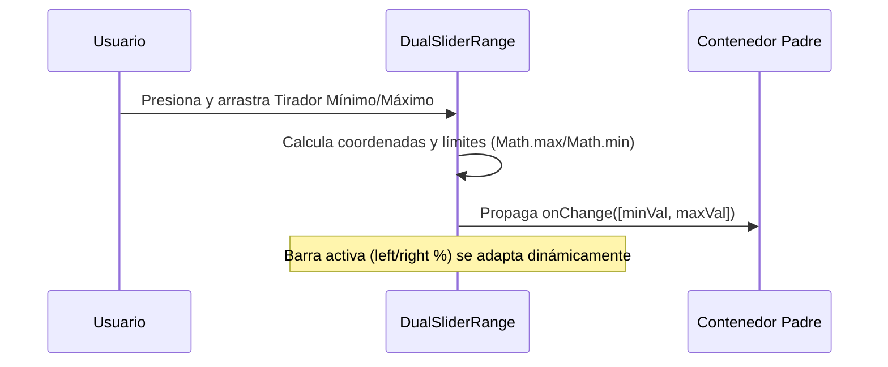

<!--
{
  "resource": "DualSliderRange",
  "technicalName": "DualSliderRange",
  "targetPath": "src/components/common/DualSliderRange.jsx",
  "type": "atom",
  "niches": ["retail_clothing", "technical_services"],
  "dependencies": {
    "npm": {
      "framer-motion": "^11.0.0"
    },
    "internal": []
  }
}
-->

# Selector de Rango Doble (DualSliderRange)

Componente atómico de filtrado cuantitativo que permite seleccionar un rango numérico (mínimo y máximo) mediante dos tiradores deslizables coordinados que impiden cruces lógicos.

## 1. Propósito y Casos de Uso
Permite seleccionar rangos de precio en catálogo móvil (*Retail y Calzado*) o rangos de tolerancia en pulgadas/milímetros (*Tornerías y Mecanizado de Precisión*), actualizando en tiempo real la previsualización del filtro.

## 2. Especificación Visual y Estilos (Tailwind CSS)
Utiliza una barra de progreso absoluta posicionada sobre un riel base y tiradores redondos interactivos con sombras suaves. Consume variables HSL:
- Riel pasivo: `bg-[var(--color-surface-3)]`
- Riel activo: `bg-[var(--color-primary)]`
- Tirador: `bg-white border-2 border-[var(--color-primary)]`

---

## 3. Código React Completo y 100% Funcional

```jsx
import React, { useRef, useState, useEffect } from 'react';
import { motion } from 'framer-motion';

export default function DualSliderRange({
  min = 0,
  max = 100,
  value = [10, 80],
  onChange,
  disabled = false
}) {
  const containerRef = useRef(null);
  const [rangeVal, setRangeVal] = useState(value);

  useEffect(() => {
    setRangeVal(value);
  }, [value]);

  const getPercentage = (val) => {
    return ((val - min) / (max - min)) * 100;
  };

  const handlePointerDown = (e, isMax) => {
    if (disabled || !containerRef.current) return;
    e.currentTarget.setPointerCapture(e.pointerId);

    const updateValue = (pointerEvent) => {
      const { left, width } = containerRef.current.getBoundingClientRect();
      const clientX = pointerEvent.clientX;
      const percentage = Math.max(0, Math.min(100, ((clientX - left) / width) * 100));
      const calculatedVal = Math.round(min + (percentage / 100) * (max - min));

      const newRange = [...rangeVal];
      if (isMax) {
        newRange[1] = Math.max(newRange[0] + 1, calculatedVal); // Impide cruzarse
      } else {
        newRange[0] = Math.min(newRange[1] - 1, calculatedVal);
      }
      
      setRangeVal(newRange);
      if (onChange) onChange(newRange);
    };

    const handlePointerMove = (moveEvent) => updateValue(moveEvent);
    const handlePointerUp = (upEvent) => {
      upEvent.currentTarget.releasePointerCapture(upEvent.pointerId);
      upEvent.currentTarget.removeEventListener('pointermove', handlePointerMove);
      upEvent.currentTarget.removeEventListener('pointerup', handlePointerUp);
    };

    e.currentTarget.addEventListener('pointermove', handlePointerMove);
    e.currentTarget.addEventListener('pointerup', handlePointerUp);
  };

  const minPct = getPercentage(rangeVal[0]);
  const maxPct = getPercentage(rangeVal[1]);

  return (
    <div className={`w-full py-4 px-2 select-none ${disabled ? 'opacity-40 cursor-not-allowed pointer-events-none' : ''}`}>
      <div
        ref={containerRef}
        className="relative w-full h-2 rounded-full bg-[var(--color-surface-3)] border border-[var(--color-border)]"
      >
        {/* Barra de progreso de rango activo */}
        <div
          className="absolute h-full bg-[var(--color-primary)] rounded-full"
          style={{ left: `${minPct}%`, right: `${100 - maxPct}%` }}
        />

        {/* Tirador Mínimo */}
        <motion.div
          onPointerDown={(e) => handlePointerDown(e, false)}
          whileHover={{ scale: 1.15 }}
          whileTap={{ scale: 0.95 }}
          className="absolute top-1/2 -translate-y-1/2 w-5 h-5 rounded-full bg-white border-2 border-[var(--color-primary)] shadow-md cursor-ew-resize z-20"
          style={{ left: `calc(${minPct}% - 10px)` }}
        />

        {/* Tirador Máximo */}
        <motion.div
          onPointerDown={(e) => handlePointerDown(e, true)}
          whileHover={{ scale: 1.15 }}
          whileTap={{ scale: 0.95 }}
          className="absolute top-1/2 -translate-y-1/2 w-5 h-5 rounded-full bg-white border-2 border-[var(--color-primary)] shadow-md cursor-ew-resize z-20"
          style={{ left: `calc(${maxPct}% - 10px)` }}
        />
      </div>
    </div>
  );
}
```

---

## 4. Lógica de Estado y Flujo Operativo


