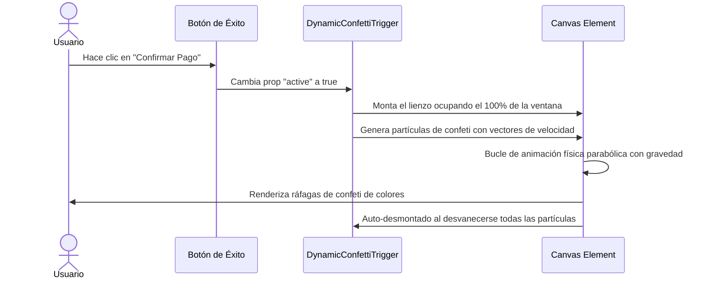

<!--
{
  "resource": "DynamicConfettiTrigger",
  "technicalName": "DynamicConfettiTrigger",
  "targetPath": "src/components/ui/DynamicConfettiTrigger.jsx",
  "type": "atom",
  "dependencies": {
    "npm": {},
    "internal": []
  }
}
-->

# Efecto de Confeti Dinámico de Canvas (DynamicConfettiTrigger)

## 1. Propósito y Casos de Uso
Disparador interactivo invisible que renderiza ráfagas de confeti festivo multicolor con física gravitacional e inercial simulada en Canvas sobre el viewport al activar un estado exitoso.

### Casos de Uso Real:
- Celebración visual tras aprobar una venta o emitir una factura POS en la vertical de *Minimarkets y Alimentos (`grocery_food`)*.
- Éxito tras concretar una reserva de spa/peluquería en la vertical de *Estética, Podología y Bienestar (`wellness_podology`)*.

## 2. Especificación Visual y Estilos (Tailwind CSS)
Utiliza partículas vectoriales aleatorias renderizadas en un lienzo a pantalla completa.

---

## 3. Código React Completo y 100% Funcional

```jsx
import React, { useEffect, useRef } from 'react';

export default function DynamicConfettiTrigger({
  active = false,
  particleCount = 80,
  colors = ['#6366f1', '#a855f7', '#ec4899', '#3b82f6', '#22c55e', '#eab308']
}) {
  const canvasRef = useRef(null);

  useEffect(() => {
    if (!active || !canvasRef.current) return;

    const canvas = canvasRef.current;
    const ctx = canvas.getContext('2d');
    let animationFrameId;

    const resizeCanvas = () => {
      canvas.width = window.innerWidth;
      canvas.height = window.innerHeight;
    };
    resizeCanvas();
    window.addEventListener('resize', resizeCanvas);

    // Clase para representar cada partícula de confeti
    class ConfettiParticle {
      constructor() {
        this.x = Math.random() * canvas.width;
        // Iniciar en la parte inferior de la pantalla o disperso
        this.y = canvas.height + 20;
        this.size = Math.random() * 8 + 6;
        
        // Velocidad inicial y ángulo parabólico
        this.vx = (Math.random() - 0.5) * 12;
        this.vy = -Math.random() * 15 - 15;
        
        this.color = colors[Math.floor(Math.random() * colors.length)];
        this.gravity = 0.45;
        this.rotation = Math.random() * 360;
        this.rotationSpeed = (Math.random() - 0.5) * 8;
        this.opacity = 1;
      }

      update() {
        this.vy += this.gravity;
        this.x += this.vx;
        this.y += this.vy;
        this.rotation += this.rotationSpeed;

        // Desvanecimiento suave al ir cayendo
        if (this.vy > 0) {
          this.opacity -= 0.015;
        }
      }

      draw() {
        ctx.save();
        ctx.translate(this.x, this.y);
        ctx.rotate((this.rotation * Math.PI) / 180);
        ctx.globalAlpha = Math.max(0, this.opacity);
        ctx.fillStyle = this.color;
        
        // Dibujar un rectángulo o paralelogramo de confeti
        ctx.fillRect(-this.size / 2, -this.size / 2, this.size, this.size / 2);
        ctx.restore();
      }
    }

    const particles = [];
    // Generar partículas iniciales
    for (let i = 0; i < particleCount; i++) {
      particles.push(new ConfettiParticle());
    }

    const render = () => {
      ctx.clearRect(0, 0, canvas.width, canvas.height);
      
      // Filtrar y actualizar partículas activas
      for (let i = particles.length - 1; i >= 0; i--) {
        const p = particles[i];
        p.update();
        p.draw();
        
        if (p.opacity <= 0 || p.y > canvas.height + 50) {
          particles.splice(i, 1);
        }
      }

      if (particles.length > 0) {
        animationFrameId = requestAnimationFrame(render);
      }
    };
    render();

    return () => {
      cancelAnimationFrame(animationFrameId);
      window.removeEventListener('resize', resizeCanvas);
    };
  }, [active, particleCount, colors]);

  if (!active) return null;

  return (
    <canvas
      ref={canvasRef}
      className="fixed inset-0 pointer-events-none z-[9999] w-full h-full"
    />
  );
}
```

---

## 4. Flujo Operativo y Secuencia de Interacción


