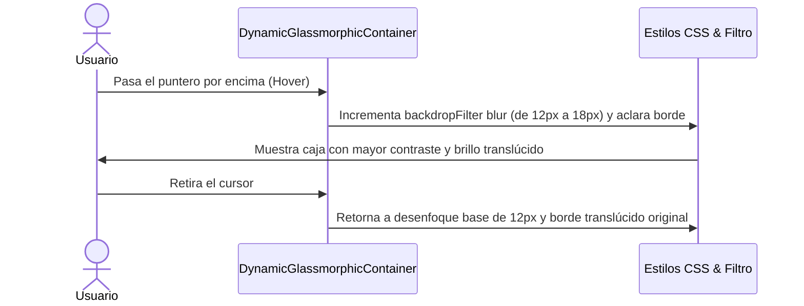

<!--
{
  "resource": "DynamicGlassmorphicContainer",
  "technicalName": "DynamicGlassmorphicContainer",
  "targetPath": "src/components/ui/DynamicGlassmorphicContainer.jsx",
  "type": "atom",
  "dependencies": {
    "npm": {
      "framer-motion": "^11.0.0"
    },
    "internal": []
  }
}
-->

# Contenedor de Vidrio Glaseado Dinámico (DynamicGlassmorphicContainer)

## 1. Propósito y Casos de Uso
Provee un panel con diseño glassmorphic de última generación. Los contenedores de vidrio tradicionales suelen colisionar de contraste sobre fondos claros u oscuros con mucho ruido. Este componente optimiza la legibilidad ajustando dinámicamente el desenfoque (`backdrop-filter`) y el grosor o luminosidad del borde (`border-color`) mediante micro-animaciones suaves.

### Casos de Uso Real:
- Caja de cotización rápida sobrepuesta en el visor público de la vertical de *Contratistas y Construcción (`contractors`)*.
- Modales contextuales de comisiones o reportes rápidos de facturación en el POS.

## 2. Especificación Visual y Estilos (Tailwind CSS)
Utiliza bordes translúcidos con fondos difuminados de opacidad reducida.

---

## 3. Código React Completo y 100% Funcional

```jsx
import React from 'react';
import { motion } from 'framer-motion';

export default function DynamicGlassmorphicContainer({
  children,
  className = '',
  baseBlur = 12,
  hoverBlur = 18,
  glowColor = 'var(--color-primary)'
}) {
  return (
    <motion.div
      whileHover={{
        borderColor: 'rgba(255, 255, 255, 0.25)',
        boxShadow: `0 20px 40px -15px ${glowColor}15`,
      }}
      transition={{ duration: 0.4, ease: 'easeOut' }}
      style={{
        backdropFilter: `blur(${baseBlur}px)`,
        WebkitBackdropFilter: `blur(${baseBlur}px)`,
      }}
      className={`relative rounded-2xl border border-white/10 bg-white/[0.05] dark:bg-black/[0.15] p-6 shadow-xl ${className}`}
    >
      {/* Resplandor decorativo de borde superior */}
      <div className="absolute top-0 left-10 right-10 h-[1px] bg-gradient-to-r from-transparent via-white/20 to-transparent pointer-events-none" />

      {/* Contenido principal */}
      <div className="relative z-10">
        {children}
      </div>
    </motion.div>
  );
}
```

---

## 4. Flujo Operativo y Secuencia de Interacción


