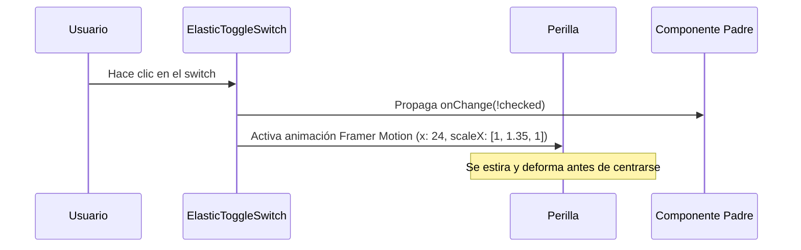

<!--
{
  "resource": "ElasticToggleSwitch",
  "technicalName": "ElasticToggleSwitch",
  "targetPath": "src/components/common/ElasticToggleSwitch.jsx",
  "type": "atom",
  "niches": ["laundry", "technical_services"],
  "dependencies": {
    "npm": {
      "framer-motion": "^11.0.0"
    },
    "internal": []
  }
}
-->

# Switch de Palanca Elástica (ElasticToggleSwitch)

Componente atómico de selección binaria (Toggle/Switch) que deforma y estira la perilla interior (efecto squash and stretch) durante la transición lateral de posición.

## 1. Propósito y Casos de Uso
Optimiza la retroalimentación háptica y el dinamismo visual en la activación de opciones lógicas secundarias (ej: "Envío a Domicilio", "Servicio Express con recargo", "Activar Telemetría"). Especialmente útil en el flujo de pedidos de la vertical de *Lavanderías y Tintorerías*.

## 2. Especificación Visual y Estilos (Tailwind CSS)
Utiliza transiciones de color de fondo y un tirador dinámico con escala elástica X e inyección HSL variables. Consume variables:
- Fondo Activo: `bg-[var(--color-primary)]`
- Fondo Inactivo: `bg-[var(--color-surface-3)]`
- Perilla: `bg-white`

---

## 3. Código React Completo y 100% Funcional

```jsx
import React from 'react';
import { motion } from 'framer-motion';

export default function ElasticToggleSwitch({
  checked = false,
  onChange,
  disabled = false
}) {
  return (
    <div
      onClick={() => !disabled && onChange && onChange(!checked)}
      className={`relative w-14 h-8 rounded-full p-1 cursor-pointer transition-colors duration-300 select-none
        ${checked ? 'bg-[var(--color-primary)]' : 'bg-[var(--color-surface-3)] border border-[var(--color-border)]'}
        ${disabled ? 'opacity-40 cursor-not-allowed pointer-events-none' : ''}
      `}
    >
      <motion.div
        animate={{
          x: checked ? 24 : 0,
          scaleX: [1, 1.35, 1], // Efecto elástico squash y stretch
        }}
        transition={{
          type: "spring",
          stiffness: 400,
          damping: 20
        }}
        className="w-6 h-6 rounded-full bg-white shadow-md shadow-[var(--color-shadow)] origin-center"
      />
    </div>
  );
}
```

---

## 4. Lógica de Estado y Flujo Operativo


