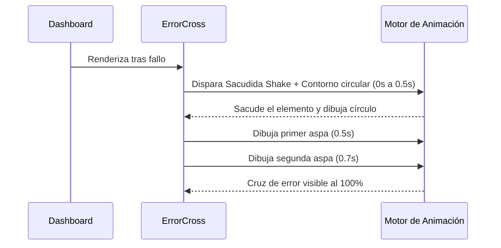

<!--
{
  "resource": "ErrorCross",
  "technicalName": "ErrorCross",
  "targetPath": "src/components/common/ErrorCross.jsx",
  "type": "atom",
  "niches": [],
  "dependencies": {
    "npm": {},
    "internal": []
  }
}
-->

# ErrorCross (Cruz de Error Animada)

Icono SVG interactivo de cruz de error que dibuja su contorno perimetral en rojo y cruza dinámicamente sus dos aspas internas con una vibración/sacudida elástica (`shake`). Diseñado para alertas críticas de validación o fallos en pasarelas de pago.

## 1. Propósito y Casos de Uso
- **Validaciones Fallidas**: Alertas visuales inmediatas cuando una firma de contrato o formulario falla.
- **Transacción Denegada**: Alerta de fondos insuficientes en la caja de cobro POS.
- **Error de Servidor**: Conexión fallida con Firebase Firestore.

## 2. Especificación Visual y Estilos (Tailwind CSS)
- **Efecto Shake (Sacudida)**: Sigue los principios de micro-animaciones premium vibrando horizontalmente.
- **Líneas Cruzadas SVG**: Las líneas diagonales se extienden progresivamente desde el centro.
- **Estética Crítica**: Utiliza `stroke-rose-500` y `fill-rose-500/10` para representar peligro de manera elegante.

## 3. Código React Completo y Portable

```jsx
import React from 'react';

export default function ErrorCross({
  size = 'w-16 h-16',
  className = ''
}) {
  return (
    <div className={`relative flex items-center justify-center animate-shakeError ${size} ${className}`}>
      <svg
        className="w-full h-full text-rose-500 fill-none"
        viewBox="0 0 52 52"
      >
        {/* Círculo de Fondo Animado */}
        <circle
          className="stroke-rose-500 stroke-[3px] animate-circleDraw"
          cx="26"
          cy="26"
          r="24"
          fill="none"
        />
        {/* Relleno Fino */}
        <circle
          className="fill-rose-500/10 animate-fillCircle"
          cx="26"
          cy="26"
          r="24"
        />
        {/* Aspa 1 (\) */}
        <path
          className="stroke-rose-500 stroke-[4px] animate-lineDraw"
          strokeLinecap="round"
          d="M16 16l20 20"
        />
        {/* Aspa 2 (/) */}
        <path
          className="stroke-rose-500 stroke-[4px] animate-lineDraw2"
          strokeLinecap="round"
          d="M36 16L16 36"
        />
      </svg>

      {/* Estilos CSS Inline para Keyframes */}
      <style dangerouslySetInnerHTML={{__html: `
        @keyframes circleDraw {
          0% {
            stroke-dasharray: 0 150;
          }
          100% {
            stroke-dasharray: 150 150;
          }
        }
        @keyframes lineDraw {
          0% {
            stroke-dasharray: 0 30;
          }
          100% {
            stroke-dasharray: 30 30;
          }
        }
        @keyframes shakeError {
          0%, 100% { transform: translateX(0); }
          15%, 45%, 75% { transform: translateX(-4px); }
          30%, 60%, 90% { transform: translateX(4px); }
        }
        .animate-circleDraw {
          stroke-dasharray: 150;
          stroke-dashoffset: 0;
          animation: circleDraw 0.5s cubic-bezier(0.65, 0, 0.45, 1) forwards;
        }
        .animate-lineDraw {
          stroke-dasharray: 30;
          stroke-dashoffset: 0;
          animation: lineDraw 0.4s cubic-bezier(0.65, 0, 0.45, 1) 0.5s forwards;
        }
        .animate-lineDraw2 {
          stroke-dasharray: 30;
          stroke-dashoffset: 0;
          animation: lineDraw 0.4s cubic-bezier(0.65, 0, 0.45, 1) 0.7s forwards;
        }
        .animate-shakeError {
          animation: shakeError 0.5s cubic-bezier(.36,.07,.19,.97) both;
        }
      `}} />
    </div>
  );
}
```

## 4. Lógica de Estado y Ciclo de Vida
El componente es un render estático auto-iniciado. Utiliza retrasos lógicos en la animación CSS (`0.5s` y `0.7s`) para asegurar que las aspas se dibujen de forma cruzada y secuencial después de que el círculo y el efecto de sacudida se hayan completado.

## 5. Secuencia de Interacción


