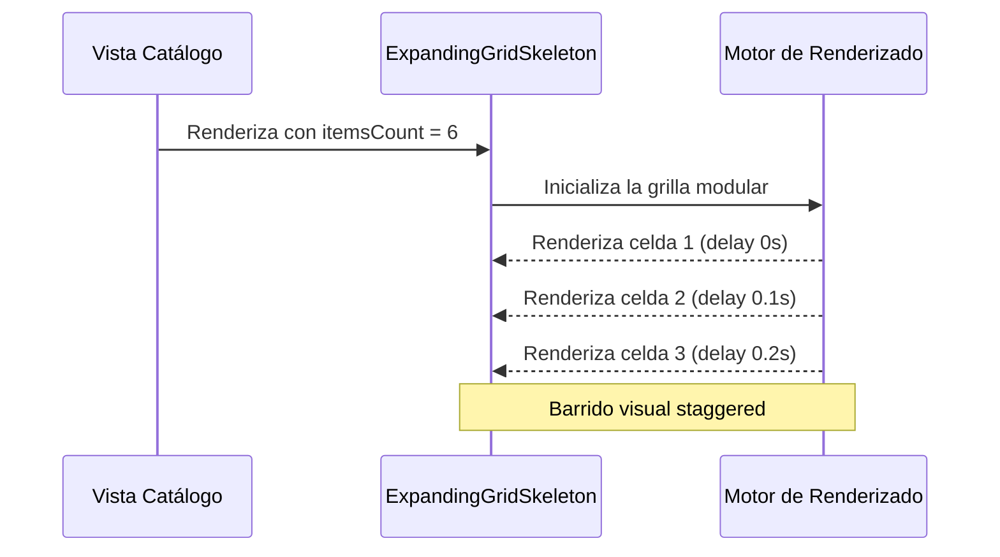

<!--
{
  "resource": "ExpandingGridSkeleton",
  "technicalName": "ExpandingGridSkeleton",
  "targetPath": "src/components/common/ExpandingGridSkeleton.jsx",
  "type": "atom",
  "niches": [],
  "dependencies": {
    "npm": {},
    "internal": []
  }
}
-->

# ExpandingGridSkeleton (Esqueleto de Grid Progresivo)

Sustituto de carga estructurado que dibuja una grilla modular de tarjetas falsas con aparición progresiva y escalonada (staggered delay). Previene movimientos bruscos de desplazamiento acumulativo (CLS) en catálogos y listados asíncronos.

## 1. Propósito y Casos de Uso
- **Catálogos de Ropa/Retail**: Skeleton ideal para simular la cuadrícula de productos de ropa al cargar.
- **Grillas de Muebles y Renders**: Estructuras que mantienen las proporciones de aspecto de las imágenes.
- **Buscador de Insumos/Repuestos**: Carga modular estructurada de repuestos automotrices o agrícolas.

## 2. Especificación Visual y Estilos (Tailwind CSS)
- **Aparición Escalonada**: Cada celda de la grilla tiene un retraso de desvanecimiento (`opacity`) incremental (`0.1s`, `0.2s`, etc.) animado mediante keyframes.
- **Brillo de Pulso**: Pulso de resplandor sutil e interno de opacidades controladas.
- **Responsividad**: Grid autoadaptativo (`grid-cols-1 sm:grid-cols-2 md:grid-cols-3`) que respeta la directiva móvil de PROTOTIPE.

## 3. Código React Completo y Portable

```jsx
import React from 'react';

export default function ExpandingGridSkeleton({
  cols = 3,
  itemsCount = 6,
  className = ''
}) {
  const gridColsClass = cols === 4 
    ? 'grid-cols-1 sm:grid-cols-2 md:grid-cols-3 lg:grid-cols-4' 
    : cols === 2 
    ? 'grid-cols-1 sm:grid-cols-2' 
    : 'grid-cols-1 sm:grid-cols-2 md:grid-cols-3';

  return (
    <div className={`grid gap-4 w-full ${gridColsClass} ${className}`}>
      {Array.from({ length: itemsCount }).map((_, idx) => (
        <div
          key={idx}
          className="p-4 rounded-2xl bg-[var(--color-surface)] border border-[var(--color-border)] flex flex-col gap-3 overflow-hidden relative animate-skeletonFadeIn"
          style={{
            animationDelay: `${idx * 0.1}s`,
            animationFillMode: 'both'
          }}
        >
          {/* Imagen Placeholder */}
          <div className="w-full aspect-[4/3] rounded-xl bg-[var(--color-surface-2)] relative overflow-hidden">
            <div className="absolute inset-0 bg-gradient-to-r from-transparent via-[var(--color-text-muted)]/5 to-transparent animate-shimmer" />
          </div>

          {/* Líneas de Texto Ficticias */}
          <div className="w-3/4 h-3.5 rounded bg-[var(--color-surface-2)] overflow-hidden relative">
            <div className="absolute inset-0 bg-gradient-to-r from-transparent via-[var(--color-text-muted)]/5 to-transparent animate-shimmer" />
          </div>
          <div className="w-1/2 h-3 rounded bg-[var(--color-surface-3)] overflow-hidden relative">
            <div className="absolute inset-0 bg-gradient-to-r from-transparent via-[var(--color-text-muted)]/5 to-transparent animate-shimmer" />
          </div>
        </div>
      ))}

      {/* Estilos CSS Inline para Keyframes */}
      <style dangerouslySetInnerHTML={{__html: `
        @keyframes skeletonFadeIn {
          0% {
            opacity: 0;
            transform: translateY(6px);
          }
          100% {
            opacity: 1;
            transform: translateY(0);
          }
        }
        @keyframes shimmer {
          0% { transform: translateX(-150%); }
          50% { transform: translateX(100%); }
          100% { transform: translateX(150%); }
        }
        .animate-skeletonFadeIn {
          animation: skeletonFadeIn 0.5s ease-out forwards;
        }
        .animate-shimmer {
          animation: shimmer 1.8s infinite ease-in-out;
        }
      `}} />
    </div>
  );
}
```

## 4. Lógica de Estado y Ciclo de Vida
El componente es un cargador autónomo de un solo disparo que se renderiza mientras el estado del padre está en `loading = true`. Utiliza el índice `idx` del mapa para generar una curva de retraso staggered de `transform` y `opacity`, mejorando notablemente la percepción de velocidad de carga.

## 5. Secuencia de Interacción


