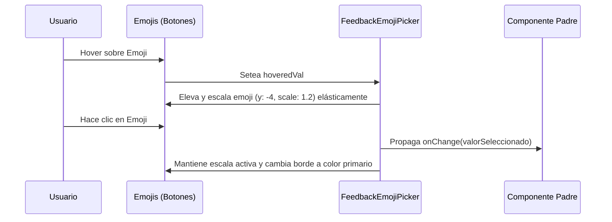

<!--
{
  "resource": "FeedbackEmojiPicker",
  "technicalName": "FeedbackEmojiPicker",
  "targetPath": "src/components/common/FeedbackEmojiPicker.jsx",
  "type": "atom",
  "niches": ["grocery_food", "retail_clothing"],
  "dependencies": {
    "npm": {
      "framer-motion": "^11.0.0"
    },
    "internal": []
  }
}
-->

# Selector de Humor Gestual (FeedbackEmojiPicker)

Componente atómico de valoración interactiva (Rating/Feedback) que presenta una fila de emojis que reaccionan con micro-escalas elásticas (spring) y cambios de color de fondo al ser seleccionados o enfocados.

## 1. Propósito y Casos de Uso
Permite a los usuarios finales calificar la calidad de la atención de una cita de bienestar, el despacho de su pedido a domicilio o la experiencia de compra en el e-commerce de forma sumamente lúdica, ágil e interactiva.

## 2. Especificación Visual y Estilos (Tailwind CSS)
Alineación en cuadrícula horizontal elástica con padding amplio para evitar cortes de sombras y elevaciones. Los emojis seleccionados consumen variables HSL:
- Contenedor Pasivo: `border-[var(--color-border)] bg-[var(--color-surface)] hover:bg-[var(--color-surface-2)]`
- Contenedor Seleccionado: `border-[var(--color-primary)] bg-[var(--color-primary)]/10`
- Emoji Seleccionado: `scale-120 filter-none`

---

## 3. Código React Completo y 100% Funcional

```jsx
import React, { useState } from 'react';
import { motion } from 'framer-motion';

const EMOJIS = [
  { value: 1, char: '😢', label: 'Malo' },
  { value: 2, char: '😕', label: 'Regular' },
  { value: 3, char: '😐', label: 'Aceptable' },
  { value: 4, char: '🙂', label: 'Bueno' },
  { value: 5, char: '😍', label: 'Excelente' }
];

export default function FeedbackEmojiPicker({
  value = 0,
  onChange,
  disabled = false
}) {
  const [hoveredVal, setHoveredVal] = useState(null);

  return (
    <div className={`flex gap-3 justify-center items-center py-4 select-none ${disabled ? 'opacity-40 cursor-not-allowed pointer-events-none' : ''}`}>
      {EMOJIS.map((emoji) => {
        const isSelected = value === emoji.value;
        const isHovered = hoveredVal === emoji.value;

        return (
          <div key={emoji.value} className="flex flex-col items-center gap-1">
            <motion.button
              type="button"
              disabled={disabled}
              onMouseEnter={() => !disabled && setHoveredVal(emoji.value)}
              onMouseLeave={() => !disabled && setHoveredVal(null)}
              onClick={() => onChange && onChange(emoji.value)}
              whileHover={{ scale: 1.2, y: -4 }}
              whileTap={{ scale: 0.9 }}
              transition={{ type: "spring", stiffness: 400, damping: 15 }}
              className={`w-12 h-12 rounded-full flex items-center justify-center text-2xl border transition-all duration-200 outline-none
                ${isSelected 
                  ? 'border-[var(--color-primary)] bg-[var(--color-primary)]/10 shadow-sm shadow-[var(--color-primary)]/10' 
                  : 'border-[var(--color-border)] bg-[var(--color-surface)] hover:border-[var(--color-primary)]/40'
                }
                ${isHovered ? 'shadow-md border-[var(--color-primary)]/50' : ''}
              `}
            >
              <span className={`transition-transform duration-200 ${isSelected ? 'scale-110' : 'opacity-85'}`}>
                {emoji.char}
              </span>
            </motion.button>
            <span className={`text-[10px] font-semibold transition-all duration-200
              ${isSelected ? 'text-[var(--color-primary)] font-bold opacity-100' : 'text-[var(--color-text-muted)] opacity-60'}
            `}>
              {emoji.label}
            </span>
          </div>
        );
      })}
    </div>
  );
}
```

---

## 4. Lógica de Estado y Flujo Operativo


