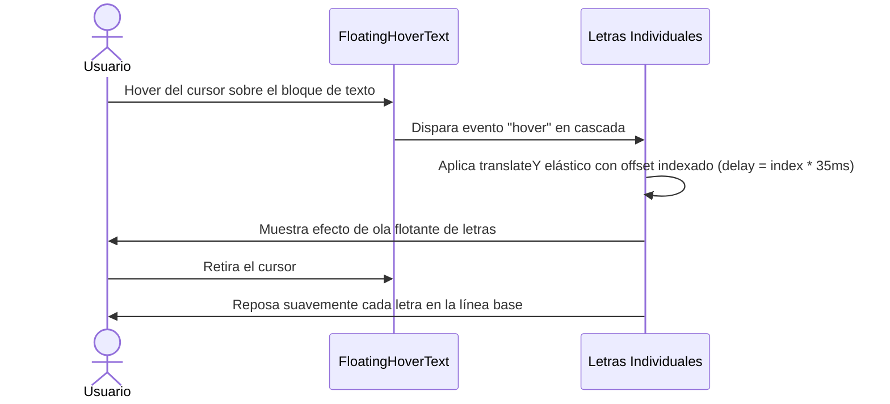

<!--
{
  "resource": "FloatingHoverText",
  "technicalName": "FloatingHoverText",
  "targetPath": "src/components/ui/FloatingHoverText.jsx",
  "type": "atom",
  "dependencies": {
    "npm": {
      "framer-motion": "^11.0.0"
    },
    "internal": []
  }
}
-->

# Texto Dinámico Flotante de Hover (FloatingHoverText)

## 1. Propósito y Casos de Uso
Texto interactivo de alta gama para enlaces o títulos. Al pasar el cursor sobre él, cada letra individual se separa de base, flota en el aire verticalmente y vuelve a caer con un retraso escalonado (staggered delay).

### Casos de Uso Real:
- Enlaces interactivos en el pie de página (footer) de la tienda virtual de la vertical de *Ropa y Retail Tradicional (`retail_clothing`)*.
- Título principal de llamadas a la acción (CTA) en el checkout.

## 2. Especificación Visual y Estilos (Tailwind CSS)
Utiliza inline flexbox con partículas tipográficas individuales animadas en el eje Y.

---

## 3. Código React Completo y 100% Funcional

```jsx
import React from 'react';
import { motion } from 'framer-motion';

export default function FloatingHoverText({
  text = 'PROTOTIPE',
  className = '',
  bounceHeight = -6,
  stiffness = 300,
  damping = 10,
  letterSpacing = '0.04em'
}) {
  // Dividir el string en caracteres individuales
  const characters = text.split('');

  const containerVariants = {
    initial: {},
    hover: {}
  };

  const letterVariants = {
    initial: { y: 0 },
    hover: (i) => ({
      y: [0, bounceHeight, 0],
      transition: {
        type: 'spring',
        stiffness: stiffness,
        damping: damping,
        delay: i * 0.035, // Staggered delay secuencial
      }
    })
  };

  return (
    <motion.span
      variants={containerVariants}
      initial="initial"
      whileHover="hover"
      style={{ letterSpacing }}
      className={`inline-flex items-center cursor-default select-none ${className}`}
    >
      {characters.map((char, index) => (
        <motion.span
          key={index}
          custom={index}
          variants={letterVariants}
          className="inline-block"
        >
          {char === ' ' ? '\u00A0' : char}
        </motion.span>
      ))}
    </motion.span>
  );
}
```

---

## 4. Flujo Operativo y Secuencia de Interacción


