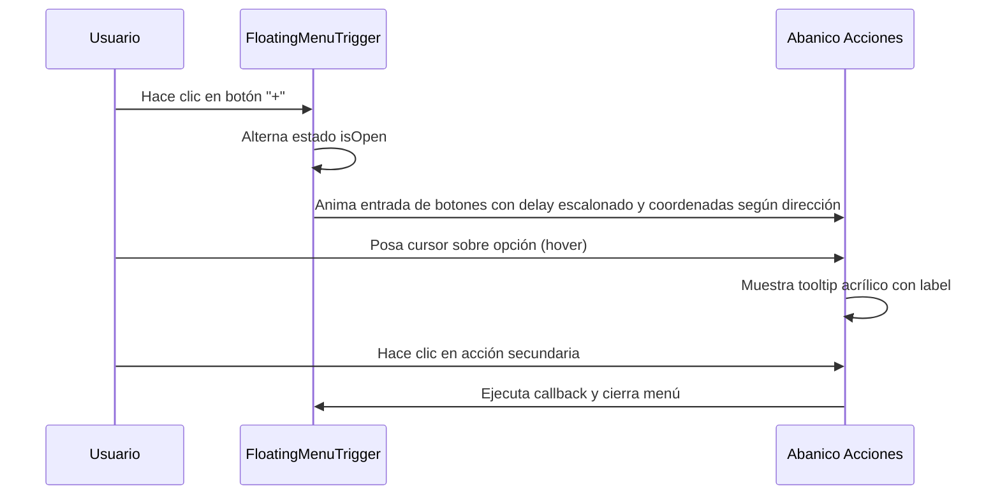

<!--
{
  "resource": "FloatingMenuTrigger",
  "technicalName": "FloatingMenuTrigger",
  "targetPath": "src/components/ui/FloatingMenuTrigger.jsx",
  "type": "atom",
  "niches": ["wellness_podology", "retail_clothing"],
  "dependencies": {
    "npm": {
      "framer-motion": "^11.0.0",
      "lucide-react": "^0.300.0"
    },
    "internal": []
  }
}
-->

# Trigger de Menú Flotante (FloatingMenuTrigger)

Componente atómico de navegación contextual flotante que despliega en abanico, radial o líneas verticales múltiples micro-acciones con efectos de retraso staggered, tooltips acrílicos y difuminado de fondo.

## 1. Propósito y Casos de Uso
Permite a los usuarios acceder rápidamente a acciones comunes (ej: "Llamar por WhatsApp", "Ver Horarios", "Compartir Catálogo") desde cualquier parte de la pantalla móvil sin ocupar espacio visual estático persistente. Soporta múltiples direcciones espaciales para adaptarse a cualquier esquina de la UI.

## 2. Especificación Visual y Estilos (Tailwind CSS)
- **Capa Acrílica:** Tooltips en `bg-zinc-950/85 border border-white/10 backdrop-blur-md text-white`.
- **Trigger Principal:** `bg-[var(--color-primary)] shadow-lg shadow-[var(--color-primary)]/20` con rotación spring en el icono de suma.
- **Acciones Secundarias:** Botones de círculo de vidrio con efectos hover y escalado elástico.

---

## 3. Código React Completo y 100% Funcional

```jsx
import React, { useState } from 'react';
import { motion, AnimatePresence } from 'framer-motion';
import { MessageSquare, Calendar, Share2, Plus, X } from 'lucide-react';

export default function FloatingMenuTrigger({
  actions = [],
  disabled = false,
  direction = 'up' // up, down, left, right, radial
}) {
  const [isOpen, setIsOpen] = useState(false);
  const [hoveredIdx, setHoveredIdx] = useState(null);

  const toggleMenu = () => {
    if (disabled) return;
    setIsOpen(!isOpen);
  };

  const getContainerClass = (dir) => {
    switch (dir) {
      case 'down':
        return 'absolute top-16 flex flex-col gap-2.5 items-center z-50';
      case 'left':
        return 'absolute right-16 flex flex-row gap-2.5 items-center z-50';
      case 'right':
        return 'absolute left-16 flex flex-row gap-2.5 items-center z-50';
      case 'radial':
        return 'absolute inset-0 flex items-center justify-center z-50 pointer-events-none';
      case 'up':
      default:
        return 'absolute bottom-16 flex flex-col gap-2.5 items-center z-50';
    }
  };

  const getRadialCoords = (idx, total) => {
    const radius = 80;
    // Arco de 120 grados centrado hacia arriba (de 30° a 150°)
    const startAngle = 30;
    const endAngle = 150;
    const angleRange = endAngle - startAngle;
    const angleStep = total > 1 ? angleRange / (total - 1) : 0;
    const angleDegrees = startAngle + idx * angleStep;
    const angleRadians = (angleDegrees * Math.PI) / 180;
    
    return {
      x: radius * Math.cos(angleRadians),
      y: -radius * Math.sin(angleRadians)
    };
  };

  const getAnimationProps = (dir, idx, total) => {
    if (dir === 'radial') {
      const coords = getRadialCoords(idx, total);
      return {
        initial: { scale: 0.6, x: 0, y: 0, opacity: 0 },
        animate: { scale: 1, x: coords.x, y: coords.y, opacity: 1 },
        exit: { scale: 0.6, x: 0, y: 0, opacity: 0 }
      };
    }
    
    let initialOffset = { x: 0, y: 15 };
    if (dir === 'down') initialOffset = { x: 0, y: -15 };
    if (dir === 'left') initialOffset = { x: 15, y: 0 };
    if (dir === 'right') initialOffset = { x: -15, y: 0 };
    
    return {
      initial: { scale: 0.6, opacity: 0, ...initialOffset },
      animate: { scale: 1, opacity: 1, x: 0, y: 0 },
      exit: { scale: 0.6, opacity: 0, ...initialOffset }
    };
  };

  return (
    <div className="relative flex flex-col items-center justify-center">
      <AnimatePresence>
        {isOpen && (
          <div className={getContainerClass(direction)}>
            {actions.map((act, idx) => {
              const animProps = getAnimationProps(direction, idx, actions.length);
              return (
                <motion.button
                  key={idx}
                  initial={animProps.initial}
                  animate={animProps.animate}
                  exit={animProps.exit}
                  transition={{
                    type: "spring",
                    stiffness: 380,
                    damping: 20,
                    delay: idx * 0.04
                  }}
                  onMouseEnter={() => setHoveredIdx(idx)}
                  onMouseLeave={() => setHoveredIdx(null)}
                  onClick={() => {
                    if (act.onClick) act.onClick();
                    setIsOpen(false);
                    setHoveredIdx(null);
                  }}
                  className="w-10 h-10 rounded-full flex items-center justify-center bg-[var(--color-surface)] text-[var(--color-text)] border border-[var(--color-border)] shadow-lg hover:border-[var(--color-primary)] hover:shadow-[var(--color-primary)]/10 transition-colors outline-none cursor-pointer pointer-events-auto relative group"
                  title={act.label}
                >
                  <span className="text-sm transition-transform duration-200 group-hover:scale-110">{act.icon}</span>
                  
                  {/* Tooltip Acrílico Premium */}
                  <AnimatePresence>
                    {hoveredIdx === idx && (
                      <motion.div
                        initial={{ opacity: 0, y: 4, scale: 0.95 }}
                        animate={{ opacity: 1, y: 0, scale: 1 }}
                        exit={{ opacity: 0, y: 4, scale: 0.95 }}
                        className="absolute bottom-full mb-2.5 left-1/2 -translate-x-1/2 whitespace-nowrap bg-zinc-950/85 text-[var(--color-text)] text-[9px] font-black uppercase tracking-wider px-2.5 py-1 rounded-lg border border-white/10 backdrop-blur-md shadow-xl pointer-events-none z-50"
                      >
                        {act.label}
                      </motion.div>
                    )}
                  </AnimatePresence>
                </motion.button>
              );
            })}
          </div>
        )}
      </AnimatePresence>

      <motion.button
        onClick={toggleMenu}
        disabled={disabled}
        whileTap={{ scale: 0.92 }}
        className="w-12 h-12 rounded-full flex items-center justify-center bg-[var(--color-primary)] !text-[var(--color-text)] shadow-lg shadow-[var(--color-primary)]/25 outline-none disabled:opacity-50 disabled:cursor-not-allowed z-50 cursor-pointer hover:opacity-95"
      >
        <motion.span
          animate={{ rotate: isOpen ? 135 : 0 }}
          transition={{ type: "spring", stiffness: 350, damping: 20 }}
          className="text-xl font-bold block"
        >
          <Plus size={20} />
        </motion.span>
      </motion.button>
    </div>
  );
}
```

---

## 4. Lógica de Estado y Flujo Operativo


