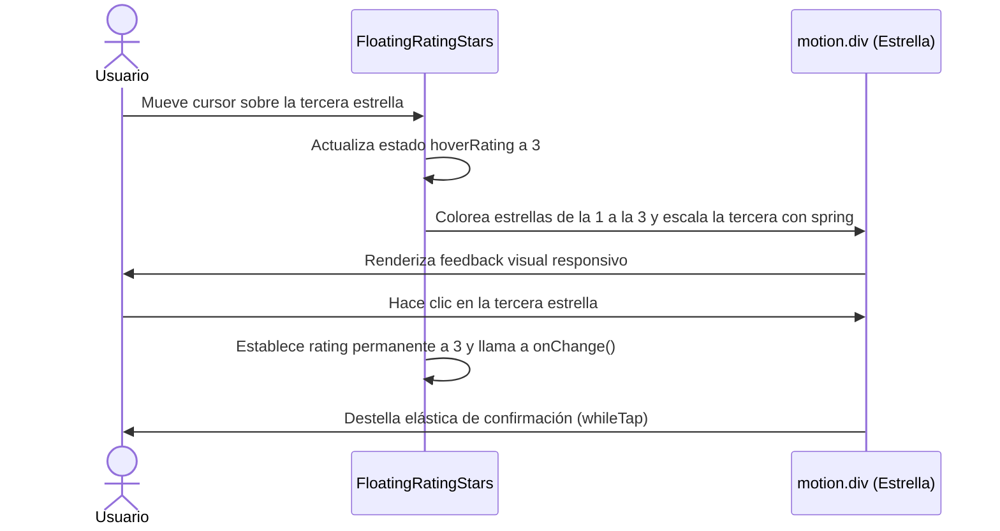

<!--
{
  "resource": "FloatingRatingStars",
  "technicalName": "FloatingRatingStars",
  "targetPath": "src/components/ui/FloatingRatingStars.jsx",
  "type": "atom",
  "dependencies": {
    "npm": {
      "framer-motion": "^11.0.0"
    },
    "internal": []
  }
}
-->

# Efecto de Estrellas de Calificación Flotantes (FloatingRatingStars)

## 1. Propósito y Casos de Uso
Selector de puntuación de 5 estrellas de alta interacción. Al hacer hover, cada estrella rota levemente y emite una micro-escala elástica de spring, coloreando las estrellas anteriores en cascada con respuesta táctil.

### Casos de Uso Real:
- Captura de satisfacción del cliente post-servicio en la vertical de *Estética, Podología y Bienestar (`wellness_podology`)*.
- Calificación de calidad de platillos o postres en el checkout de la vertical de *Alimentos Artesanales y Repostería (`alimentos-artesanales`)*.

## 2. Especificación Visual y Estilos (Tailwind CSS)
Utiliza flexbox con espaciado de seguridad y transiciones de color de trazo y relleno SVG.

---

## 3. Código React Completo y 100% Funcional

```jsx
import React, { useState } from 'react';
import { motion } from 'framer-motion';

export default function FloatingRatingStars({
  maxRating = 5,
  initialRating = 0,
  onChange,
  activeColor = '#eab308', // Yellow-500 default
  inactiveColor = 'var(--color-surface-3)',
  size = 28
}) {
  const [rating, setRating] = useState(initialRating);
  const [hoverRating, setHoverRating] = useState(0);

  const handleSelect = (val) => {
    setRating(val);
    if (onChange) onChange(val);
  };

  return (
    <div className="flex gap-2 items-center justify-center select-none">
      {Array.from({ length: maxRating }).map((_, index) => {
        const starValue = index + 1;
        const isActive = starValue <= (hoverRating || rating);

        return (
          <motion.div
            key={index}
            onClick={() => handleSelect(starValue)}
            onMouseEnter={() => setHoverRating(starValue)}
            onMouseLeave={() => setHoverRating(0)}
            whileHover={{ scale: 1.25, rotate: 12 }}
            whileTap={{ scale: 0.9 }}
            transition={{ type: 'spring', stiffness: 400, damping: 15 }}
            className="cursor-pointer p-1"
          >
            {/* Estrella Vectorial SVG Premium */}
            <svg
              width={size}
              height={size}
              viewBox="0 0 24 24"
              fill={isActive ? activeColor : 'none'}
              stroke={isActive ? activeColor : 'var(--color-text)'}
              strokeWidth="2"
              strokeLinecap="round"
              strokeLinejoin="round"
              className="transition-colors duration-300"
            >
              <polygon points="12 2 15.09 8.26 22 9.27 17 14.14 18.18 21.02 12 17.77 5.82 21.02 7 14.14 2 9.27 8.91 8.26 12 2" />
            </svg>
          </motion.div>
        );
      })}
    </div>
  );
}
```

---

## 4. Flujo Operativo y Secuencia de Interacción


