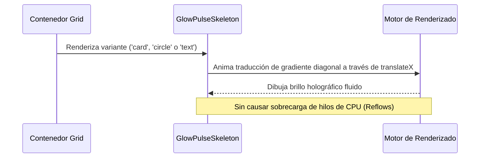

<!--
{
  "resource": "GlowPulseSkeleton",
  "technicalName": "GlowPulseSkeleton",
  "targetPath": "src/components/common/GlowPulseSkeleton.jsx",
  "type": "atom",
  "niches": [],
  "dependencies": {
    "npm": {},
    "internal": []
  }
}
-->

# GlowPulseSkeleton (Esqueleto con Pulso de Resplandor)

Componente de carga esqueleto con un pulso de gradiente holográfico suavizado en diagonal. Diseñado para representar cargas de elementos complejos como tarjetas de producto, listas o perfiles con una fluidez visual superior a las barras estáticas tradicionales.

## 1. Propósito y Casos de Uso
- **Placeholder para imágenes y tarjetas**: Representa la carga asíncrona de recursos multimedia pesados.
- **Sección de perfil de usuario**: Simula la estructura del perfil mientras se obtienen los datos de Firestore.
- **Listas de facturación/pedidos**: Skeletons que coinciden exactamente con la altura física de las filas para prevenir saltos acumulativos de diseño (CLS).

## 2. Especificación Visual y Estilos (Tailwind CSS)
- **Gradiente Diagonal**: Usa un barrido diagonal de brillo (`shimmerDiagonal`) combinando opacidades controladas de `var(--color-surface-3)`.
- **Efecto Holográfico**: El barrido simula un brillo tridimensional traslúcido.
- **Formas Modulares**: Soporta formas circulares (`rounded-full`), rectangulares redondeadas (`rounded-xl`) e inputs ficticios.

## 3. Código React Completo y Portable

```jsx
import React from 'react';

export default function GlowPulseSkeleton({
  variant = 'card', // 'card', 'circle', 'text'
  className = ''
}) {
  return (
    <div className={`relative overflow-hidden bg-[var(--color-surface-3)] ${className}`}>
      {/* Brillo de barrido diagonal */}
      <div 
        className="absolute inset-0 bg-gradient-to-r from-transparent via-[var(--color-text-muted)]/10 to-transparent will-change-transform"
        style={{
          animation: 'shimmerDiagonal 1.8s infinite ease-in-out',
          backgroundSize: '200% 100%'
        }}
      />

      {/* Estructuras visuales según variante */}
      {variant === 'card' && (
        <div className="flex flex-col gap-3 p-4 opacity-0 pointer-events-none">
          <div className="w-full h-32 bg-transparent" />
          <div className="w-2/3 h-4 bg-transparent" />
          <div className="w-1/2 h-3 bg-transparent" />
        </div>
      )}

      {variant === 'circle' && (
        <div className="w-16 h-16 rounded-full opacity-0 pointer-events-none" />
      )}

      {variant === 'text' && (
        <div className="w-full h-4 opacity-0 pointer-events-none" />
      )}

      {/* Estilos CSS Inline para Keyframes */}
      <style dangerouslySetInnerHTML={{__html: `
        @keyframes shimmerDiagonal {
          0% {
            transform: translateX(-150%);
          }
          50% {
            transform: translateX(100%);
          }
          100% {
            transform: translateX(150%);
          }
        }
      `}} />
    </div>
  );
}
```

## 4. Lógica de Estado y Ciclo de Vida
El componente utiliza layouts invisibles (`opacity-0 pointer-events-none`) que coinciden exactamente con la variante elegida para que el contenedor de esqueleto se dimensione de forma natural por CSS (previniendo CLS). La animación diagonal corre de manera autónoma en GPU.

## 5. Secuencia de Interacción


