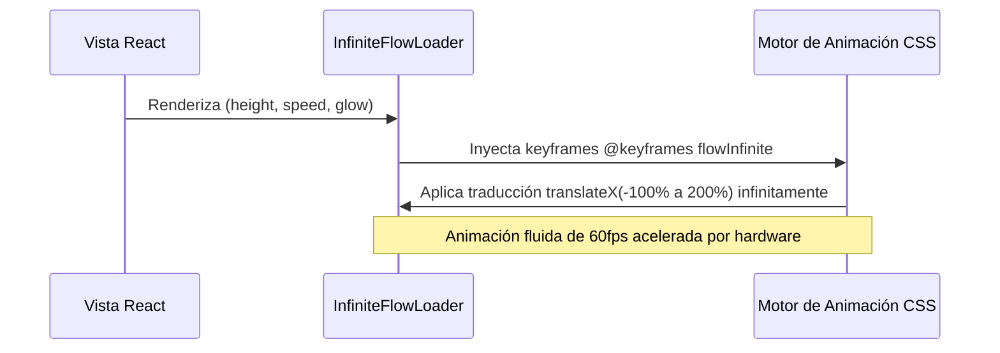

<!--
{
  "resource": "InfiniteFlowLoader",
  "technicalName": "InfiniteFlowLoader",
  "targetPath": "src/components/common/InfiniteFlowLoader.jsx",
  "type": "atom",
  "niches": [],
  "dependencies": {
    "npm": {},
    "internal": []
  }
}
-->

# InfiniteFlowLoader (Barra de Carga de Flujo Infinito)

Barra de carga lineal infinitamente deslizable con gradientes HSL fluidos, destellos perimetrales y transiciones suavizadas por hardware. Diseñada como indicador de carga premium para transiciones de página o peticiones asíncronas de fondo.

## 1. Propósito y Casos de Uso
- **Peticiones asíncronas en segundo plano**: Ideal para mostrar actividad asíncrona de fondo sin bloquear toda la interfaz.
- **Onboarding de marca**: Barra de transición al cargar configuraciones y marcas.
- **Acciones prolongadas**: Indicador visual para subidas de archivos o ejecuciones de scripts de base de datos.

## 2. Especificación Visual y Estilos (Tailwind CSS)
- **Gradiente Dinámico**: Emplea una combinación de gradiente con `bg-[var(--color-primary)]` y un destello traslúcido para dar una sensación de fluidez extrema.
- **Efecto de Destello (Shimmer glow)**: Sombra perimetral difusa mediante `shadow-[0_0_8px_var(--color-primary)]`.
- **Aceleración por GPU**: Uso de transiciones `will-change-transform` para animaciones ultra-fluidas de 60fps.

## 3. Código React Completo y Portable

```jsx
import React from 'react';

export default function InfiniteFlowLoader({
  height = 'h-1.5',
  speed = 'duration-1000',
  glow = true,
  className = ''
}) {
  return (
    <div className={`relative w-full overflow-hidden bg-[var(--color-surface-3)] rounded-full ${height} ${className}`}>
      {/* Línea de fondo activa */}
      <div 
        className={`absolute inset-y-0 left-0 w-1/2 rounded-full bg-gradient-to-r from-transparent via-[var(--color-primary)] to-transparent will-change-transform animate-shimmer`}
        style={{
          animation: `flowInfinite 1.6s infinite linear`
        }}
      />
      
      {/* Sombra de glow difusa opcional */}
      {glow && (
        <div 
          className="absolute inset-y-0 left-0 w-1/2 opacity-30 blur-sm bg-[var(--color-primary)]"
          style={{
            animation: `flowInfinite 1.6s infinite linear`
          }}
        />
      )}

      {/* Estilos CSS Inline para Keyframes */}
      <style dangerouslySetInnerHTML={{__html: `
        @keyframes flowInfinite {
          0% {
            transform: translateX(-100%);
          }
          100% {
            transform: translateX(200%);
          }
        }
      `}} />
    </div>
  );
}
```

## 4. Lógica de Estado y Ciclo de Vida
El componente es puramente presentacional y autocontenido. Utiliza una animación CSS declarada mediante estilos inline seguros (`dangerouslySetInnerHTML`) para inyectar los keyframes de traslación (`flowInfinite`), lo que garantiza su independencia de hojas de estilo externas o configuraciones rígidas de Tailwind.

## 5. Secuencia de Interacción


