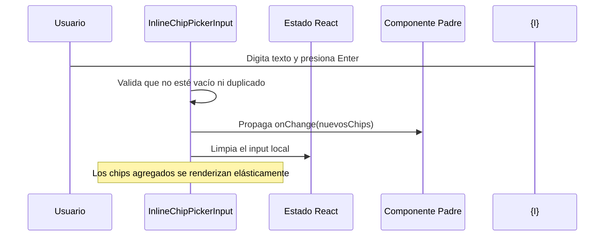

<!--
{
  "resource": "InlineChipPickerInput",
  "technicalName": "InlineChipPickerInput",
  "targetPath": "src/components/common/InlineChipPickerInput.jsx",
  "type": "atom",
  "niches": ["alimentos-artesanales", "retail_clothing"],
  "dependencies": {
    "npm": {
      "framer-motion": "^11.0.0"
    },
    "internal": []
  }
}
-->

# Input de Selección de Chip Integrado (InlineChipPickerInput)

Componente atómico de formulario que permite al usuario escribir texto libre y agruparlo en chips o etiquetas autocompletadas en línea al presionar Enter, Coma o Espacio.

## 1. Propósito y Casos de Uso
Permite capturar múltiples elementos de forma compacta y visual, como ingredientes extra, alérgenos en pastelería artesanal (*Alimentos Artesanales*) o atributos de estilo y colores en una prenda de vestir (*Retail y Confección*).

## 2. Especificación Visual y Estilos (Tailwind CSS)
Diseño de caja flexible con envoltura responsiva (`flex flex-wrap gap-1.5`). Chips animados individualmente con efectos de rebote (spring). Consume variables:
- Chips: `bg-[var(--color-primary)]/10 text-[var(--color-primary)] border border-[var(--color-primary)]/20`
- Contenedor Input: `bg-[var(--color-surface)] border-[var(--color-border)] focus-within:border-[var(--color-primary)]`

---

## 3. Código React Completo y 100% Funcional

```jsx
import React, { useState } from 'react';
import { motion, AnimatePresence } from 'framer-motion';

export default function InlineChipPickerInput({
  chips = [],
  onChange,
  placeholder = 'Añadir elemento...',
  disabled = false
}) {
  const [inputValue, setInputValue] = useState('');

  const handleKeyDown = (e) => {
    if (disabled) return;
    
    if (e.key === 'Enter' || e.key === ',' || e.key === ' ') {
      e.preventDefault();
      const val = inputValue.trim().replace(/,/g, '');
      if (val && !chips.includes(val)) {
        const newChips = [...chips, val];
        if (onChange) onChange(newChips);
        setInputValue('');
      }
    } else if (e.key === 'Backspace' && !inputValue && chips.length > 0) {
      // Eliminar el último chip si el input está vacío
      const newChips = chips.slice(0, -1);
      if (onChange) onChange(newChips);
    }
  };

  const removeChip = (indexToRemove) => {
    if (disabled) return;
    const newChips = chips.filter((_, idx) => idx !== indexToRemove);
    if (onChange) onChange(newChips);
  };

  return (
    <div className={`flex flex-wrap gap-1.5 items-center w-full border border-[var(--color-border)] rounded-xl bg-[var(--color-surface)] p-2 transition-all duration-200 focus-within:border-[var(--color-primary)] focus-within:ring-4 focus-within:ring-[var(--color-primary)]/15
      ${disabled ? 'opacity-50 cursor-not-allowed bg-[var(--color-surface-3)]/30' : ''}
    `}>
      <AnimatePresence>
        {chips.map((chip, index) => (
          <motion.div
            key={chip}
            initial={{ scale: 0.7, opacity: 0 }}
            animate={{ scale: 1, opacity: 1 }}
            exit={{ scale: 0.8, opacity: 0 }}
            transition={{ type: "spring", stiffness: 450, damping: 22 }}
            className="flex items-center gap-1 px-2.5 py-1 rounded-lg bg-[var(--color-primary)]/10 text-[var(--color-primary)] border border-[var(--color-primary)]/20 text-xs font-semibold select-none"
          >
            <span>{chip}</span>
            <button
              type="button"
              onClick={() => removeChip(index)}
              disabled={disabled}
              className="hover:bg-[var(--color-primary)]/20 rounded-full p-0.5 transition-colors text-[var(--color-primary)] font-bold outline-none"
            >
              &times;
            </button>
          </motion.div>
        ))}
      </AnimatePresence>
      <input
        type="text"
        value={inputValue}
        onChange={(e) => setInputValue(e.target.value)}
        onKeyDown={handleKeyDown}
        disabled={disabled}
        placeholder={chips.length === 0 ? placeholder : ''}
        className="flex-grow bg-transparent text-sm text-[var(--color-text)] outline-none px-2 py-1 placeholder-[var(--color-text-muted)]/50 min-w-[120px]"
      />
    </div>
  );
}
```

---

## 4. Lógica de Estado y Flujo Operativo


