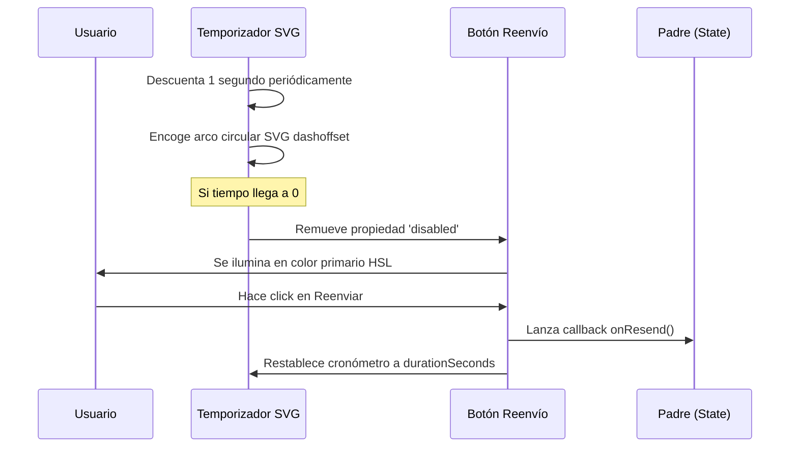

<!--
{
  "technicalName": "InteractiveOtpTimer",
  "targetPath": "src/components/ui/InteractiveOtpTimer.jsx",
  "dependencies": {
    "npm": {
      "framer-motion": "^11.0.0",
      "lucide-react": "^0.300.0"
    },
    "internal": []
  },
  "type": "atom",
  "niches": []
}
-->

# InteractiveOtpTimer — Cronómetro Regresivo de Reenvío OTP

## 1. Propósito y Casos de Uso
El `InteractiveOtpTimer` es un cronómetro circular regresivo que se integra en pantallas de verificación y registro telefónico (OTP) a través de SMS o WhatsApp. Su propósito es regular el reenvío de códigos de seguridad controlando que no se sature el canal de mensajes mediante un bloqueo visual temporal.

## 2. Especificación Visual y Estilos
- **Progreso Circular SVG:** Trazo elástico basado en el porcentaje de tiempo restante calculado en base al perímetro circular.
- **Micro-Animaciones:** Transición suave de la propiedad `strokeDashoffset` combinada con un botón elástico reactivo.

## 3. Código React Completo y 100% Funcional

```jsx
import React, { useState, useEffect } from 'react';
import { motion } from 'framer-motion';
import { RotateCcw } from 'lucide-react';

export default function InteractiveOtpTimer({
  durationSeconds = 60,
  onResend,
  className = ''
}) {
  const [timeLeft, setTimeLeft] = useState(durationSeconds);
  const [isActive, setIsActive] = useState(true);

  // SVG Config
  const radius = 22;
  const strokeWidth = 3;
  const circumference = 2 * Math.PI * radius;
  const strokeDashoffset = circumference - (timeLeft / durationSeconds) * circumference;

  useEffect(() => {
    if (!isActive || timeLeft <= 0) {
      if (timeLeft <= 0) setIsActive(false);
      return;
    }

    const interval = setInterval(() => {
      setTimeLeft((prev) => prev - 1);
    }, 1000);

    return () => clearInterval(interval);
  }, [timeLeft, isActive]);

  const handleResendClick = () => {
    if (timeLeft > 0) return;
    setTimeLeft(durationSeconds);
    setIsActive(true);
    if (onResend) {
      onResend();
    }
  };

  const formatTime = (secs) => {
    const m = Math.floor(secs / 60).toString().padStart(2, '0');
    const s = (secs % 60).toString().padStart(2, '0');
    return `${m}:${s}`;
  };

  return (
    <div className={`flex flex-col items-center p-4 bg-[var(--color-surface-2)] border border-[var(--color-border)] rounded-2xl w-48 text-center ${className}`}>
      {/* Indicador Circular SVG */}
      <div className="relative w-16 h-16 flex items-center justify-center">
        <svg className="w-full h-full transform -rotate-90">
          {/* Anillo de Fondo */}
          <circle
            cx="32"
            cy="32"
            r={radius}
            stroke="var(--color-border)"
            strokeWidth={strokeWidth}
            fill="transparent"
          />
          {/* Anillo de Progreso Activo */}
          <motion.circle
            cx="32"
            cy="32"
            r={radius}
            stroke="var(--color-primary)"
            strokeWidth={strokeWidth}
            fill="transparent"
            strokeDasharray={circumference}
            animate={{ strokeDashoffset }}
            transition={{ duration: 0.9, ease: 'linear' }}
          />
        </svg>
        <span className="absolute text-xs font-mono font-extrabold text-[var(--color-text)]">
          {formatTime(timeLeft)}
        </span>
      </div>

      {/* Botón de Reenvío */}
      <button
        type="button"
        disabled={timeLeft > 0}
        onClick={handleResendClick}
        className={`mt-4 w-full py-2 px-3 rounded-xl text-[10px] font-extrabold uppercase tracking-wider flex items-center justify-center space-x-1.5 border transition-all duration-300 ${
          timeLeft > 0
            ? 'bg-[var(--color-surface-3)] text-[var(--color-text-muted)]/50 border-[var(--color-border)] cursor-not-allowed'
            : 'bg-[var(--color-primary)] text-[var(--color-text)] border-[var(--color-primary)] hover:bg-[var(--color-primary)]/90 shadow-sm hover:scale-[1.02]'
        }`}
      >
        <RotateCcw className="w-3.5 h-3.5" />
        <span>Reenviar</span>
      </button>
    </div>
  );
}
```

## 4. Lógica de Estado y Ciclo de Vida
Inicializa un temporizador nativo `setInterval` que reduce el contador de segundos restantes en el estado local `timeLeft`. Controla la destrucción segura de la suscripción al temporizador cuando el componente se desmonta o cuando la cuenta regresiva llega a cero.

## 5. Flujo Operativo y Secuencia de Interacción


