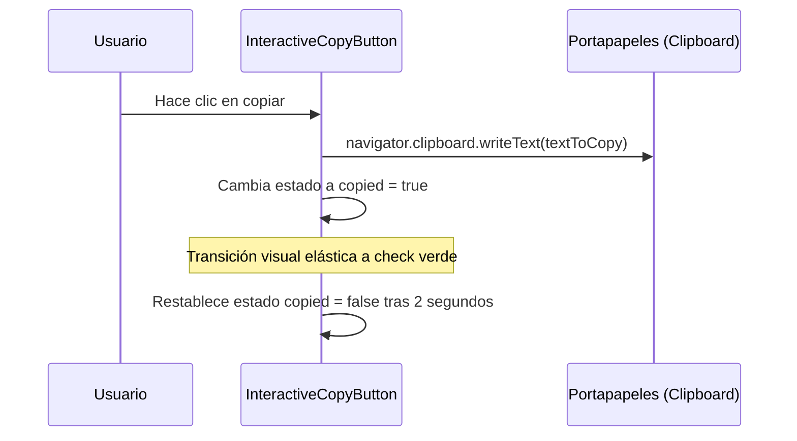

<!--
{
  "resource": "InteractiveCopyButton",
  "technicalName": "InteractiveCopyButton",
  "targetPath": "src/components/common/InteractiveCopyButton.jsx",
  "type": "atom",
  "niches": ["grocery_food", "retail_clothing"],
  "dependencies": {
    "npm": {
      "framer-motion": "^11.0.0"
    },
    "internal": []
  }
}
-->

# Botón de Copiado Interactivo (InteractiveCopyButton)

Componente atómico utilitario que ejecuta el copiado de texto al portapapeles y cambia de forma dinámica su iconografía y estado de color con micro-animaciones elásticas para confirmar el éxito de la operación.

## 1. Propósito y Casos de Uso
Permite copiar de manera rápida códigos de seguimiento de envíos, identificadores de facturas o cupones de descuento promocionales, brindando una confirmación visual clara en lugar del comportamiento estático tradicional.

## 2. Especificación Visual y Estilos (Tailwind CSS)
Utiliza transiciones de color de borde y relleno basadas en el éxito del copiado. Consume variables HSL:
- Contenedor Pasivo: `bg-[var(--color-surface)] border-[var(--color-border)] hover:border-[var(--color-primary)]`
- Contenedor Éxito: `bg-green-500/10 border-green-500 text-green-500`

---

## 3. Código React Completo y 100% Funcional

```jsx
import React, { useState } from 'react';
import { motion, AnimatePresence } from 'framer-motion';

export default function InteractiveCopyButton({
  textToCopy = '',
  label = 'Copiar',
  successLabel = 'Copiado',
  disabled = false,
  className = ''
}) {
  const [copied, setCopied] = useState(false);

  const handleCopy = async () => {
    if (disabled || !textToCopy) return;

    try {
      await navigator.clipboard.writeText(textToCopy);
      setCopied(true);
      setTimeout(() => setCopied(false), 2000); // Volver al estado pasivo en 2s
    } catch (err) {
      console.error('Fallo al copiar:', err);
    }
  };

  return (
    <motion.button
      type="button"
      onClick={handleCopy}
      disabled={disabled || !textToCopy}
      whileTap={{ scale: 0.96 }}
      className={`flex items-center justify-center gap-1.5 px-3 py-1.5 rounded-lg border text-xs font-semibold select-none outline-none transition-all duration-300
        ${copied 
          ? 'bg-green-500/15 border-green-500 text-green-500 ring-2 ring-green-500/10' 
          : 'bg-[var(--color-surface)] border-[var(--color-border)] text-[var(--color-text)] hover:border-[var(--color-primary)]/60'
        }
        ${disabled ? 'opacity-40 cursor-not-allowed pointer-events-none' : ''}
        ${className}
      `}
    >
      <AnimatePresence mode="wait" initial={false}>
        <motion.span
          key={copied ? 'success' : 'passive'}
          initial={{ y: 5, opacity: 0 }}
          animate={{ y: 0, opacity: 1 }}
          exit={{ y: -5, opacity: 0 }}
          transition={{ duration: 0.15 }}
          className="flex items-center gap-1"
        >
          {copied ? (
            <>
              <svg className="w-3.5 h-3.5 fill-current" viewBox="0 0 20 20">
                <path d="M16.707 5.293a1 1 0 010 1.414l-8 8a1 1 0 01-1.414 0l-4-4a1 1 0 011.414-1.414L8 12.586l7.293-7.293a1 1 0 011.414 0z" />
              </svg>
              <span>{successLabel}</span>
            </>
          ) : (
            <>
              <svg className="w-3.5 h-3.5 fill-current opacity-70" viewBox="0 0 24 24">
                <path d="M16 1H4c-1.1 0-2 .9-2 2v14h2V3h12V1zm3 4H8c-1.1 0-2 .9-2 2v14c0 1.1.9 2 2 2h11c1.1 0 2-.9 2-2V7c0-1.1-.9-2-2-2zm0 16H8V7h11v14z" />
              </svg>
              <span>{label}</span>
            </>
          )}
        </motion.span>
      </AnimatePresence>
    </motion.button>
  );
}
```

---

## 4. Lógica de Estado y Flujo Operativo


