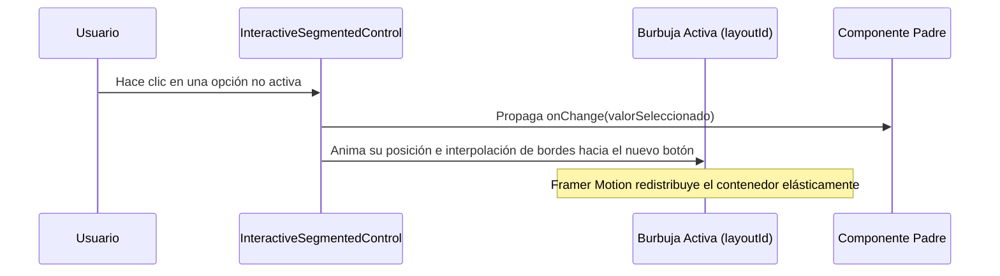

<!--
{
  "resource": "InteractiveSegmentedControl",
  "technicalName": "InteractiveSegmentedControl",
  "targetPath": "src/components/common/InteractiveSegmentedControl.jsx",
  "type": "atom",
  "niches": ["grocery_food", "retail_clothing"],
  "dependencies": {
    "npm": {
      "framer-motion": "^11.0.0"
    },
    "internal": []
  }
}
-->

# Control Segmentado Interactivo (InteractiveSegmentedControl)

Componente atómico de navegación local (Tabs/Filtros rápidos) que desplaza suave y elásticamente una burbuja o fondo activo detrás de la opción seleccionada usando `layoutId` para animaciones compartidas.

## 1. Propósito y Casos de Uso
Permite cambiar vistas o subcategorías en catálogos y paneles de administración de forma táctil y sumamente profesional (ej: alternar entre "Hoy / Semana / Mes" en paneles de reportes o "Grid / Lista" en visualización de productos).

## 2. Especificación Visual y Estilos (Tailwind CSS)
Utiliza un contenedor semi-traslúcido y botones flotantes. El fondo elástico consumirá variables HSL:
- Contenedor base: `bg-[var(--color-surface-2)] border border-[var(--color-border)] rounded-xl`
- Fondo deslizable activo: `bg-[var(--color-surface)] shadow-sm`
- Texto seleccionado: `text-[var(--color-primary)] font-bold`

---

## 3. Código React Completo y 100% Funcional

```jsx
import React from 'react';
import { motion } from 'framer-motion';

export default function InteractiveSegmentedControl({
  options = [],
  selectedValue,
  onChange,
  disabled = false
}) {
  return (
    <div className={`relative flex items-center p-1 rounded-xl bg-[var(--color-surface-2)] border border-[var(--color-border)] select-none
      ${disabled ? 'opacity-40 cursor-not-allowed pointer-events-none' : ''}
    `}>
      {options.map((opt) => {
        const isActive = opt.value === selectedValue;
        return (
          <button
            key={opt.value}
            type="button"
            disabled={disabled}
            onClick={() => onChange && onChange(opt.value)}
            className="relative flex-1 py-1.5 px-3 text-xs font-semibold text-center text-[var(--color-text-muted)] hover:text-[var(--color-text)] transition-colors outline-none"
          >
            {/* Burbuja de fondo activo animada con layoutId */}
            {isActive && (
              <motion.div
                layoutId="activeSegmentBubble"
                className="absolute inset-0 rounded-lg bg-[var(--color-surface)] border border-[var(--color-border)] shadow-sm z-0"
                transition={{ type: "spring", stiffness: 380, damping: 22 }}
              />
            )}
            <span className={`relative z-10 transition-colors duration-250 ${isActive ? '!text-[var(--color-primary)] font-bold' : ''}`}>
              {opt.label}
            </span>
          </button>
        );
      })}
    </div>
  );
}
```

---

## 4. Lógica de Estado y Flujo Operativo


