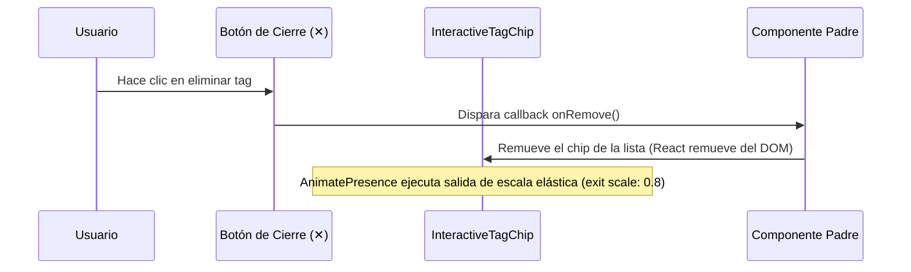

<!--
{
  "resource": "InteractiveTagChip",
  "technicalName": "InteractiveTagChip",
  "targetPath": "src/components/common/InteractiveTagChip.jsx",
  "type": "atom",
  "niches": ["retail_clothing", "grocery_food"],
  "dependencies": {
    "npm": {
      "framer-motion": "^11.0.0"
    },
    "internal": []
  }
}
-->

# Chip de Etiqueta Interactivo (InteractiveTagChip)

Componente atómico en forma de pastilla/tag interactivo que implementa micro-escalas de entrada y salida elásticas (squash-and-stretch) cuando es removido o añadido.

## 1. Propósito y Casos de Uso
Perfecto para listas de filtros activos (categorías de productos, rango de precios, tallas seleccionadas) o asignación de palabras clave a fichas técnicas en paneles administrativos, haciendo que la eliminación de filtros se sienta fluida e interactiva.

## 2. Especificación Visual y Estilos (Tailwind CSS)
Utiliza bordes finos con colores semitransparentes y un botón de cierre integrado. Consume variables HSL:
- Contenedor base: `bg-[var(--color-surface-2)] border-[var(--color-border)] hover:border-[var(--color-primary)]/40 text-[var(--color-text)]`
- Botón de cierre: `hover:bg-red-500/10 hover:text-red-500 text-[var(--color-text-muted)]`

---

## 3. Código React Completo y 100% Funcional

```jsx
import React from 'react';
import { motion, AnimatePresence } from 'framer-motion';

export default function InteractiveTagChip({
  label = '',
  onRemove,
  disabled = false,
  className = ''
}) {
  return (
    <motion.div
      initial={{ scale: 0.8, opacity: 0 }}
      animate={{ scale: 1, opacity: 1 }}
      exit={{ scale: 0.8, opacity: 0 }}
      transition={{ type: "spring", stiffness: 500, damping: 25 }}
      className={`inline-flex items-center gap-1.5 px-3 py-1 rounded-full border border-[var(--color-border)] bg-[var(--color-surface-2)] text-xs font-semibold text-[var(--color-text)] shadow-sm hover:border-[var(--color-primary)]/30 transition-colors select-none ${className}`}
    >
      <span>{label}</span>

      {onRemove && (
        <button
          type="button"
          disabled={disabled}
          onClick={onRemove}
          className="w-4 h-4 rounded-full flex items-center justify-center text-[10px] font-bold outline-none text-[var(--color-text-muted)] hover:bg-red-500/15 hover:text-red-500 disabled:opacity-50 disabled:cursor-not-allowed transition-colors"
        >
          ✕
        </button>
      )}
    </motion.div>
  );
}
```

---

## 4. Lógica de Estado y Flujo Operativo


