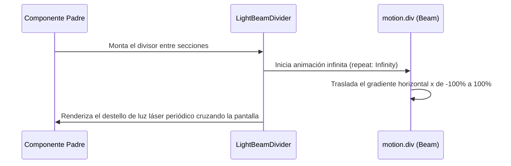

<!--
{
  "resource": "LightBeamDivider",
  "technicalName": "LightBeamDivider",
  "targetPath": "src/components/ui/LightBeamDivider.jsx",
  "type": "atom",
  "dependencies": {
    "npm": {
      "framer-motion": "^11.0.0"
    },
    "internal": []
  }
}
-->

# Divisor Cromático con Haz de Luz (LightBeamDivider)

## 1. Propósito y Casos de Uso
Línea divisora horizontal estética ultra-delgada. Proyecta un haz luminoso de alta intensidad (glow degradado HSL) que viaja de forma periódica e infinita de izquierda a derecha.

### Casos de Uso Real:
- Divisor estético entre módulos o secciones financieras en el reporte diario POS en la vertical de *Minimarkets y Alimentos (`grocery_food`)*.
- Separador de categorías en la barra lateral del Dashboard.

## 2. Especificación Visual y Estilos (Tailwind CSS)
Utiliza una línea horizontal ultra-delgada con un elemento interno posicionado de forma absoluta con gradientes lineales cromáticos.

---

## 3. Código React Completo y 100% Funcional

```jsx
import React from 'react';
import { motion } from 'framer-motion';

export default function LightBeamDivider({
  className = '',
  height = 1,
  duration = 3.5,
  glowColor = 'var(--color-primary)',
  beamWidth = 120
}) {
  return (
    <div
      style={{ height: `${height}px` }}
      className={`relative w-full bg-[var(--color-border)]/40 overflow-hidden ${className}`}
    >
      {/* Haz de luz de alta intensidad (Láser perimetral deslizable) */}
      <motion.div
        animate={{
          x: ['-100%', '100%'],
        }}
        transition={{
          repeat: Infinity,
          duration: duration,
          ease: 'easeInOut',
        }}
        style={{
          width: beamWidth,
          background: `linear-gradient(to right, transparent, ${glowColor}, transparent)`,
        }}
        className="absolute inset-y-0 left-0 h-full filter blur-[1px]"
      />
    </div>
  );
}
```

---

## 4. Flujo Operativo y Secuencia de Interacción


