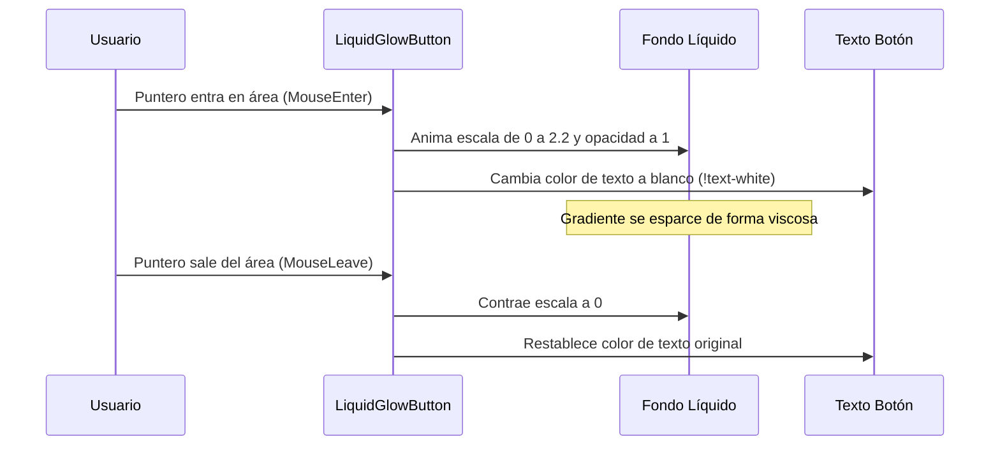

<!--
{
  "resource": "LiquidGlowButton",
  "technicalName": "LiquidGlowButton",
  "targetPath": "src/components/common/LiquidGlowButton.jsx",
  "type": "atom",
  "niches": ["distribucion-horeca", "alimentos-artesanales"],
  "dependencies": {
    "npm": {
      "framer-motion": "^11.0.0"
    },
    "internal": []
  }
}
-->

# Botón con Brillo Líquido (LiquidGlowButton)

Componente atómico de botón premium que posee un efecto de relleno líquido con gradiente cromático neón. Al hacer hover, el brillo líquido emerge desde el centro expandiéndose fluidamente hacia los bordes de la tarjeta.

## 1. Propósito y Casos de Uso
Perfecto para confirmaciones de pago, envíos de formularios comerciales o llamadas a la acción estables de gran impacto en *Distribución HORECA B2B* y *Repostería de Eventos*, generando una experiencia táctil fluida y moderna.

## 2. Especificación Visual y Estilos (Tailwind CSS)
Utiliza bordes responsivos y posicionamiento relativo con enmascaramiento de desbordamiento (`overflow-hidden`). Los textos usan la clase `!text-white` en hover para garantizar el contraste de lectura sobre el gradiente líquido. Consume variables HSL:
- Contenedor Pasivo: `bg-[var(--color-surface-3)] border-[var(--color-border)] text-[var(--color-text)]`
- Relleno Líquido: `bg-gradient-to-tr from-[var(--color-primary)] to-[var(--color-secondary)]`

---

## 3. Código React Completo y 100% Funcional

```jsx
import React, { useState } from 'react';
import { motion } from 'framer-motion';

export default function LiquidGlowButton({
  children,
  onClick,
  disabled = false,
  className = ''
}) {
  const [isHovered, setIsHovered] = useState(false);

  return (
    <motion.button
      onMouseEnter={() => setIsHovered(true)}
      onMouseLeave={() => setIsHovered(false)}
      onClick={onClick}
      disabled={disabled}
      whileTap={{ scale: 0.96 }}
      className={`relative overflow-hidden rounded-xl border border-[var(--color-border)] bg-[var(--color-surface-3)] px-6 py-3 text-sm font-bold text-[var(--color-text)] transition-colors duration-300 outline-none select-none disabled:opacity-50 disabled:cursor-not-allowed isolate ${className}`}
      style={{ 
        transform: 'translateZ(0)',
        WebkitMaskImage: '-webkit-radial-gradient(white, black)', // Hack definitivo para Webkit overflow-clip
        maskImage: 'radial-gradient(white, black)'
      }}
    >
      {/* Contenido líquido de fondo */}
      <motion.div
        animate={{
          scale: isHovered ? 1.5 : 0,
          opacity: isHovered ? 1 : 0
        }}
        transition={{
          duration: 0.4,
          ease: [0.16, 1, 0.3, 1] // Custom cubic-bezier para efecto viscoso fluido
        }}
        className="absolute inset-0 bg-gradient-to-tr from-[var(--color-primary)] to-[var(--color-secondary)] pointer-events-none z-0 rounded-xl"
        style={{ 
          width: '100%', 
          height: '100%', 
          top: 0, 
          left: 0,
          transformOrigin: 'center'
        }}
      />
      {/* Texto del Botón */}
      <span className={`relative z-15 transition-colors duration-300 ${isHovered ? '!text-[var(--color-text)]' : ''}`}>
        {children}
      </span>
    </motion.button>
  );
}
```

---

## 4. Lógica de Estado y Flujo Operativo


