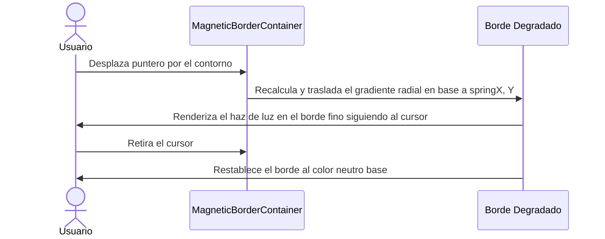

<!--
{
  "resource": "MagneticBorderContainer",
  "technicalName": "MagneticBorderContainer",
  "targetPath": "src/components/ui/MagneticBorderContainer.jsx",
  "type": "atom",
  "dependencies": {
    "npm": {
      "framer-motion": "^11.0.0"
    },
    "internal": []
  }
}
-->

# Contenedor con Borde Magnético (MagneticBorderContainer)

## 1. Propósito y Casos de Uso
Contenedor interactivo premium que cuenta con un borde fino degradado. Al deslizar el puntero sobre el contenedor, la zona activa del borde se ilumina atrayendo la posición del ratón de forma magnética e interactiva.

### Casos de Uso Real:
- Contenedor de planes de suscripción o módulos premium en la landing page de servicios técnicos.
- Tarjeta de catalogación de maquinaria destacada en la vertical de *Alquiler de Maquinaria y Equipos (`machinery_rental`)*.

## 2. Especificación Visual y Estilos (Tailwind CSS)
Utiliza bordes degradados con refracción física radial.

---

## 3. Código React Completo y 100% Funcional

```jsx
import React, { useState } from 'react';
import { motion, useMotionValue, useSpring, useTransform } from 'framer-motion';

export default function MagneticBorderContainer({
  children,
  className = '',
  borderWidth = 1.5,
  glowColor = 'var(--color-primary)',
  borderColor = 'var(--color-border)'
}) {
  const containerRef = React.useRef(null);
  const [hovered, setHovered] = useState(false);

  // Coordenadas relativas del cursor
  const mouseX = useMotionValue(0);
  const mouseY = useMotionValue(0);

  const springConfig = { damping: 25, stiffness: 250, mass: 0.3 };
  const springX = useSpring(mouseX, springConfig);
  const springY = useSpring(mouseY, springConfig);

  const handleMouseMove = (e) => {
    if (!containerRef.current) return;
    const rect = containerRef.current.getBoundingClientRect();
    mouseX.set(e.clientX - rect.left);
    mouseY.set(e.clientY - rect.top);
  };

  return (
    <div
      ref={containerRef}
      onMouseMove={handleMouseMove}
      onMouseEnter={() => setHovered(true)}
      onMouseLeave={() => setHovered(false)}
      style={{
        padding: `${borderWidth}px`,
        background: hovered 
          ? useTransform(
              [springX, springY],
              ([x, y]) => `radial-gradient(circle 120px at ${x}px ${y}px, ${glowColor} 0%, ${borderColor} 80%)`
            )
          : borderColor
      }}
      className={`relative rounded-2xl overflow-hidden transition-all duration-300 ${className}`}
    >
      {/* Contenido interior que tapa el fondo para revelar únicamente el contorno */}
      <div className="relative w-full h-full bg-[var(--color-surface)] rounded-[14px] p-6 z-10">
        {children}
      </div>
    </div>
  );
}
```

---

## 4. Flujo Operativo y Secuencia de Interacción


