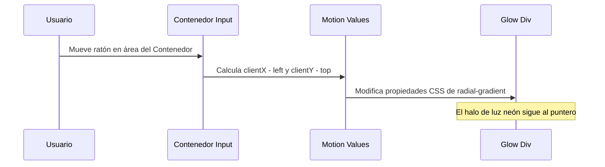

<!--
{
  "resource": "MagneticGlowInput",
  "technicalName": "MagneticGlowInput",
  "targetPath": "src/components/common/MagneticGlowInput.jsx",
  "type": "atom",
  "niches": ["technical_services", "grocery_food"],
  "dependencies": {
    "npm": {
      "framer-motion": "^11.0.0"
    },
    "internal": []
  }
}
-->

# Input con Foco Magnético y Glow HSL (MagneticGlowInput)

Componente atómico de formulario premium que reacciona a la proximidad física del puntero del usuario mediante un degradado radial (glow) dinámico que rastrea las coordenadas del mouse.

## 1. Propósito y Casos de Uso
Genera un efecto visual cautivador ("WOW factor") al interactuar con campos de entrada críticos, aumentando la tasa de conversión en barras de búsqueda, registros rápidos de clientes o inputs de cotización. Es ideal para terminales de *Servicios Técnicos y Mecanizado* o barras de búsqueda de e-commerce.

## 2. Especificación Visual y Estilos (Tailwind CSS)
Utiliza bordes degradados y posicionamiento absoluto para el glow de fondo. Consume variables HSL:
- Contenedor: `relative rounded-xl bg-[var(--color-surface)] border border-[var(--color-border)]`
- Haz de luz (Glow): `bg-gradient-to-r from-[var(--color-primary)] to-[var(--color-secondary)]`

---

## 3. Código React Completo y 100% Funcional

```jsx
import React, { useRef, useState } from 'react';
import { motion, useMotionTemplate, useMotionValue } from 'framer-motion';

export default function MagneticGlowInput({
  type = 'text',
  placeholder = '',
  value = '',
  onChange,
  disabled = false,
  required = false
}) {
  const containerRef = useRef(null);
  const [isFocused, setIsFocused] = useState(false);
  const mouseX = useMotionValue(0);
  const mouseY = useMotionValue(0);

  const handleMouseMove = ({ currentTarget, clientX, clientY }) => {
    const { left, top } = currentTarget.getBoundingClientRect();
    mouseX.set(clientX - left);
    mouseY.set(clientY - top);
  };

  return (
    <div
      ref={containerRef}
      onMouseMove={handleMouseMove}
      className={`group relative rounded-xl border border-[var(--color-border)] bg-[var(--color-surface)] p-[1px] transition-all duration-300
        ${isFocused ? 'ring-2 ring-[var(--color-primary)]/30 border-transparent' : 'hover:border-[var(--color-primary)]/50'}
        ${disabled ? 'opacity-50 cursor-not-allowed pointer-events-none' : ''}
      `}
    >
      <motion.div
        className="absolute inset-0 rounded-xl opacity-0 group-hover:opacity-100 group-focus-within:opacity-100 transition-opacity duration-300 pointer-events-none z-0"
        style={{
          background: useMotionTemplate`
            radial-gradient(
              120px circle at ${mouseX}px ${mouseY}px,
              var(--color-primary) 0%,
              transparent 80%
            )
          `
        }}
      />
      <input
        type={type}
        placeholder={placeholder}
        value={value}
        onChange={onChange}
        disabled={disabled}
        required={required}
        onFocus={() => setIsFocused(true)}
        onBlur={() => setIsFocused(false)}
        className="relative w-full rounded-[11px] bg-[var(--color-surface)] px-4 py-3 text-sm text-[var(--color-text)] placeholder-[var(--color-text-muted)]/50 outline-none transition-all z-10"
      />
    </div>
  );
}
```

---

## 4. Lógica de Estado y Flujo Operativo


