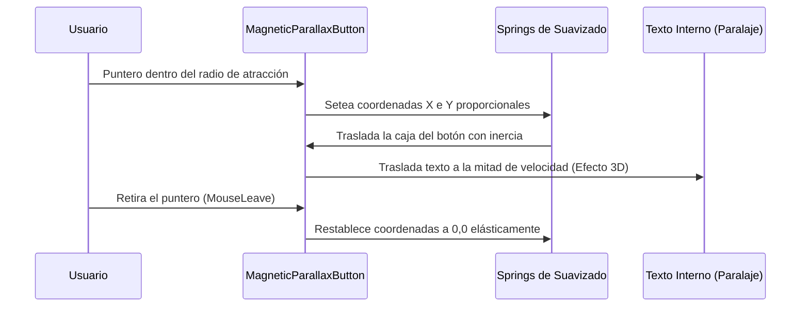

<!--
{
  "resource": "MagneticParallaxButton",
  "technicalName": "MagneticParallaxButton",
  "targetPath": "src/components/common/MagneticParallaxButton.jsx",
  "type": "atom",
  "niches": ["wellness_podology", "retail_clothing"],
  "dependencies": {
    "npm": {
      "framer-motion": "^11.0.0"
    },
    "internal": []
  }
}
-->

# Botón Magnético de Paralaje (MagneticParallaxButton)

Componente atómico de llamada a la acción (CTA) que ejerce una fuerza de atracción magnética sobre el cursor cercano y desplaza el contenido interno a una velocidad menor, simulando profundidad 3D tridimensional.

## 1. Propósito y Casos de Uso
Maximiza la tasa de clics y la interacción interactiva en botones cruciales de conversión como "Agendar Turno", "Añadir al Carrito" o "Confirmar Pedido" en sectores de *Estética y Bienestar* o *Retail Confección*.

## 2. Especificación Visual y Estilos (Tailwind CSS)
Utiliza un diseño redondo premium e inyección HSL semántica con la clase obligatoria `!text-white` para evitar sobrescrituras de contraste en Light Mode. Consume variables:
- Fondo: `bg-[var(--color-primary)]`
- Contorno: `shadow-lg shadow-[var(--color-primary)]/25`

---

## 3. Código React Completo y 100% Funcional

```jsx
import React, { useRef, useState } from 'react';
import { motion, useMotionValue, useSpring } from 'framer-motion';

export default function MagneticParallaxButton({
  children,
  onClick,
  disabled = false,
  className = ''
}) {
  const ref = useRef(null);
  const [isHovered, setIsHovered] = useState(false);

  // Motion values para el botón
  const x = useMotionValue(0);
  const y = useMotionValue(0);

  // Motion values para el texto interno (paralaje de la mitad de velocidad)
  const textX = useMotionValue(0);
  const textY = useMotionValue(0);

  // Físicas elásticas (Springs) de suavizado
  const springConfig = { damping: 15, stiffness: 150, mass: 0.6 };
  const springX = useSpring(x, springConfig);
  const springY = useSpring(y, springConfig);
  const springTextX = useSpring(textX, springConfig);
  const springTextY = useSpring(textY, springConfig);

  const handleMouseMove = (e) => {
    if (disabled || !ref.current) return;
    const { clientX, clientY } = e;
    const { left, top, width, height } = ref.current.getBoundingClientRect();
    const centerX = left + width / 2;
    const centerY = top + height / 2;

    // Calcular vector de distancia entre el puntero y el centro del botón
    const distanceX = clientX - centerX;
    const distanceY = clientY - centerY;

    // Atracción magnética limitada a un delta máximo de 30px
    x.set(distanceX * 0.35);
    y.set(distanceY * 0.35);

    // Paralaje interno de texto a la mitad (15px máximo)
    textX.set(distanceX * 0.15);
    textY.set(distanceY * 0.15);
  };

  const handleMouseLeave = () => {
    setIsHovered(false);
    x.set(0);
    y.set(0);
    textX.set(0);
    textY.set(0);
  };

  return (
    <motion.button
      ref={ref}
      onMouseMove={handleMouseMove}
      onMouseEnter={() => setIsHovered(true)}
      onMouseLeave={handleMouseLeave}
      onClick={onClick}
      disabled={disabled}
      style={{ x: springX, y: springY }}
      whileTap={{ scale: 0.94 }}
      className={`relative flex items-center justify-center rounded-full bg-[var(--color-primary)] !text-[var(--color-text)] px-8 py-3.5 font-bold shadow-lg shadow-[var(--color-primary)]/20 transition-shadow select-none outline-none disabled:opacity-50 disabled:cursor-not-allowed ${className}`}
    >
      <motion.span
        style={{ x: springTextX, y: springTextY }}
        className="relative block pointer-events-none"
      >
        {children}
      </motion.span>
    </motion.button>
  );
}
```

---

## 4. Lógica de Estado y Flujo Operativo


