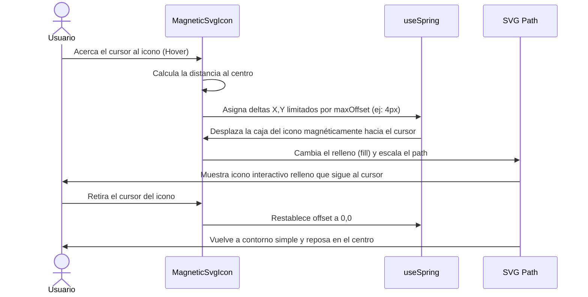

<!--
{
  "resource": "MagneticSvgIcon",
  "technicalName": "MagneticSvgIcon",
  "targetPath": "src/components/ui/MagneticSvgIcon.jsx",
  "type": "atom",
  "dependencies": {
    "npm": {
      "framer-motion": "^11.0.0"
    },
    "internal": []
  }
}
-->

# Efecto Magnético de Icono SVG (MagneticSvgIcon)

## 1. Propósito y Casos de Uso
Micro-interacción premium para iconos de navegación o botones de favoritos. Al colocar el cursor sobre el icono SVG, cada línea de trazado (path) se traslada de forma independiente hacia el cursor con velocidades y elasticidad diferenciadas.

### Casos de Uso Real:
- Icono de "Favoritos / Guardar" en la vertical de *Artículos Geek y Coleccionismo (`coleccionismo-geek`)*.
- Iconos de navegación del panel lateral del Dashboard Administrativo.

## 2. Especificación Visual y Estilos (Tailwind CSS)
Utiliza traslación interactiva vectorial (SVG) amortiguada con Framer Motion.

---

## 3. Código React Completo y 100% Funcional

```jsx
import React, { useState } from 'react';
import { motion, useMotionValue, useSpring } from 'framer-motion';

export default function MagneticSvgIcon({
  className = '',
  size = 24,
  maxOffset = 4,
  glowColor = 'var(--color-primary)'
}) {
  const [hovered, setHovered] = useState(false);
  const iconRef = React.useRef(null);

  // Valores de desplazamiento para el efecto magnético
  const offsetX = useMotionValue(0);
  const offsetY = useMotionValue(0);

  const springConfig = { damping: 15, stiffness: 250, mass: 0.5 };
  const springX = useSpring(offsetX, springConfig);
  const springY = useSpring(offsetY, springConfig);

  const handleMouseMove = (e) => {
    if (!iconRef.current) return;
    const rect = iconRef.current.getBoundingClientRect();
    
    // Obtener la distancia del mouse respecto al centro del icono
    const centerX = rect.left + rect.width / 2;
    const centerY = rect.top + rect.height / 2;
    const dx = e.clientX - centerX;
    const dy = e.clientY - centerY;

    // Confinar el desplazamiento a un rango pequeño
    const length = Math.hypot(dx, dy);
    const scale = length > 0 ? Math.min(maxOffset, length * 0.1) / length : 0;

    offsetX.set(dx * scale);
    offsetY.set(dy * scale);
  };

  const handleMouseLeave = () => {
    setHovered(false);
    offsetX.set(0);
    offsetY.set(0);
  };

  return (
    <motion.div
      ref={iconRef}
      onMouseMove={handleMouseMove}
      onMouseEnter={() => setHovered(true)}
      onMouseLeave={handleMouseLeave}
      style={{
        x: springX,
        y: springY,
      }}
      className={`relative flex items-center justify-center cursor-pointer p-2 rounded-full transition-colors ${
        hovered ? 'bg-[var(--color-surface-3)]' : 'bg-transparent'
      } ${className}`}
    >
      {/* Icono de Corazón / Favorito SVG Magnético */}
      <svg
        width={size}
        height={size}
        viewBox="0 0 24 24"
        fill={hovered ? glowColor : 'none'}
        stroke={hovered ? glowColor : 'var(--color-text)'}
        strokeWidth="2"
        strokeLinecap="round"
        strokeLinejoin="round"
        className="transition-all duration-300 transform scale-100 hover:scale-110"
      >
        <motion.path
          animate={hovered ? { scale: [1, 1.15, 1] } : {}}
          transition={{ duration: 0.4 }}
          d="M19 14c1.49-1.46 3-3.21 3-5.5A5.5 5.5 0 0 0 16.5 3c-1.76 0-3 .5-4.5 2-1.5-1.5-2.74-2-4.5-2A5.5 5.5 0 0 0 2 8.5c0 2.3 1.5 4.05 3 5.5l7 7Z"
        />
      </svg>
    </motion.div>
  );
}
```

---

## 4. Flujo Operativo y Secuencia de Interacción


