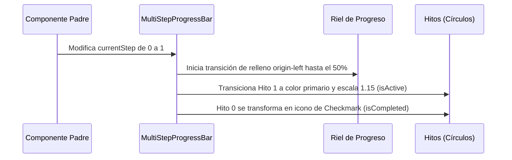

<!--
{
  "resource": "MultiStepProgressBar",
  "technicalName": "MultiStepProgressBar",
  "targetPath": "src/components/common/MultiStepProgressBar.jsx",
  "type": "atom",
  "niches": ["grocery_food", "laundry", "wellness_podology"],
  "dependencies": {
    "npm": {
      "framer-motion": "^11.0.0"
    },
    "internal": []
  }
}
-->

# Barra de Progreso Multi-Etapas (MultiStepProgressBar)

Componente atómico indicador de hitos que dibuja una línea de progreso interactiva y círculos de estado secuenciales que se iluminan y validan con micro-transiciones staggered (escalonadas).

## 1. Propósito y Casos de Uso
Permite guiar al usuario final en flujos de compra ("Carrito" ➔ "Envío" ➔ "Pago"), flujos de servicios ("Recibido" ➔ "Lavado" ➔ "Planchado" ➔ "Listo para Retiro" en *Lavanderías*), o citas de estética.

## 2. Especificación Visual y Estilos (Tailwind CSS)
Aplica la regla de niveles de profundidad `z-index` obligatoria para evitar solapamientos incorrectos:
- Línea de progreso: `absolute z-[-10]`
- Círculos de hito: `relative z-10 bg-[var(--color-surface-3)]` (con color sólido de máscara para cubrir la línea subyacente).

---

## 3. Código React Completo y 100% Funcional

```jsx
import React from 'react';
import { motion } from 'framer-motion';

export default function MultiStepProgressBar({
  steps = ['Paso 1', 'Paso 2', 'Paso 3'],
  currentStep = 0, // 0-indexed
  className = ''
}) {
  const totalSteps = steps.length;
  // Calcular porcentaje de relleno del riel de progreso
  const progressPercent = totalSteps > 1 
    ? (currentStep / (totalSteps - 1)) * 100 
    : 0;

  return (
    <div className={`relative flex items-center justify-between w-full select-none ${className}`}>
      {/* Riel de fondo inactivo */}
      <div className="absolute left-0 right-0 h-1 bg-[var(--color-border)] z-[-20] rounded-full" />

      {/* Riel activo con relleno animado */}
      <motion.div
        initial={{ width: '0%' }}
        animate={{ width: `${progressPercent}%` }}
        transition={{ duration: 0.4, ease: "easeInOut" }}
        className="absolute left-0 h-1 bg-[var(--color-primary)] z-[-10] rounded-full origin-left"
      />

      {steps.map((step, idx) => {
        const isCompleted = idx < currentStep;
        const isActive = idx === currentStep;

        return (
          <div key={idx} className="flex flex-col items-center relative">
            {/* Círculo del hito con z-10 y color de fondo sólido como máscara */}
            <motion.div
              initial={false}
              animate={{
                backgroundColor: isCompleted || isActive 
                  ? 'var(--color-primary)' 
                  : 'var(--color-surface-3)',
                borderColor: isCompleted || isActive 
                  ? 'var(--color-primary)' 
                  : 'var(--color-border)',
                scale: isActive ? 1.15 : 1
              }}
              transition={{ duration: 0.3 }}
              className={`w-8 h-8 rounded-full border-2 flex items-center justify-center relative z-10 text-xs font-bold transition-all
                ${isCompleted || isActive ? '!text-[var(--color-text)]' : 'text-[var(--color-text-muted)]'}
              `}
              style={{
                backgroundColor: 'var(--color-surface-3)', // Fallback estático
              }}
            >
              {isCompleted ? (
                <svg className="w-4 h-4 fill-current" viewBox="0 0 20 20">
                  <path d="M16.707 5.293a1 1 0 010 1.414l-8 8a1 1 0 01-1.414 0l-4-4a1 1 0 011.414-1.414L8 12.586l7.293-7.293a1 1 0 011.414 0z" />
                </svg>
              ) : (
                <span>{idx + 1}</span>
              )}
            </motion.div>

            {/* Etiqueta del Paso */}
            <span className={`absolute top-10 text-[10px] font-semibold whitespace-nowrap transition-all duration-200
              ${isActive ? 'text-[var(--color-primary)] font-bold opacity-100' : 'text-[var(--color-text-muted)] opacity-60'}
            `}>
              {step}
            </span>
          </div>
        );
      })}
    </div>
  );
}
```

---

## 4. Lógica de Estado y Flujo Operativo


