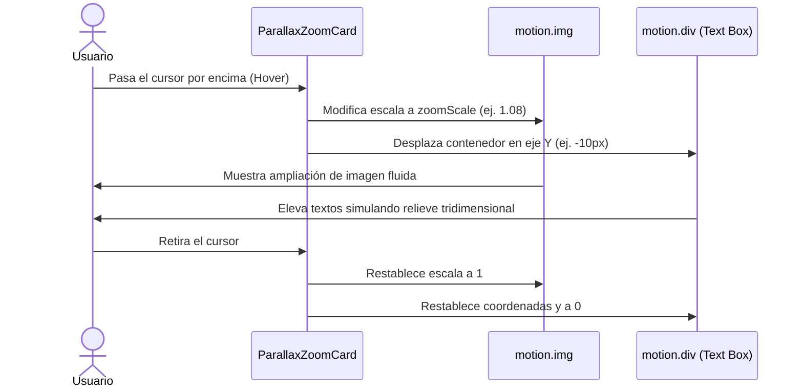

<!--
{
  "resource": "ParallaxZoomCard",
  "technicalName": "ParallaxZoomCard",
  "targetPath": "src/components/ui/ParallaxZoomCard.jsx",
  "type": "atom",
  "dependencies": {
    "npm": {
      "framer-motion": "^11.0.0"
    },
    "internal": []
  }
}
-->

# Tarjeta de Producto con Zoom en Paralaje (ParallaxZoomCard)

## 1. Propósito y Casos de Uso
Provee un contenedor interactivo de catálogo optimizado para capturar el interés visual del usuario. Al pasar el ratón sobre la tarjeta, se activa una doble micro-transición: el contenedor de la imagen se escala (zoom-in) y la caja de textos/badge inferiores se desplaza ligeramente hacia arriba (slide-up), generando una ilusión óptica de profundidad y movimiento físico en paralaje.

### Casos de Uso Real:
- Tarjeta de catálogo de pasteles o repostería fina en la vertical de *Alimentos Artesanales y Repostería (`alimentos-artesanales`)*.
- Mosaicos o Bento Grids de colecciones de calzado en la vertical de *Moda y Calzado Local (`moda-local-calzado`)*.

## 2. Especificación Visual y Estilos (Tailwind CSS)
Utiliza capas de imagen escalables combinadas con layouts flex y transformaciones en el eje Y.

---

## 3. Código React Completo y 100% Funcional

```jsx
import React, { useState } from 'react';
import { motion } from 'framer-motion';

export default function ParallaxZoomCard({
  children,
  className = '',
  imageSrc = 'https://images.unsplash.com/photo-1542291026-7eec264c27ff?auto=format&fit=crop&w=400&q=80',
  zoomScale = 1.08,
  textOffset = -10
}) {
  const [hovered, setHovered] = useState(false);

  return (
    <div
      onMouseEnter={() => setHovered(true)}
      onMouseLeave={() => setHovered(false)}
      className={`relative overflow-hidden rounded-2xl border border-[var(--color-border)] bg-[var(--color-surface)] shadow-md transition-shadow duration-300 ${
        hovered ? 'shadow-xl shadow-[var(--color-primary)]/5' : ''
      } ${className}`}
    >
      {/* Contenedor de la Imagen con Zoom */}
      <div className="relative w-full h-48 overflow-hidden">
        <motion.img
          animate={{ scale: hovered ? zoomScale : 1 }}
          transition={{ type: 'spring', stiffness: 180, damping: 22 }}
          src={imageSrc}
          alt="Visual del producto"
          className="w-full h-full object-cover"
        />
        {/* Capa de degradado oscuro sobre la imagen para contraste */}
        <div className="absolute inset-0 bg-gradient-to-t from-black/60 via-transparent to-transparent opacity-80" />
      </div>

      {/* Caja de Contenido con Desplazamiento Vertical en Paralaje */}
      <motion.div
        animate={{ y: hovered ? textOffset : 0 }}
        transition={{ type: 'spring', stiffness: 200, damping: 20 }}
        className="relative z-10 p-5 bg-[var(--color-surface)] rounded-b-2xl"
      >
        {children}
      </motion.div>
    </div>
  );
}
```

---

## 4. Flujo Operativo y Secuencia de Interacción


