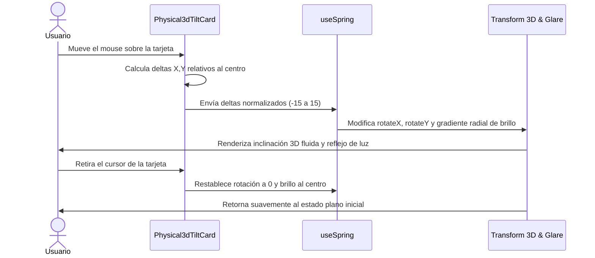

<!--
{
  "resource": "Physical3dTiltCard",
  "technicalName": "Physical3dTiltCard",
  "targetPath": "src/components/ui/Physical3dTiltCard.jsx",
  "type": "atom",
  "dependencies": {
    "npm": {
      "framer-motion": "^11.0.0"
    },
    "internal": []
  }
}
-->

# Tarjeta con Efecto 3D Tilt Físico (Physical3dTiltCard)

## 1. Propósito y Casos de Uso
Provee una envoltura de tarjeta tridimensional sumamente atractiva para catálogos o paneles destacados. Al deslizar el cursor sobre ella, la tarjeta calcula el ángulo de inclinación relativo a la posición del ratón respecto al centro, aplicando una transformación 3D interactiva en tiempo real.

### Casos de Uso Real:
- Tarjeta de catálogo de maquinaria de alto valor en la vertical de *Alquiler de Maquinaria y Equipos (`machinery_rental`)*.
- Tarjeta de producto exclusivo o de colección de edición limitada en la vertical de *Ropa y Retail Tradicional (`retail_clothing`)*.

## 2. Especificación Visual y Estilos (Tailwind CSS)
Utiliza transformaciones 3D perimetrales con perspectiva para lograr el paralaje físico y un brillo radial reflectante HSL.

---

## 3. Código React Completo y 100% Funcional

```jsx
import React, { useState, useRef } from 'react';
import { motion, useMotionValue, useSpring, useTransform } from 'framer-motion';

export default function Physical3dTiltCard({ 
  children, 
  className = '', 
  glowColor = 'var(--color-primary)', 
  maxTilt = 15 
}) {
  const cardRef = useRef(null);
  const [hovering, setHovering] = useState(false);

  // Valores de movimiento para la posición del cursor relative al contenedor
  const rotateX = useMotionValue(0);
  const rotateY = useMotionValue(0);

  // Configuración física suave (spring) para evitar sacudidas toscas
  const springConfig = { damping: 25, stiffness: 200, mass: 0.5 };
  const springX = useSpring(rotateX, springConfig);
  const springY = useSpring(rotateY, springConfig);

  // Transformaciones para el haz de luz reflectante (glare)
  const glareX = useMotionValue(50);
  const glareY = useMotionValue(50);
  const glareSpringX = useSpring(glareX, springConfig);
  const glareSpringY = useSpring(glareY, springConfig);

  const handleMouseMove = (e) => {
    if (!cardRef.current) return;
    const rect = cardRef.current.getBoundingClientRect();
    
    // Obtener la posición del mouse relative al centro del componente
    const width = rect.width;
    const height = rect.height;
    const mouseX = e.clientX - rect.left - width / 2;
    const mouseY = e.clientY - rect.top - height / 2;

    // Calcular ángulos de rotación basados en deltas (normalizados de -0.5 a 0.5)
    const rX = -(mouseY / (height / 2)) * maxTilt;
    const rY = (mouseX / (width / 2)) * maxTilt;

    rotateX.set(rX);
    rotateY.set(rY);

    // Calcular posición porcentual del cursor para el reflejo (de 0 a 100)
    const pctX = ((e.clientX - rect.left) / width) * 100;
    const pctY = ((e.clientY - rect.top) / height) * 100;
    glareX.set(pctX);
    glareY.set(pctY);
  };

  const handleMouseLeave = () => {
    setHovering(false);
    rotateX.set(0);
    rotateY.set(0);
    glareX.set(50);
    glareY.set(50);
  };

  return (
    <div className="relative w-full [perspective:1000px]">
      <motion.div
        ref={cardRef}
        onMouseMove={handleMouseMove}
        onMouseEnter={() => setHovering(true)}
        onMouseLeave={handleMouseLeave}
        style={{
          rotateX: springX,
          rotateY: springY,
          transformStyle: 'preserve-3d',
        }}
        className={`relative w-full rounded-2xl border border-[var(--color-border)] bg-[var(--color-surface)] p-6 transition-shadow duration-300 ${
          hovering ? 'shadow-2xl shadow-[var(--color-primary)]/10' : 'shadow-md'
        } ${className}`}
      >
        {/* Capa de reflejo o brillo virtual (Glare) */}
        <motion.div
          style={{
            background: useTransform(
              [glareSpringX, glareSpringY],
              ([x, y]) => `radial-gradient(circle 250px at ${x}% ${y}%, ${glowColor}15 0%, transparent 80%)`
            ),
            transform: 'translateZ(1px)',
          }}
          className="absolute inset-0 pointer-events-none rounded-2xl z-10"
        />

        {/* Borde de luz dinámico */}
        <motion.div
          style={{
            background: useTransform(
              [glareSpringX, glareSpringY],
              ([x, y]) => `radial-gradient(circle 180px at ${x}% ${y}%, ${glowColor}50 0%, transparent 70%)`
            ),
            transform: 'translateZ(0px)',
          }}
          className="absolute inset-[-1px] rounded-2xl -z-10 pointer-events-none opacity-0 hover:opacity-100 transition-opacity duration-300"
        />

        {/* Contenido envuelto con elevación en el eje Z */}
        <div style={{ transform: 'translateZ(30px)', transformStyle: 'preserve-3d' }} className="relative z-20">
          {children}
        </div>
      </motion.div>
    </div>
  );
}
```

---

## 4. Flujo Operativo y Secuencia de Interacción


