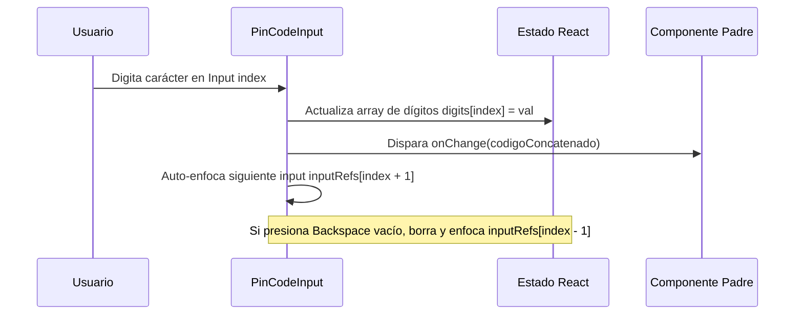

<!--
{
  "resource": "PinCodeInput",
  "technicalName": "PinCodeInput",
  "targetPath": "src/components/common/PinCodeInput.jsx",
  "type": "atom",
  "niches": ["grocery_food", "retail_clothing"],
  "dependencies": {
    "npm": {
      "framer-motion": "^11.0.0"
    },
    "internal": []
  }
}
-->

# Entrada de Pin Código (PinCodeInput)

Componente atómico de formulario diseñado para la captura de códigos de verificación temporales, pines de seguridad o autorizaciones rápidas de personal en terminales de punto de venta (POS) y flujos de autenticación.

## 1. Propósito y Casos de Uso
Permite al usuario ingresar una secuencia corta de dígitos (normalmente 4 o 6) de forma fluida, automatizando el enfoque secuencial de cajas y controlando el pegado masivo del portapapeles. Su uso principal es la validación de transacciones o el desbloqueo de cajas diarias en *Minimarkets y Alimentos* o autorizaciones de fletes.

## 2. Especificación Visual y Estilos (Tailwind CSS)
Utiliza bordes responsivos HSL y un glow difuso al enfocar (`focus:ring-4 focus:ring-[var(--color-primary)]/20`). Las cajas consumen variables del tema:
- Fondo: `bg-[var(--color-surface)]`
- Borde: `border-[var(--color-border)]`
- Activo: `border-[var(--color-primary)]`

---

## 3. Código React Completo y 100% Funcional

```jsx
import React, { useRef, useState, useEffect } from 'react';
import { motion, AnimatePresence } from 'framer-motion';

export default function PinCodeInput({
  length = 4,
  value = '',
  onChange,
  disabled = false,
  error = false
}) {
  const [digits, setDigits] = useState(Array(length).fill(''));
  const inputRefs = useRef([]);

  useEffect(() => {
    // Sincronizar valor controlado externo
    const valString = String(value || '');
    const newDigits = Array(length).fill('');
    for (let i = 0; i < length; i++) {
      newDigits[i] = valString[i] || '';
    }
    setDigits(newDigits);
  }, [value, length]);

  const handleChange = (e, index) => {
    const val = e.target.value;
    const lastChar = val.substring(val.length - 1);
    
    // Solo permitir números
    if (lastChar && !/^\d$/.test(lastChar)) return;

    const newDigits = [...digits];
    newDigits[index] = lastChar;
    setDigits(newDigits);

    const joined = newDigits.join('');
    if (onChange) onChange(joined);

    // Auto-focus al siguiente input
    if (lastChar && index < length - 1) {
      inputRefs.current[index + 1]?.focus();
    }
  };

  const handleKeyDown = (e, index) => {
    if (e.key === 'Backspace') {
      const newDigits = [...digits];
      
      if (digits[index] === '' && index > 0) {
        // Borrar el anterior y enfocarlo
        newDigits[index - 1] = '';
        setDigits(newDigits);
        if (onChange) onChange(newDigits.join(''));
        inputRefs.current[index - 1]?.focus();
      } else {
        // Borrar el actual
        newDigits[index] = '';
        setDigits(newDigits);
        if (onChange) onChange(newDigits.join(''));
      }
    }
  };

  const handlePaste = (e) => {
    e.preventDefault();
    const pasteData = e.clipboardData.getData('text').trim();
    if (!/^\d+$/.test(pasteData)) return;

    const newDigits = [...digits];
    for (let i = 0; i < length; i++) {
      if (pasteData[i]) {
        newDigits[i] = pasteData[i];
      }
    }
    setDigits(newDigits);
    const joined = newDigits.join('');
    if (onChange) onChange(joined);

    // Enfocar el último input rellenado o el final
    const focusIndex = Math.min(pasteData.length, length - 1);
    inputRefs.current[focusIndex]?.focus();
  };

  return (
    <div className="flex gap-3 justify-center items-center py-2.5">
      {digits.map((digit, idx) => (
        <div key={idx} className="relative w-12 h-14">
          <input
            ref={(el) => (inputRefs.current[idx] = el)}
            type="text"
            inputMode="numeric"
            pattern="[0-9]*"
            maxLength={2}
            value={digit}
            onChange={(e) => handleChange(e, idx)}
            onKeyDown={(e) => handleKeyDown(e, idx)}
            onPaste={idx === 0 ? handlePaste : undefined}
            disabled={disabled}
            className={`w-full h-full text-center text-xl font-bold rounded-xl border bg-[var(--color-surface)] text-[var(--color-text)] outline-none transition-all duration-200
              ${error 
                ? 'border-red-500 focus:ring-4 focus:ring-red-500/20' 
                : 'border-[var(--color-border)] focus:border-[var(--color-primary)] focus:ring-4 focus:ring-[var(--color-primary)]/20'
              }
              disabled:opacity-50 disabled:cursor-not-allowed [appearance:textfield] [&::-webkit-outer-spin-button]:appearance-none [&::-webkit-inner-spin-button]:appearance-none
            `}
          />
          <AnimatePresence>
            {digit && (
              <motion.div
                initial={{ scale: 0.5, opacity: 0, y: 10 }}
                animate={{ scale: 1, opacity: 1, y: 0 }}
                exit={{ scale: 0.8, opacity: 0 }}
                transition={{ type: "spring", stiffness: 450, damping: 20 }}
                className="absolute inset-0 flex items-center justify-center pointer-events-none text-xl font-bold text-[var(--color-text)]"
              >
                {digit}
              </motion.div>
            )}
          </AnimatePresence>
        </div>
      ))}
    </div>
  );
}
```

---

## 4. Lógica de Estado y Flujo Operativo


