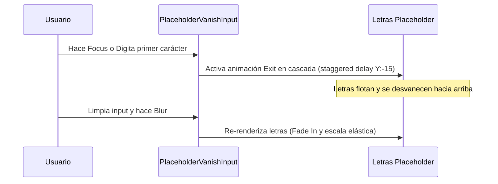

<!--
{
  "resource": "PlaceholderVanishInput",
  "technicalName": "PlaceholderVanishInput",
  "targetPath": "src/components/common/PlaceholderVanishInput.jsx",
  "type": "atom",
  "niches": ["retail_clothing", "grocery_food"],
  "dependencies": {
    "npm": {
      "framer-motion": "^11.0.0"
    },
    "internal": []
  }
}
-->

# Input de Desaparición de Marcador (PlaceholderVanishInput)

Componente atómico de formulario diseñado para animar de forma premium la salida del texto del marcador de posición (placeholder) cuando el usuario escribe, dividiendo el texto en letras que se desvanecen hacia arriba de forma escalonada.

## 1. Propósito y Casos de Uso
Optimiza la fricción inicial de búsqueda en catálogos de e-commerce o portales minoristas (*Retail y Alimentos*). Al ingresar caracteres, la desaparición dinámica de las letras del placeholder guía visualmente la atención del usuario hacia el contenido que está digitando.

## 2. Especificación Visual y Estilos (Tailwind CSS)
Mantiene una estructura relativa con capas absolutas para los caracteres individuales del placeholder. Consume variables HSL:
- Input: `bg-[var(--color-surface)] border border-[var(--color-border)] rounded-xl py-3 px-4 outline-none`
- Placeholder: `text-[var(--color-text-muted)]/50 absolute left-4 top-3.5 select-none pointer-events-none`

---

## 3. Código React Completo y 100% Funcional

```jsx
import React, { useState } from 'react';
import { motion, AnimatePresence } from 'framer-motion';

export default function PlaceholderVanishInput({
  value = '',
  onChange,
  placeholder = 'Buscar producto...',
  disabled = false
}) {
  const [isFocused, setIsFocused] = useState(false);
  const showPlaceholder = !value && !isFocused;

  const placeholderLetters = placeholder.split('');

  return (
    <div className="relative w-full rounded-xl bg-[var(--color-surface)]">
      <AnimatePresence mode="popLayout">
        {showPlaceholder && (
          <div className="absolute left-4 top-3.5 flex pointer-events-none select-none overflow-hidden z-20">
            {placeholderLetters.map((char, index) => (
              <motion.span
                key={index}
                initial={{ y: 0, opacity: 1 }}
                animate={{ y: 0, opacity: 0.5 }}
                exit={{
                  y: -15,
                  opacity: 0,
                  transition: {
                    duration: 0.25,
                    delay: index * 0.02,
                    ease: "easeOut"
                  }
                }}
                className="text-sm font-medium text-[var(--color-text-muted)]/50 whitespace-pre"
              >
                {char}
              </motion.span>
            ))}
          </div>
        )}
      </AnimatePresence>
      <input
        type="text"
        value={value}
        onChange={onChange}
        disabled={disabled}
        onFocus={() => setIsFocused(true)}
        onBlur={() => setIsFocused(false)}
        className="w-full rounded-xl border border-[var(--color-border)] bg-transparent px-4 py-3 text-sm text-[var(--color-text)] outline-none focus:border-[var(--color-primary)] focus:ring-4 focus:ring-[var(--color-primary)]/20 transition-all duration-200 z-10 relative"
      />
    </div>
  );
}
```

---

## 4. Lógica de Estado y Flujo Operativo


