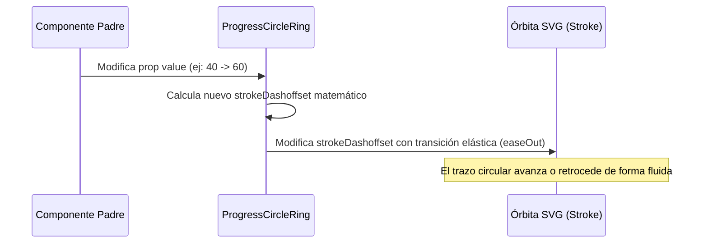

<!--
{
  "resource": "ProgressCircleRing",
  "technicalName": "ProgressCircleRing",
  "targetPath": "src/components/common/ProgressCircleRing.jsx",
  "type": "atom",
  "niches": ["grocery_food", "technical_services", "laundry"],
  "dependencies": {
    "npm": {
      "framer-motion": "^11.0.0"
    },
    "internal": []
  }
}
-->

# Anillo de Progreso Circular (ProgressCircleRing)

Componente atómico indicador de progreso circular basado en vectores SVG que transiciona de forma fluida y elástica el trazo del anillo en correspondencia al porcentaje configurado.

## 1. Propósito y Casos de Uso
Perfecto para pantallas de carga, medidores de salud o estado, resúmenes del día ("% de Cupo Diario Reservado", "% de Tareas Completadas" en *Servicios Técnicos* o "Límite de Carga Lavado" en *Lavanderías*).

## 2. Especificación Visual y Estilos (Tailwind CSS)
Utiliza una órbita circular SVG concéntrica y limpia con textos centrales alineados geométricamente de forma exacta. Consume variables HSL:
- Anillo activo: `stroke-[var(--color-primary)]`
- Anillo inactivo: `stroke-[var(--color-border)]`
- Texto de porcentaje: `text-[var(--color-text)] font-extrabold`

---

## 3. Código React Completo y 100% Funcional

```jsx
import React from 'react';
import { motion } from 'framer-motion';

export default function ProgressCircleRing({
  value = 0, // Porcentaje 0 a 100
  size = 64, // Ancho y alto en px
  strokeWidth = 6,
  className = ''
}) {
  const radius = (size - strokeWidth) / 2;
  const circumference = radius * 2 * Math.PI;
  // Limitar valor entre 0 y 100
  const normalizedValue = Math.min(Math.max(value, 0), 100);
  const strokeDashoffset = circumference - (normalizedValue / 100) * circumference;

  return (
    <div className={`relative flex items-center justify-center select-none ${className}`} style={{ width: size, height: size }}>
      <svg className="transform -rotate-90 w-full h-full" viewBox={`0 0 ${size} ${size}`}>
        {/* Anillo de fondo (inactivo) */}
        <circle
          cx={size / 2}
          cy={size / 2}
          r={radius}
          className="stroke-[var(--color-border)] fill-transparent"
          strokeWidth={strokeWidth}
        />

        {/* Anillo activo con animación de trazo */}
        <motion.circle
          cx={size / 2}
          cy={size / 2}
          r={radius}
          className="stroke-[var(--color-primary)] fill-transparent"
          strokeWidth={strokeWidth}
          strokeDasharray={circumference}
          animate={{ strokeDashoffset }}
          transition={{ duration: 0.6, ease: "easeOut" }}
          strokeLinecap="round"
        />
      </svg>

      {/* Texto de porcentaje central */}
      <span className="absolute text-[10px] font-extrabold text-[var(--color-text)] tracking-tight">
        {Math.round(normalizedValue)}%
      </span>
    </div>
  );
}
```

---

## 4. Lógica de Estado y Flujo Operativo


