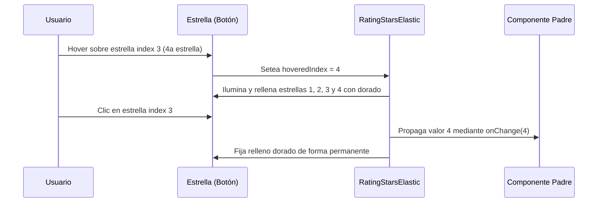

<!--
{
  "resource": "RatingStarsElastic",
  "technicalName": "RatingStarsElastic",
  "targetPath": "src/components/common/RatingStarsElastic.jsx",
  "type": "atom",
  "niches": ["wellness_podology", " grocery_food", "retail_clothing"],
  "dependencies": {
    "npm": {
      "framer-motion": "^11.0.0"
    },
    "internal": []
  }
}
-->

# Calificación de Estrellas Elástica (RatingStarsElastic)

Componente atómico de valoración interactiva que presenta una fila de estrellas SVG que reaccionan con micro-animaciones de rebote (scale/spring) y cambios cromáticos al ser seleccionadas o enfocadas.

## 1. Propósito y Casos de Uso
Permite a los clientes valorar la calidad de un producto, la atención de un especialista de belleza o la velocidad de un repartidor a domicilio.

## 2. Especificación Visual y Estilos (Tailwind CSS)
Utiliza estrellas vectoriales SVG con contorno y relleno definidos dinámicamente:
- Estrellas activas/hover: `fill-yellow-400 text-yellow-400 stroke-yellow-500`
- Estrellas inactivas: `fill-transparent text-[var(--color-text-muted)] opacity-40`

---

## 3. Código React Completo y 100% Funcional

```jsx
import React, { useState } from 'react';
import { motion } from 'framer-motion';

export default function RatingStarsElastic({
  value = 0, // Calificación de 0 a 5
  onChange,
  disabled = false,
  className = ''
}) {
  const [hoveredIndex, setHoveredIndex] = useState(null);

  const handleSelect = (idx) => {
    if (disabled) return;
    if (onChange) onChange(idx + 1);
  };

  return (
    <div className={`flex gap-1.5 justify-center items-center py-2 select-none ${disabled ? 'opacity-40 cursor-not-allowed pointer-events-none' : ''} ${className}`}>
      {Array.from({ length: 5 }).map((_, idx) => {
        const starNum = idx + 1;
        // Evaluar si la estrella está activa por hover o selección real
        const isFilled = hoveredIndex !== null 
          ? starNum <= hoveredIndex 
          : starNum <= value;

        return (
          <motion.button
            key={idx}
            type="button"
            disabled={disabled}
            onMouseEnter={() => !disabled && setHoveredIndex(starNum)}
            onMouseLeave={() => !disabled && setHoveredIndex(null)}
            onClick={() => handleSelect(idx)}
            whileHover={{ scale: 1.25, rotate: 10 }}
            whileTap={{ scale: 0.85 }}
            transition={{ type: "spring", stiffness: 400, damping: 12 }}
            className="w-8 h-8 flex items-center justify-center outline-none"
          >
            <svg
              className={`w-7 h-7 stroke-2 transition-all duration-200
                ${isFilled 
                  ? 'fill-yellow-400 stroke-yellow-500 text-yellow-500 filter drop-shadow-[0_2px_4px_rgba(234,179,8,0.25)]' 
                  : 'fill-transparent stroke-[var(--color-text-muted)] opacity-40'
                }
              `}
              viewBox="0 0 24 24"
            >
              <path strokeLinecap="round" strokeLinejoin="round" d="M11.48 3.499c.195-.49.846-.49 1.04 0l2.125 5.111a.563.563 0 00.475.345l5.518.442c.53.043.74.693.35 1.013l-3.97 3.828a.563.563 0 00-.162.498l.939 5.497c.09.529-.465.932-.938.682l-4.935-2.596a.563.563 0 00-.522 0l-4.935 2.596c-.473.249-1.027-.154-.938-.682l.939-5.497a.563.563 0 00-.162-.498l-3.97-3.828c-.39-.376-.18-1.03.35-1.013l5.518-.442a.563.563 0 00.475-.345L11.48 3.5z" />
            </svg>
          </motion.button>
        );
      })}
    </div>
  );
}
```

---

## 4. Lógica de Estado y Flujo Operativo


