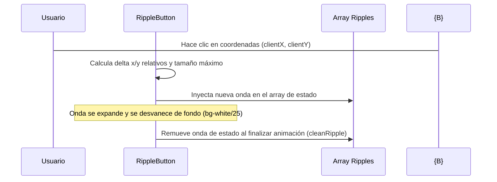

<!--
{
  "resource": "RippleButton",
  "technicalName": "RippleButton",
  "targetPath": "src/components/common/RippleButton.jsx",
  "type": "atom",
  "niches": ["grocery_food", "retail_clothing"],
  "dependencies": {
    "npm": {
      "framer-motion": "^11.0.0"
    },
    "internal": []
  }
}
-->

# Botón con Ondas Radiales (RippleButton)

Componente atómico de botón que proyecta ondas concéntricas radiales (efectos de ondas de agua) que se propagan desde las coordenadas exactas de clic del puntero.

## 1. Propósito y Casos de Uso
Enriquece el feedback táctil al confirmar transacciones críticas en terminales de caja (*Minimarkets y Alimentos*) o añadir artículos al carrito de compra. Proporciona una respuesta visual clara de que la interacción física fue capturada con éxito.

## 2. Especificación Visual y Estilos (Tailwind CSS)
Utiliza un contenedor con desbordamiento enmascarado (`overflow-hidden`) y ondas absolutas de corta duración. Consume variables HSL:
- Contenedor base: `bg-[var(--color-primary)] !text-white`
- Color de Onda (Ripple): `bg-white/30`

---

## 3. Código React Completo y 100% Funcional

```jsx
import React, { useState } from 'react';
import { motion, AnimatePresence } from 'framer-motion';

export default function RippleButton({
  children,
  onClick,
  disabled = false,
  className = ''
}) {
  const [ripples, setRipples] = useState([]);

  const handleClick = (e) => {
    if (disabled) return;

    const { left, top, width, height } = e.currentTarget.getBoundingClientRect();
    const clientX = e.clientX;
    const clientY = e.clientY;

    // Calcular posición de clic relativa al botón
    const x = clientX - left;
    const y = clientY - top;

    // Diámetro para cubrir toda la superficie
    const size = Math.max(width, height) * 2;

    const newRipple = {
      id: Date.now() + Math.random(),
      x,
      y,
      size
    };

    setRipples((prev) => [...prev, newRipple]);

    if (onClick) onClick(e);
  };

  const cleanRipple = (id) => {
    setRipples((prev) => prev.filter((r) => r.id !== id));
  };

  return (
    <button
      onClick={handleClick}
      disabled={disabled}
      className={`relative overflow-hidden rounded-xl bg-[var(--color-primary)] !text-[var(--color-text)] px-6 py-3 font-semibold shadow-md shadow-[var(--color-primary)]/15 outline-none select-none disabled:opacity-50 disabled:cursor-not-allowed ${className}`}
    >
      <span className="relative z-10">{children}</span>
      <AnimatePresence>
        {ripples.map((ripple) => (
          <motion.span
            key={ripple.id}
            initial={{ scale: 0, opacity: 0.6 }}
            animate={{ scale: 1, opacity: 0 }}
            exit={{ opacity: 0 }}
            onAnimationComplete={() => cleanRipple(ripple.id)}
            transition={{ duration: 0.5, ease: "easeOut" }}
            className="absolute rounded-full bg-white/25 pointer-events-none z-0"
            style={{
              top: ripple.y - ripple.size / 2,
              left: ripple.x - ripple.size / 2,
              width: ripple.size,
              height: ripple.size
            }}
          />
        ))}
      </AnimatePresence>
    </button>
  );
}
```

---

## 4. Lógica de Estado y Flujo Operativo


