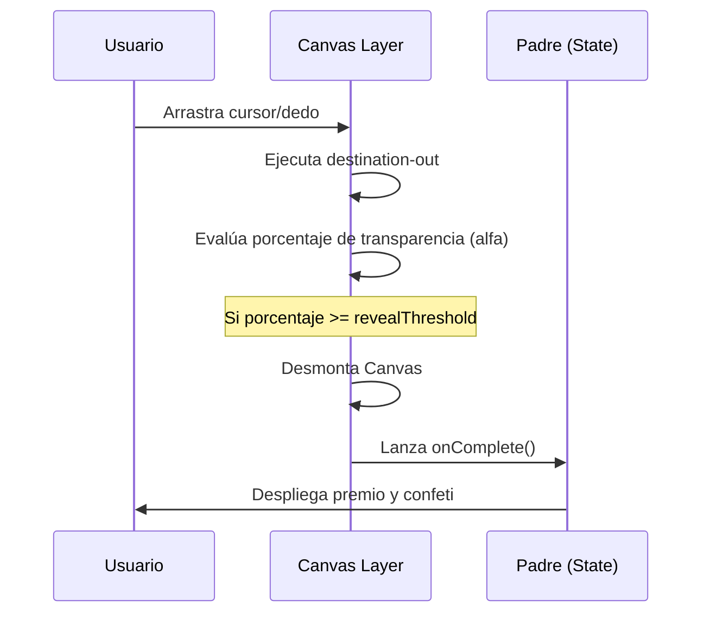

<!--
{
  "technicalName": "ScratchCardReward",
  "targetPath": "src/components/ui/ScratchCardReward.jsx",
  "dependencies": {
    "npm": {},
    "internal": []
  },
  "type": "atom",
  "niches": []
}
-->

# ScratchCardReward — Tarjeta Rascable de Recompensas

## 1. Propósito y Casos de Uso
El `ScratchCardReward` introduce dinámicas de gamificación en el e-commerce o portal de fidelización de la marca blanca. Permite que los clientes "raspen" digitalmente la superficie gris de una tarjeta mediante gestos táctiles o ratón para descubrir códigos de descuento u obsequios especiales.

## 2. Especificación Visual y Estilos
- **Capa Rascable:** Color plano satinado con texto guía blanco centrado.
- **Auto-Revelado:** Transición que remueve la capa de Canvas de forma limpia cuando el área borrada supera el umbral del 45%, previniendo la fatiga del usuario.

## 3. Código React Completo y 100% Funcional

```jsx
import React, { useRef, useEffect, useState } from 'react';

export default function ScratchCardReward({
  width = 300,
  height = 150,
  overlayColor = '#a1a1aa', // zinc-400
  overlayText = '¡Raspa aquí con el ratón!',
  brushSize = 24,
  revealThreshold = 45, // porcentaje de raspado para auto-revelar
  onComplete,
  children,
  className = ''
}) {
  const canvasRef = useRef(null);
  const containerRef = useRef(null);
  const [isScratching, setIsScratching] = useState(false);
  const [isRevealed, setIsRevealed] = useState(false);

  useEffect(() => {
    const canvas = canvasRef.current;
    if (!canvas) return;

    const ctx = canvas.getContext('2d');
    if (!ctx) return;

    // Pintar fondo satinado de cobertura
    ctx.fillStyle = overlayColor;
    ctx.fillRect(0, 0, width, height);

    // Agregar texto descriptivo centrado
    ctx.fillStyle = '#ffffff';
    ctx.font = 'bold 13px system-ui, -apple-system, sans-serif';
    ctx.textAlign = 'center';
    ctx.textBaseline = 'middle';
    ctx.fillText(overlayText, width / 2, height / 2);
  }, [width, height, overlayColor, overlayText]);

  const getCoordinates = (e) => {
    const canvas = canvasRef.current;
    if (!canvas) return { x: 0, y: 0 };
    const rect = canvas.getBoundingClientRect();
    
    // Soporte para mouse y touch events
    const clientX = e.touches ? e.touches[0].clientX : e.clientX;
    const clientY = e.touches ? e.touches[0].clientY : e.clientY;
    
    return {
      x: clientX - rect.left,
      y: clientY - rect.top
    };
  };

  const scratch = (x, y) => {
    const canvas = canvasRef.current;
    if (!canvas || isRevealed) return;
    const ctx = canvas.getContext('2d');
    if (!ctx) return;

    // Usar composición global 'destination-out' para borrar píxeles
    ctx.globalCompositeOperation = 'destination-out';
    ctx.beginPath();
    ctx.arc(x, y, brushSize, 0, Math.PI * 2);
    ctx.fill();

    checkPercentage();
  };

  const checkPercentage = () => {
    const canvas = canvasRef.current;
    if (!canvas) return;
    const ctx = canvas.getContext('2d');
    if (!ctx) return;

    const imageData = ctx.getImageData(0, 0, width, height);
    const pixels = imageData.data;
    let transparentPixels = 0;

    // Contar píxeles borrados (alfa === 0)
    for (let i = 3; i < pixels.length; i += 4) {
      if (pixels[i] === 0) {
        transparentPixels++;
      }
    }

    const percentage = (transparentPixels / (pixels.length / 4)) * 100;

    if (percentage >= revealThreshold) {
      setIsRevealed(true);
      if (onComplete) onComplete();
    }
  };

  // Manejadores de Eventos
  const handleStart = (e) => {
    setIsScratching(true);
    const { x, y } = getCoordinates(e);
    scratch(x, y);
  };

  const handleMove = (e) => {
    if (!isScratching) return;
    const { x, y } = getCoordinates(e);
    scratch(x, y);
  };

  const handleEnd = () => {
    setIsScratching(false);
  };

  return (
    <div
      ref={containerRef}
      className={`relative rounded-xl overflow-hidden border border-[var(--color-border)] select-none cursor-crosshair bg-[var(--color-surface)] ${className}`}
      style={{ width: `${width}px`, height: `${height}px` }}
    >
      {/* Contenido oculto revelado */}
      <div className="absolute inset-0 w-full h-full flex items-center justify-center pointer-events-none">
        {children}
      </div>

      {/* Capa Canvas de Raspado */}
      {!isRevealed && (
        <canvas
          ref={canvasRef}
          width={width}
          height={height}
          onMouseDown={handleStart}
          onMouseMove={handleMove}
          onMouseUp={handleEnd}
          onMouseLeave={handleEnd}
          onTouchStart={handleStart}
          onTouchMove={handleMove}
          onTouchEnd={handleEnd}
          className="absolute inset-0 w-full h-full z-10"
        />
      )}
    </div>
  );
}
```

## 4. Lógica de Estado y Ciclo de Vida
Inicializa la renderización en el Canvas 2D en `useEffect`. Para medir la transparencia, analiza el array de datos de imagen (`getImageData`) contando las posiciones correspondientes al canal alfa en 0, activando el callback `onComplete` y desmontando el Canvas si sobrepasa el umbral `revealThreshold`.

## 5. Flujo Operativo y Secuencia de Interacción


---
##### Nota: Este componente es ideal para nichos de retail y promociones flash de fidelización de la marca.
