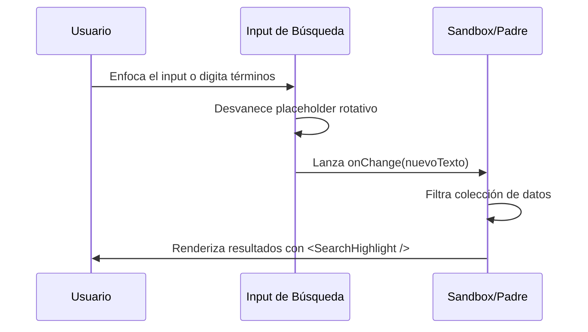

<!--
{
  "technicalName": "SearchVanishHighlightInput",
  "targetPath": "src/components/ui/SearchVanishHighlightInput.jsx",
  "dependencies": {
    "npm": {
      "framer-motion": "^11.0.0",
      "lucide-react": "^0.300.0"
    },
    "internal": []
  },
  "type": "atom",
  "niches": []
}
-->

# SearchVanishHighlightInput — Input de Búsqueda con Resaltado y Placeholder Rotativo

## 1. Propósito y Casos de Uso
El `SearchVanishHighlightInput` es un campo de entrada optimizado para búsquedas rápidas locales sobre colecciones extensas de productos, categorías u órdenes de trabajo. Su propósito es guiar al usuario mediante placeholders contextuales rotativos y proveer un resaltado visual dinámico sobre los caracteres que coinciden con los criterios de búsqueda en los resultados.

## 2. Especificación Visual y Estilos
- **Tema de Contraste:** Adaptación automática a temas claro/oscuro consumiendo variables HSL (`var(--color-primary)`, `var(--color-surface)`).
- **Animación del Placeholder:** Desvanecimiento de opacidad y desplazamiento vertical elástico para simular entrada y salida fluida de sugerencias.

## 3. Código React Completo y 100% Funcional

```jsx
import React, { useState, useEffect, useRef } from 'react';
import { motion, AnimatePresence } from 'framer-motion';
import { Search, X } from 'lucide-react';

export default function SearchVanishHighlightInput({
  value,
  onChange,
  placeholders = ['Buscar por nombre...', 'Buscar categoría...', 'Escribe un término...'],
  rotationInterval = 4000,
  className = ''
}) {
  const [currentPlaceholderIndex, setCurrentPlaceholderIndex] = useState(0);
  const [isFocused, setIsFocused] = useState(false);
  const inputRef = useRef(null);

  useEffect(() => {
    if (isFocused || value) return;
    const interval = setInterval(() => {
      setCurrentPlaceholderIndex((prev) => (prev + 1) % placeholders.length);
    }, rotationInterval);
    return () => clearInterval(interval);
  }, [placeholders.length, rotationInterval, isFocused, value]);

  const handleClear = () => {
    onChange('');
    if (inputRef.current) {
      inputRef.current.focus();
    }
  };

  return (
    <div className={`relative w-full ${className}`}>
      <div
        className={`flex items-center w-full min-h-[44px] px-3.5 rounded-xl border transition-all duration-300 bg-[var(--color-surface)] ${
          isFocused
            ? 'border-[var(--color-primary)] ring-2 ring-[var(--color-primary)]/20 shadow-md shadow-[var(--color-primary)]/5'
            : 'border-[var(--color-border)] hover:border-[var(--color-text-muted)]/50'
        }`}
      >
        <Search className="w-5 h-5 text-[var(--color-text-muted)] shrink-0 mr-2.5" />
        
        <div className="relative flex-1 min-w-0 h-full flex items-center">
          {/* Input Principal */}
          <input
            ref={inputRef}
            type="text"
            value={value}
            onChange={(e) => onChange(e.target.value)}
            onFocus={() => setIsFocused(true)}
            onBlur={() => setIsFocused(false)}
            className="w-full h-10 bg-transparent text-[var(--color-text)] focus:outline-none placeholder-transparent text-sm [appearance:textfield] [&::-webkit-outer-spin-button]:appearance-none [&::-webkit-inner-spin-button]:appearance-none"
          />

          {/* Placeholder Rotativo Animado */}
          <AnimatePresence>
            {!value && (
              <motion.span
                key={currentPlaceholderIndex}
                initial={{ y: 8, opacity: 0 }}
                animate={{ y: 0, opacity: 0.5 }}
                exit={{ y: -8, opacity: 0 }}
                transition={{ duration: 0.35, ease: 'easeOut' }}
                className="absolute left-0 pointer-events-none text-sm text-[var(--color-text-muted)] select-none truncate pr-4"
              >
                {placeholders[currentPlaceholderIndex]}
              </motion.span>
            )}
          </AnimatePresence>
        </div>

        {value && (
          <button
            type="button"
            onClick={handleClear}
            className="p-1 rounded-md text-[var(--color-text-muted)] hover:text-[var(--color-text)] hover:bg-[var(--color-surface-2)] transition-colors shrink-0 ml-2"
          >
            <X className="w-4 h-4" />
          </button>
        )}
      </div>
    </div>
  );
}

// Utilidad estandarizada para resaltar coincidencias
export function SearchHighlight({ text = '', query = '' }) {
  if (!query.trim()) return <span>{text}</span>;
  
  const regex = new RegExp(`(${query.replace(/[-\/\\^$*+?.()|[\]{}]/g, '\\$&')})`, 'gi');
  const parts = text.split(regex);
  
  return (
    <span>
      {parts.map((part, index) =>
        regex.test(part) ? (
          <mark
            key={index}
            className="bg-[var(--color-primary)]/20 text-[var(--color-primary)] font-semibold rounded px-0.5"
          >
            {part}
          </mark>
        ) : (
          part
        )
      )}
    </span>
  );
}
```

## 4. Lógica de Estado y Ciclo de Vida
Mapea el estado local `currentPlaceholderIndex` a un temporizador periódico que cambia según `rotationInterval`. El foco detectado con `isFocused` cancela temporalmente las rotaciones de placeholder para no perturbar al usuario mientras interactúa con la interfaz.

## 5. Flujo Operativo y Secuencia de Interacción


