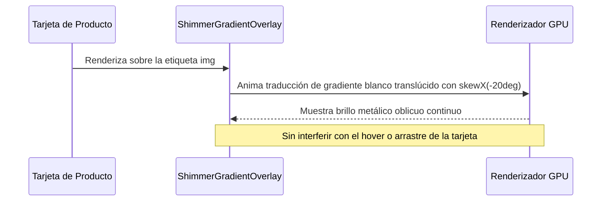

<!--
{
  "resource": "ShimmerGradientOverlay",
  "technicalName": "ShimmerGradientOverlay",
  "targetPath": "src/components/common/ShimmerGradientOverlay.jsx",
  "type": "atom",
  "niches": [],
  "dependencies": {
    "npm": {},
    "internal": []
  }
}
-->

# ShimmerGradientOverlay (Capa de Brillo Traslúcido)

Capa de gradiente de brillo (shimmer overlay) traslúcido para imágenes o contenedores multimedia durante la carga asíncrona. Aporta una sensación holográfica premium al combinar un barrido oblicuo y difuso que pasa sobre la silueta del contenedor.

## 1. Propósito y Casos de Uso
- **Galerías de Imágenes**: Máscara de carga para imágenes de ropa o renders de muebles.
- **Banners de Publicidad**: Animación de brillo metálico premium sobre ofertas o promociones especiales.
- **Detalle de Producto**: Overlay de carga activa para la foto principal del producto.

## 2. Especificación Visual y Estilos (Tailwind CSS)
- **Barrido Oblicuo**: Rotación de 15 grados del gradiente brillante lineal (`skew-x-12` o similar) para dar un efecto de reflejo metálico pulido.
- **Opacidad Controlada**: Mezcla transparente que no oculta el contenido subyacente pero añade un brillo visible en GPU.
- **Sincronización**: Animación cíclica infinita de barrido horizontal de 1.8 segundos.

## 3. Código React Completo y Portable

```jsx
import React from 'react';

export default function ShimmerGradientOverlay({
  active = true,
  opacity = 'opacity-30',
  className = ''
}) {
  if (!active) return null;

  return (
    <div className={`absolute inset-0 pointer-events-none overflow-hidden select-none ${className}`}>
      {/* Rayo de Luz Oblicuo en diagonal */}
      <div 
        className={`absolute inset-0 bg-gradient-to-r from-transparent via-white to-transparent will-change-transform ${opacity}`}
        style={{
          animation: 'shimmerSweep 1.8s infinite ease-in-out',
          width: '200%',
          transform: 'skewX(-20deg) translateX(-100%)'
        }}
      />

      {/* Estilos CSS Inline para Keyframes */}
      <style dangerouslySetInnerHTML={{__html: `
        @keyframes shimmerSweep {
          0% {
            transform: skewX(-20deg) translateX(-100%);
          }
          100% {
            transform: skewX(-20deg) translateX(100%);
          }
        }
      `}} />
    </div>
  );
}
```

## 4. Lógica de Estado y Ciclo de Vida
El componente es un elemento presentacional posicionado absolutamente (`absolute inset-0`). Está configurado con `pointer-events-none` y `select-none` para que no colisione con gestos táctiles, clics de arrastre o selección de texto en la imagen inferior.

## 5. Secuencia de Interacción


