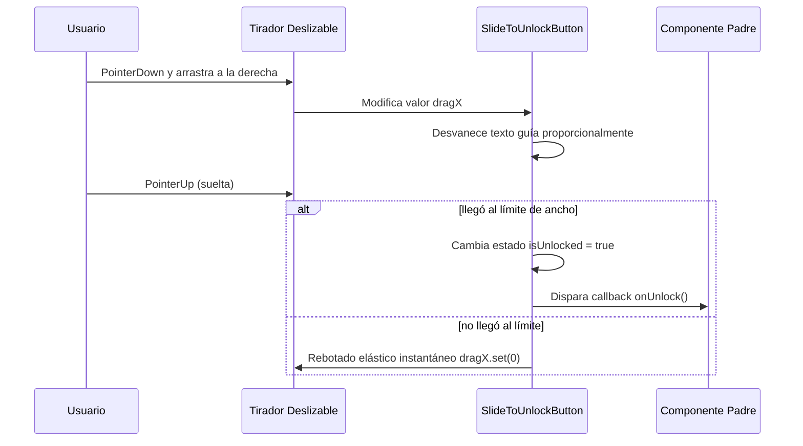

<!--
{
  "resource": "SlideToUnlockButton",
  "technicalName": "SlideToUnlockButton",
  "targetPath": "src/components/common/SlideToUnlockButton.jsx",
  "type": "atom",
  "niches": ["grocery_food", "laundry"],
  "dependencies": {
    "npm": {
      "framer-motion": "^11.0.0"
    },
    "internal": []
  }
}
-->

# Deslizador de Confirmación (SlideToUnlockButton)

Componente atómico de seguridad interactivo que requiere que el usuario deslice horizontalmente un tirador táctil hasta el extremo derecho para confirmar una acción irreversible o de alta importancia.

## 1. Propósito y Casos de Uso
Previene ejecuciones accidentales de acciones críticas, como "Confirmar Despacho de Pedido" por el repartidor, "Cerrar Caja Diaria" en el POS (*Minimarkets y Alimentos*), o "Iniciar Lavado Industrial" (*Lavanderías*), sustituyendo el diálogo modal aburrido por una interacción premium.

## 2. Especificación Visual y Estilos (Tailwind CSS)
Combina rieles redondeados semi-transparentes y un tirador elástico. Consume variables HSL:
- Riel base: `bg-[var(--color-surface-3)] border-[var(--color-border)]`
- Riel completado: `bg-green-500`
- Tirador: `bg-[var(--color-primary)]`
- Texto de guía: `text-[var(--color-text-muted)]/50`

---

## 3. Código React Completo y 100% Funcional

```jsx
import React, { useRef, useState } from 'react';
import { motion, useMotionValue, useTransform } from 'framer-motion';

export default function SlideToUnlockButton({
  onUnlock,
  text = 'Desliza para confirmar',
  successText = 'Confirmado exitosamente',
  disabled = false
}) {
  const containerRef = useRef(null);
  const [isUnlocked, setIsUnlocked] = useState(false);
  const dragX = useMotionValue(0);

  // Transformar opacidad del texto guía según el arrastre
  const textOpacity = useTransform(dragX, [0, 180], [1, 0]);

  const handleDragEnd = () => {
    if (disabled || !containerRef.current) return;
    const containerWidth = containerRef.current.offsetWidth;
    const handleWidth = 50; // Ancho del tirador
    const limit = containerWidth - handleWidth - 10;

    if (dragX.get() >= limit) {
      setIsUnlocked(true);
      if (onUnlock) onUnlock();
    } else {
      // Rebotar elásticamente al inicio si no llegó al límite
      dragX.set(0);
    }
  };

  return (
    <div
      ref={containerRef}
      className={`relative w-full h-14 rounded-full flex items-center p-1 border select-none transition-colors duration-300
        ${isUnlocked 
          ? 'bg-green-500 border-green-600' 
          : 'bg-[var(--color-surface-3)] border-[var(--color-border)]'
        }
        ${disabled ? 'opacity-40 cursor-not-allowed pointer-events-none' : ''}
      `}
    >
      {/* Texto guía de fondo confinado al área libre de deslizamiento para evitar solapamientos */}
      <motion.div
        style={{ opacity: isUnlocked ? 0 : textOpacity }}
        className="absolute left-14 right-4 inset-y-0 flex items-center justify-center text-xs font-semibold text-[var(--color-text-muted)]/60 pointer-events-none select-none"
      >
        {text} ➔
      </motion.div>

      {/* Texto de éxito */}
      {isUnlocked && (
        <div className="absolute inset-0 flex items-center justify-center text-xs font-bold text-[var(--color-text)] pointer-events-none">
          ✓ {successText}
        </div>
      )}

      {/* Tirador deslizable */}
      {!isUnlocked && (
        <motion.div
          drag="x"
          dragConstraints={{ left: 0, right: 240 }} // Límite de arrastre responsivo estimado
          dragElastic={0.05}
          dragMomentum={false}
          onDragEnd={handleDragEnd}
          style={{ x: dragX }}
          whileHover={{ scale: 1.05 }}
          whileTap={{ scale: 0.95 }}
          className="w-12 h-12 rounded-full bg-[var(--color-primary)] flex items-center justify-center text-[var(--color-text)] cursor-grab active:cursor-grabbing shadow-md z-10"
        >
          ➔
        </motion.div>
      )}
    </div>
  );
}
```

---

## 4. Lógica de Estado y Flujo Operativo


