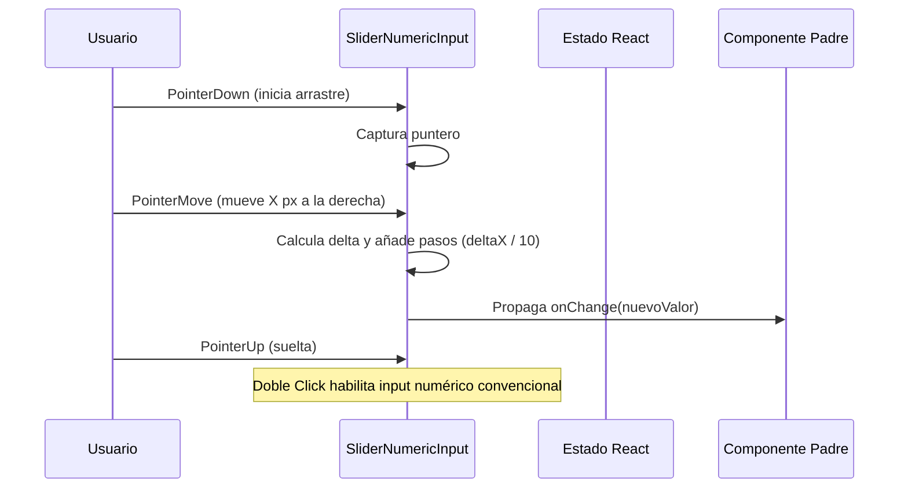

<!--
{
  "resource": "SliderNumericInput",
  "technicalName": "SliderNumericInput",
  "targetPath": "src/components/common/SliderNumericInput.jsx",
  "type": "atom",
  "niches": ["ferreteria-rural", "technical_services"],
  "dependencies": {
    "npm": {
      "framer-motion": "^11.0.0"
    },
    "internal": []
  }
}
-->

# Input Numérico Deslizable (SliderNumericInput)

Componente atómico de formulario táctil e interactivo que combina un campo de entrada numérico con un control de dial de arrastre lateral (drag), agilizando el ajuste preciso de cantidades.

## 1. Propósito y Casos de Uso
Permite a los operarios en campo o a los usuarios de POS deslizar rápidamente para ajustar cantidades físicas (ej: metros de cable, cantidad de sacos de fertilizante, peso de piezas de metal) sin necesidad de abrir teclados móviles o hacer clic repetidamente. Es ideal para las verticales de *Ferretería Rural* y *Mecanizado de Precisión*.

## 2. Especificación Visual y Estilos (Tailwind CSS)
Utiliza cursores adaptativos (`cursor-ew-resize`) y transiciones de escala elásticas al arrastrar. Consume variables:
- Fondo: `bg-[var(--color-surface)]`
- Contorno en Arrastre: `border-[var(--color-primary)]`
- Deshabilitado: `bg-[var(--color-surface-3)]/50`

---

## 3. Código React Completo y 100% Funcional

```jsx
import React, { useRef, useState } from 'react';
import { motion } from 'framer-motion';

export default function SliderNumericInput({
  value = 0,
  onChange,
  min = 0,
  max = 100,
  step = 1,
  disabled = false
}) {
  const [isDragging, setIsDragging] = useState(false);
  const [isEditing, setIsEditing] = useState(false);
  const startXRef = useRef(0);
  const startValRef = useRef(0);

  const handlePointerDown = (e) => {
    if (disabled || isEditing) return;
    setIsDragging(true);
    startXRef.current = e.clientX;
    startValRef.current = value;
    e.currentTarget.setPointerCapture(e.pointerId);
  };

  const handlePointerMove = (e) => {
    if (!isDragging) return;
    const deltaX = e.clientX - startXRef.current;
    // Factor de sensibilidad (10px de movimiento = 1 step)
    const stepsMoved = Math.round(deltaX / 10);
    const newVal = Math.min(max, Math.max(min, startValRef.current + stepsMoved * step));
    if (newVal !== value && onChange) {
      onChange(newVal);
    }
  };

  const handlePointerUp = (e) => {
    if (isDragging) {
      setIsDragging(false);
      e.currentTarget.releasePointerCapture(e.pointerId);
    }
  };

  const handleDoubleClick = () => {
    if (disabled) return;
    setIsEditing(true);
  };

  const handleBlur = () => {
    setIsEditing(false);
  };

  return (
    <div className="relative w-full select-none">
      {isEditing ? (
        <input
          type="number"
          min={min}
          max={max}
          step={step}
          value={value}
          autoFocus
          onBlur={handleBlur}
          onChange={(e) => {
            const num = Number(e.target.value);
            if (!isNaN(num) && onChange) {
              onChange(Math.min(max, Math.max(min, num)));
            }
          }}
          className="w-full text-center text-lg font-bold rounded-xl border border-[var(--color-primary)] bg-[var(--color-surface)] py-3 px-4 outline-none transition-all [appearance:textfield] [&::-webkit-outer-spin-button]:appearance-none [&::-webkit-inner-spin-button]:appearance-none"
        />
      ) : (
        <motion.div
          onPointerDown={handlePointerDown}
          onPointerMove={handlePointerMove}
          onPointerUp={handlePointerUp}
          onDoubleClick={handleDoubleClick}
          whileTap={{ scale: 0.98 }}
          className={`w-full text-center py-3 px-4 rounded-xl border font-bold text-lg cursor-ew-resize transition-all
            ${isDragging 
              ? 'border-[var(--color-primary)] bg-[var(--color-surface-2)] shadow-md shadow-[var(--color-primary)]/10 ring-2 ring-[var(--color-primary)]/20' 
              : 'border-[var(--color-border)] bg-[var(--color-surface)] hover:border-[var(--color-primary)]/60'
            }
            ${disabled ? 'opacity-50 cursor-not-allowed bg-[var(--color-surface-3)]/40 pointer-events-none' : ''}
          `}
        >
          <span className="text-sm font-normal text-[var(--color-text-muted)] block">Arrastra o Doble Click</span>
          <span className="text-xl font-extrabold text-[var(--color-text)]">{value}</span>
        </motion.div>
      )}
    </div>
  );
}
```

---

## 4. Lógica de Estado y Flujo Operativo


