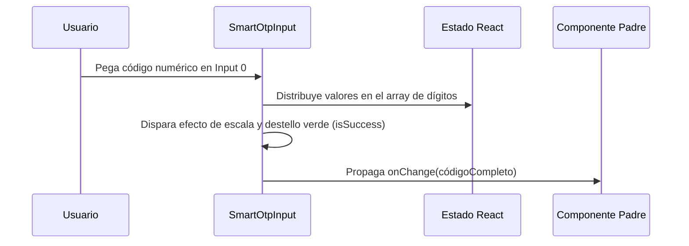

<!--
{
  "resource": "SmartOtpInput",
  "technicalName": "SmartOtpInput",
  "targetPath": "src/components/common/SmartOtpInput.jsx",
  "type": "atom",
  "niches": ["moda-local-calzado", "grocery_food"],
  "dependencies": {
    "npm": {
      "framer-motion": "^11.0.0"
    },
    "internal": []
  }
}
-->

# Campo OTP con Autotransición (SmartOtpInput)

Componente atómico avanzado para la entrada de códigos de un solo uso (OTP) que intercepta el pegado del portapapeles, autocompleta los casilleros de forma secuencial y genera un destello de validación.

## 1. Propósito y Casos de Uso
Permite a los usuarios validar contraseñas de transacciones, retiros o autorizaciones móviles con la menor fricción posible. Si el usuario copia un código enviado por SMS/WhatsApp, puede pegarlo directamente en el primer casillero y el sistema lo distribuirá de forma automática.

## 2. Especificación Visual y Estilos (Tailwind CSS)
Combina una animación elástica al recibir foco con un destello semántico verde en caso de autocompletado exitoso. Consume variables:
- Fondo: `bg-[var(--color-surface)]`
- Foco: `border-[var(--color-primary)] ring-[var(--color-primary)]/20`
- Validación de Éxito: `border-green-500 ring-green-500/20`

---

## 3. Código React Completo y 100% Funcional

```jsx
import React, { useRef, useState, useEffect } from 'react';
import { motion } from 'framer-motion';

export default function SmartOtpInput({
  length = 6,
  value = '',
  onChange,
  disabled = false
}) {
  const [digits, setDigits] = useState(Array(length).fill(''));
  const [isSuccess, setIsSuccess] = useState(false);
  const inputRefs = useRef([]);

  useEffect(() => {
    const valString = String(value || '');
    const newDigits = Array(length).fill('');
    for (let i = 0; i < length; i++) {
      newDigits[i] = valString[i] || '';
    }
    setDigits(newDigits);
  }, [value, length]);

  const handleChange = (e, index) => {
    const val = e.target.value;
    const lastChar = val.substring(val.length - 1);
    if (lastChar && !/^\d$/.test(lastChar)) return;

    const newDigits = [...digits];
    newDigits[index] = lastChar;
    setDigits(newDigits);

    const joined = newDigits.join('');
    if (onChange) onChange(joined);

    if (lastChar && index < length - 1) {
      inputRefs.current[index + 1]?.focus();
    }
  };

  const handleKeyDown = (e, index) => {
    if (e.key === 'Backspace') {
      const newDigits = [...digits];
      if (digits[index] === '' && index > 0) {
        newDigits[index - 1] = '';
        setDigits(newDigits);
        if (onChange) onChange(newDigits.join(''));
        inputRefs.current[index - 1]?.focus();
      } else {
        newDigits[index] = '';
        setDigits(newDigits);
        if (onChange) onChange(newDigits.join(''));
      }
    }
  };

  const handlePaste = (e) => {
    e.preventDefault();
    const pasteData = e.clipboardData.getData('text').trim();
    if (!/^\d+$/.test(pasteData)) return;

    const newDigits = [...digits];
    for (let i = 0; i < length; i++) {
      if (pasteData[i]) {
        newDigits[i] = pasteData[i];
      }
    }
    setDigits(newDigits);
    if (onChange) onChange(newDigits.join(''));

    // Trigger de destello verde (éxito visual de pegado)
    setIsSuccess(true);
    setTimeout(() => setIsSuccess(false), 800);

    const focusIndex = Math.min(pasteData.length, length - 1);
    inputRefs.current[focusIndex]?.focus();
  };

  return (
    <motion.div 
      animate={isSuccess ? { scale: [1, 1.02, 1] } : {}}
      transition={{ duration: 0.4 }}
      className="flex gap-2 justify-center items-center py-2"
    >
      {digits.map((digit, idx) => (
        <input
          key={idx}
          ref={(el) => (inputRefs.current[idx] = el)}
          type="text"
          inputMode="numeric"
          pattern="[0-9]*"
          maxLength={2}
          value={digit}
          onChange={(e) => handleChange(e, idx)}
          onKeyDown={(e) => handleKeyDown(e, idx)}
          onPaste={idx === 0 ? handlePaste : undefined}
          disabled={disabled}
          className={`w-10 h-12 text-center text-lg font-bold rounded-lg border bg-[var(--color-surface)] text-[var(--color-text)] outline-none transition-all duration-200
            ${isSuccess 
              ? 'border-green-500 ring-4 ring-green-500/20' 
              : 'border-[var(--color-border)] focus:border-[var(--color-primary)] focus:ring-4 focus:ring-[var(--color-primary)]/20'
            }
            disabled:opacity-50 disabled:cursor-not-allowed [appearance:textfield] [&::-webkit-outer-spin-button]:appearance-none [&::-webkit-inner-spin-button]:appearance-none
          `}
        />
      ))}
    </motion.div>
  );
}
```

---

## 4. Lógica de Estado y Flujo Operativo


