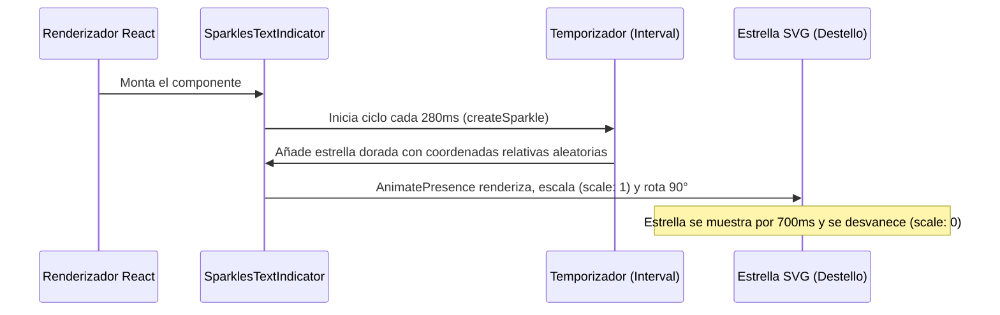

<!--
{
  "resource": "SparklesTextIndicator",
  "technicalName": "SparklesTextIndicator",
  "targetPath": "src/components/common/SparklesTextIndicator.jsx",
  "type": "atom",
  "niches": ["grocery_food", "alimentos-artesanales", "retail_clothing"],
  "dependencies": {
    "npm": {
      "framer-motion": "^11.0.0"
    },
    "internal": []
  }
}
-->

# Indicador con Destellos Mágicos (SparklesTextIndicator)

Componente atómico decorativo que envuelve un fragmento de texto y renderiza destellos SVG de cuatro puntas parpadeantes con coordenadas aleatorias alrededor del mismo, denotando novedad o recomendación especial.

## 1. Propósito y Casos de Uso
Llama la atención visual hacia textos específicos del e-commerce o plataforma administrativa (ej: "¡Nuevo Ingreso!" en *Ropa y Retail*, "Recomendado por IA ⚡" en *Alimentos Artesanales*, o "¡Descuento Flash!").

## 2. Especificación Visual y Estilos (Tailwind CSS)
Utiliza una maquetación relativa e inline con desbordamiento visible (`overflow-visible`) para que las estrellas destellantes floten alrededor de las letras sin cortarse. Los destellos usan colores dorados o variables HSL cromáticas:
- Destellos: `fill-yellow-400` o `fill-[var(--color-primary)]`

---

## 3. Código React Completo y 100% Funcional

```jsx
import React, { useState, useEffect } from 'react';
import { motion, AnimatePresence } from 'framer-motion';

// Generar una única partícula de destello
const createSparkle = () => ({
  id: Math.random(),
  createdAt: Date.now(),
  color: '#eab308', // Dorado (yellow-500)
  size: 10 + Math.random() * 12,
  style: {
    top: `${Math.random() * 100}%`,
    left: `${Math.random() * 100}%`
  }
});

export default function SparklesTextIndicator({
  children,
  className = '',
  enabled = true
}) {
  const [sparkles, setSparkles] = useState([]);

  useEffect(() => {
    if (!enabled) {
      setSparkles([]);
      return;
    }

    // Intervalo continuo para añadir destellos de forma asíncrona
    const interval = setInterval(() => {
      setSparkles((prev) => {
        const now = Date.now();
        // Filtrar destellos viejos (vida útil de 700ms) y añadir uno nuevo
        const clean = prev.filter((sp) => now - sp.createdAt < 700);
        return [...clean, createSparkle()];
      });
    }, 280);

    return () => clearInterval(interval);
  }, [enabled]);

  return (
    <span className={`relative inline-block overflow-visible px-2 py-0.5 select-none ${className}`}>
      {/* Renderizar destellos en capa superior */}
      <AnimatePresence>
        {sparkles.map((sp) => (
          <motion.svg
            key={sp.id}
            initial={{ scale: 0, rotate: 0, opacity: 0 }}
            animate={{ scale: 1, rotate: 90, opacity: 1 }}
            exit={{ scale: 0, opacity: 0 }}
            transition={{ duration: 0.6 }}
            className="absolute pointer-events-none z-20 fill-yellow-400"
            style={{
              ...sp.style,
              width: sp.size,
              height: sp.size,
              marginLeft: -sp.size / 2,
              marginTop: -sp.size / 2
            }}
            viewBox="0 0 160 160"
          >
            <path d="M80 0C80 44.1828 115.817 80 160 80C115.817 80 80 115.817 80 160C80 115.817 44.1828 80 0 80C44.1828 80 80 44.1828 80 0Z" />
          </motion.svg>
        ))}
      </AnimatePresence>

      {/* Texto original */}
      <span className="relative z-10 font-bold">{children}</span>
    </span>
  );
}
```

---

## 4. Lógica de Estado y Flujo Operativo


