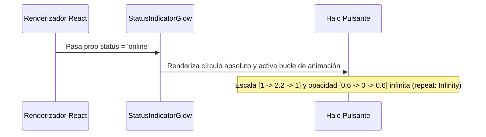

<!--
{
  "resource": "StatusIndicatorGlow",
  "technicalName": "StatusIndicatorGlow",
  "targetPath": "src/components/common/StatusIndicatorGlow.jsx",
  "type": "atom",
  "niches": ["wellness_podology", " grocery_food"],
  "dependencies": {
    "npm": {
      "framer-motion": "^11.0.0"
    },
    "internal": []
  }
}
-->

# Punto de Estado Pulsante (StatusIndicatorGlow)

Componente atómico indicador que proyecta un halo luminoso concéntrico respiratorio (pulsante) usando animaciones fluidas, para denotar estados lógicos de conexión o actividad en tiempo real.

## 1. Propósito y Casos de Uso
Ideal para tableros administrativos u omnicanales de comunicación (ej. "Repartidor en Camino" en *Minimarkets y Alimentos*, "Especialista Disponible" en *Estética y Podología*, o "Caja POS Abierta").

## 2. Especificación Visual y Estilos (Tailwind CSS)
El punto interno de color y el halo exterior semitransparente usan variables HSL semánticas del sistema de diseño para asegurar el contraste tanto en Light Mode como en Dark Mode.

### Variantes Soportadas
- **online**: Verde (`bg-green-500`, halo `bg-green-500/30`)
- **offline**: Gris (`bg-[var(--color-text-muted)]`, sin pulso)
- **busy**: Rojo (`bg-red-500`, halo `bg-red-500/30`)
- **away**: Naranja/Amarillo (`bg-amber-500`, halo `bg-amber-500/30`)

---

## 3. Código React Completo y 100% Funcional

```jsx
import React from 'react';
import { motion } from 'framer-motion';

const STATUS_CONFIGS = {
  online: { color: 'bg-green-500', glowColor: 'bg-green-500/30', label: 'Disponible' },
  offline: { color: 'bg-[var(--color-text-muted)]/60', glowColor: 'hidden', label: 'Desconectado' },
  busy: { color: 'bg-red-500', glowColor: 'bg-red-500/30', label: 'Ocupado' },
  away: { color: 'bg-amber-500', glowColor: 'bg-amber-500/30', label: 'Ausente' }
};

export default function StatusIndicatorGlow({
  status = 'online',
  showLabel = false,
  className = ''
}) {
  const config = STATUS_CONFIGS[status] || STATUS_CONFIGS.online;

  return (
    <div className={`inline-flex items-center gap-2 select-none ${className}`}>
      {/* Contenedor relativo para el punto y el halo */}
      <div className="relative flex h-3 w-3 items-center justify-center">
        {/* Halo pulsante (solo si no está offline) */}
        {status !== 'offline' && (
          <motion.span
            animate={{
              scale: [1, 2.2, 1],
              opacity: [0.6, 0, 0.6]
            }}
            transition={{
              duration: 2,
              repeat: Infinity,
              ease: "easeInOut"
            }}
            className={`absolute inline-flex h-full w-full rounded-full ${config.glowColor}`}
          />
        )}

        {/* Punto central sólido */}
        <span className={`relative inline-flex rounded-full h-2.5 w-2.5 ${config.color}`} />
      </div>

      {showLabel && (
        <span className="text-xs font-semibold text-[var(--color-text-muted)] leading-none">
          {config.label}
        </span>
      )}
    </div>
  );
}
```

---

## 4. Lógica de Estado y Flujo Operativo


