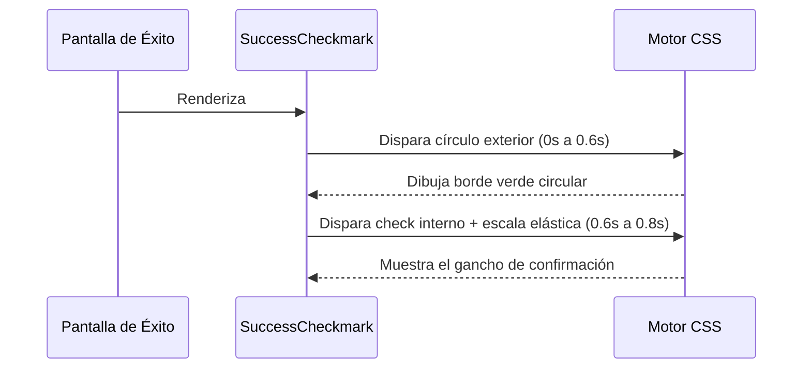

<!--
{
  "resource": "SuccessCheckmark",
  "technicalName": "SuccessCheckmark",
  "targetPath": "src/components/common/SuccessCheckmark.jsx",
  "type": "atom",
  "niches": [],
  "dependencies": {
    "npm": {},
    "internal": []
  }
}
-->

# SuccessCheckmark (Checkmark Animado de Éxito)

Icono de checkmark de éxito SVG premium que dibuja progresivamente su trazo perimetral y su gancho interior con un efecto spring de rebote. Ideal para transiciones de éxito en confirmación de transacciones o firmas digitales.

## 1. Propósito y Casos de Uso
- **Confirmación de Pago**: Pantalla final de éxito de pago tras autorizar una venta.
- **Creación de Citas exitosa**: Confirmación visual para agendamiento de citas en barberías/estética.
- **Formularios completados**: Animación de confirmación tras validar un formulario de onboarding.

## 2. Especificación Visual y Estilos (Tailwind CSS)
- **Efecto de Dibujado (Stroke draw)**: Uso de `stroke-dasharray` para revelar progresivamente los trazos SVG.
- **Escala Spring**: Animación de rebote con escalado elástico `scale(1.15)` en el círculo exterior.
- **Colores de Éxito**: Combina `stroke-emerald-500` con `fill-emerald-500/10` para un acabado visual de alta gama.

## 3. Código React Completo y Portable

```jsx
import React from 'react';

export default function SuccessCheckmark({
  size = 'w-16 h-16',
  className = ''
}) {
  return (
    <div className={`relative flex items-center justify-center ${size} ${className}`}>
      <svg
        className="w-full h-full text-emerald-500 fill-none"
        viewBox="0 0 52 52"
      >
        {/* Círculo Exterior Animado */}
        <circle
          className="stroke-emerald-500 stroke-[3px] animate-circleDraw"
          cx="26"
          cy="26"
          r="24"
          fill="none"
        />
        {/* Relleno de Fondo Translúcido */}
        <circle
          className="fill-emerald-500/10 animate-fillCircle"
          cx="26"
          cy="26"
          r="24"
        />
        {/* Gancho interior de éxito */}
        <path
          className="stroke-emerald-500 stroke-[4px] animate-checkmarkDraw"
          strokeLinecap="round"
          strokeLinejoin="round"
          d="M14 27l8 8 16-16"
        />
      </svg>

      {/* Estilos CSS Inline para Keyframes */}
      <style dangerouslySetInnerHTML={{__html: `
        @keyframes circleDraw {
          0% {
            stroke-dasharray: 0 150;
          }
          100% {
            stroke-dasharray: 150 150;
          }
        }
        @keyframes checkmarkDraw {
          0% {
            stroke-dasharray: 0 50;
          }
          50% {
            stroke-dasharray: 0 50;
          }
          100% {
            stroke-dasharray: 50 50;
          }
        }
        @keyframes fillCircle {
          0%, 100% {
            transform: scale(1);
          }
          50% {
            transform: scale(1.08);
          }
        }
        .animate-circleDraw {
          stroke-dasharray: 150;
          stroke-dashoffset: 0;
          animation: circleDraw 0.6s cubic-bezier(0.65, 0, 0.45, 1) forwards;
        }
        .animate-checkmarkDraw {
          stroke-dasharray: 50;
          stroke-dashoffset: 0;
          animation: checkmarkDraw 0.8s cubic-bezier(0.65, 0, 0.45, 1) forwards;
          transform-origin: 50% 50%;
        }
        .animate-fillCircle {
          transform-origin: 50% 50%;
          animation: fillCircle 0.4s ease-in-out 0.6s forwards;
        }
      `}} />
    </div>
  );
}
```

## 4. Lógica de Estado y Ciclo de Vida
El componente es un disparador visual de disparo único al renderizarse. Utiliza animaciones secuenciadas por retraso (`0.6s` en el relleno y checkmark) para coordinar el dibujo del círculo con la aparición del check interno.

## 5. Secuencia de Interacción


